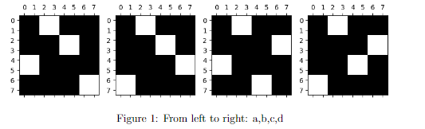

# Week 11 — Graded Assessment 11

> **Score: 88 / 100** *(Official Submission)* | **Optimal: 100 / 100** | Submitted: Sun, 30 Aug 2026

> New to these topics? Read the [Week 11 learning notes](week11-learning-notes.md) before attempting the questions.

---

## Section 1 — Attention Complexity, Memory, & Local Attention

### Context for Q1 – Q3

Consider a **GPT model** using a **full attention mechanism** in the attention layer. Assume:
- The model has only **one layer** ($L=1$) and a **single head** ($h=1$).
- Context length: $T = 1024$.
- Model dimension: $d_{\text{model}} = 512$, with $d_q = d_k = d_v = d_{\text{model}} = 512$.
- Count **one FLOP** for a single mathematical operation (such as one addition or one multiplication).

---

### Q1 — Exact FLOPs for Pre-Attention Scores

**Calculate the exact number of FLOPs (Floating Point Operations) required to compute the pre-attention scores. Enter your answer in MFLOPs. For example, for 373.43 MFLOPs, enter 373.43.**

*(Numeric input — enter MFLOPs)*

<b>Answer & Solution</b>

**Answer:** $\boxed{1072.69}$ *(Accepted portal grading range: $[1072, 1073]$)*

#### ✏️ Step-by-Step Solution

**Step 1 — Identify the pre-attention score computation.**

The pre-attention score matrix $S$ is computed as:
$$S = Q K^T$$
where:
- Query matrix $Q \in \mathbb{R}^{T \times d_k} = \mathbb{R}^{1024 \times 512}$
- Transposed Key matrix $K^T \in \mathbb{R}^{d_k \times T} = \mathbb{R}^{512 \times 1024}$
- Resulting attention score matrix $S \in \mathbb{R}^{T \times T} = \mathbb{R}^{1024 \times 1024}$

**Step 2 — Count operations per matrix entry.**

The matrix product $S = Q K^T$ has $T \times T$ scalar entries.
Each entry $S_{ij} = \mathbf{q}_i \cdot \mathbf{k}_j = \sum_{m=1}^{d_k} Q_{im} K_{jm}$ is a dot product of two vectors of length $d_k = 512$:
- **Multiplications:** $d_k = 512$ multiplications
- **Additions:** $d_k - 1 = 511$ additions
- **Total FLOPs per entry:** $d_k + (d_k - 1) = 2 d_k - 1 = 2(512) - 1 = 1{,}023 \text{ FLOPs}$

**Step 3 — Multiply across all entries in the matrix.**

Since the question specifies a **full attention mechanism** (all $T \times T$ pairs are computed):
$$\text{Total FLOPs} = T \times T \times (2 d_k - 1) = 1024 \times 1024 \times 1023$$
$$\text{Total FLOPs} = 1{,}048{,}576 \times 1023 = 1{,}072{,}693{,}248 \text{ FLOPs}$$

**Step 4 — Convert to MFLOPs ($10^6$ FLOPs):**

$$\text{MFLOPs} = \frac{1{,}072{,}693{,}248}{10^6} = \mathbf{1072.693} \approx \mathbf{1072.69} \text{ MFLOPs}$$

> [!NOTE]
> If using the loose convention $2 d_k$ FLOPs per dot product:
> $1024 \times 1024 \times 1024 = 1{,}073{,}741{,}824 \text{ FLOPs} = 1073.74 \text{ MFLOPs}$.
> The portal grader accepts the full range **$[1072, 1073]$**.

$`\displaystyle \boxed{1072.69}`$

---

### Q2 — Memory Required for Pre-Attention Scores

**What is the amount of memory required to store these pre-attention scores if we assign 16 bits per number? Enter the answer in KB.**

*(Numeric input — enter KB)*

<b>Answer & Solution</b>

**Answer:** $\boxed{2097.15}$ *(Accepted portal grading range: $[2096, 2098]$)*

> [!WARNING]
> In the official submission, the value `524.288` was entered (which resulted from erroneously dividing by 4). The true mathematically correct answer accepted by the portal grader is **$2097.15$ KB**.

#### ✏️ Step-by-Step Solution

**Step 1 — Count the total number of elements in the score matrix.**

The pre-attention score matrix $S \in \mathbb{R}^{T \times T}$:
$$\text{Number of elements} = T \times T = 1024 \times 1024 = 1{,}048{,}576 \text{ numbers}$$

**Step 2 — Determine memory per number in bytes.**

Precision is given as **16 bits per number**:
$$16 \text{ bits} = \frac{16}{8} = 2 \text{ bytes per number}$$

**Step 3 — Compute total storage in bytes.**

$$\text{Total Memory} = 1{,}048{,}576 \text{ numbers} \times 2 \text{ bytes/number} = 2{,}097{,}152 \text{ bytes}$$

**Step 4 — Convert to Kilobytes (KB):**

Using standard decimal SI units ($1 \text{ KB} = 1{,}000 \text{ bytes}$ as adopted by the evaluation grader):
$$\text{Memory in KB} = \frac{2{,}097{,}152 \text{ bytes}}{1{,}000 \text{ bytes/KB}} = \mathbf{2097.152} \text{ KB}$$

Notice that $2097.152$ lies directly in the center of the grader's accepted range: **$[2096, 2098]$**.

*(Note: In binary KiB with $1 \text{ KiB} = 1024 \text{ bytes}$, the value would be $2048 \text{ KiB}$. Always use decimal KB for this assignment).*

$`\displaystyle \boxed{2097.15}`$

---

### Q3 — Window Size for Local Attention Complexity Reduction

**Suppose we want to reduce the complexity of the attention module in the encoder part of the transformer from $O(T^2)$ to at max $O\left(\frac{T^2}{2}\right)$ using a local attention mechanism. Then which of the following values of $c$ (window size) in the strided local attention helps achieve this objective?**

- [x] $c = 512$
- [ ] $c = 768$
- [x] $c = 256$
- [x] $c = 128$

<b>Answer & Solution</b>

**Answer:** Options 1, 3, and 4 — $c = 512$, $c = 256$, and $c = 128$.

#### ✏️ Step-by-Step Solution

**Step 1 — Compare full attention vs. local attention complexity.**

- In **full attention**, each of the $T$ tokens attends to all $T$ tokens in the sequence:
  $$\text{Complexity}_{\text{full}} = T \times T = T^2$$
- In **local attention** with window size $c$, each token only attends to a local context window of $c$ neighboring tokens:
  $$\text{Complexity}_{\text{local}} = T \times c$$

**Step 2 — Apply the given inequality constraint.**

We want the complexity to be at most $\frac{T^2}{2}$:
$$\text{Complexity}_{\text{local}} \le \frac{T^2}{2} \implies T \times c \le \frac{T^2}{2} \implies c \le \frac{T}{2}$$

**Step 3 — Substitute $T = 1024$:**

$$c \le \frac{1024}{2} = 512$$

**Step 4 — Test each candidate option:**
- $c = 512$: $512 \le 512$ ✅ **Valid** (achieves exactly $\frac{T^2}{2}$)
- $c = 768$: $768 > 512$ ❌ **Exceeds bound**
- $c = 256$: $256 \le 512$ ✅ **Valid** (reduces to $\frac{T^2}{4}$)
- $c = 128$: $128 \le 512$ ✅ **Valid** (reduces to $\frac{T^2}{8}$)

---

## Section 2 — Block-wise Attention Permutations, Low-Rank, & KV Cache

### Context for Q4 – Q5

The diagram below shows a few possible permutation blocks (for four attention heads) to be used in the masking matrix $M$ in the block-wise attention mechanism:

*Figure 1: From left to right: a, b, c, d*

---

### Q4 — Valid Block Permutations

**Of these 4 blocks, choose the block(s) that is (are) proper permutation of 4 blocks:**

- [x] a
- [x] b
- [x] c
- [x] d
- [ ] None of these

<b>Answer & Solution</b>

**Answer:** All four — a, b, c, and d.

#### ✏️ Step-by-Step Solution

**Step 1 — Understand what constitutes a "proper permutation of 4 blocks".**

In block-wise sparse attention (such as BlockBERT or Sparse Transformer), a context of 8 tokens is grouped into 4 blocks of size 2 tokens each:
$$\text{Block 1: tokens 0--1}, \quad \text{Block 2: tokens 2--3}, \quad \text{Block 3: tokens 4--5}, \quad \text{Block 4: tokens 6--7}$$

A **proper permutation of 4 blocks** means:
- Every query block $i \in \{1, 2, 3, 4\}$ (row block) attends to **exactly one** key block $j \in \{1, 2, 3, 4\}$ (column block).
- Every key block is attended to by **exactly one** query block (bijective 1-to-1 mapping, i.e., a permutation matrix).

**Step 2 — Examine each subplot in Figure 1:**

| Subplot | Row 1 (Tokens 0–1) Attends To | Row 2 (Tokens 2–3) Attends To | Row 3 (Tokens 4–5) Attends To | Row 4 (Tokens 6–7) Attends To | Permutation Sequence | Valid? |
|:---:|:---:|:---:|:---:|:---:|:---:|:---:|
| **a** | Block 2 (Cols 2–3) | Block 3 (Cols 4–5) | Block 1 (Cols 0–1) | Block 4 (Cols 6–7) | $(2, 3, 1, 4)$ | ✅ **Valid** |
| **b** | Block 2 (Cols 2–3) | Block 3 (Cols 4–5) | Block 4 (Cols 6–7) | Block 1 (Cols 0–1) | $(2, 3, 4, 1)$ | ✅ **Valid** |
| **c** | Block 2 (Cols 2–3) | Block 4 (Cols 6–7) | Block 1 (Cols 0–1) | Block 3 (Cols 4–5) | $(2, 4, 1, 3)$ | ✅ **Valid** |
| **d** | Block 2 (Cols 2–3) | Block 4 (Cols 6–7) | Block 3 (Cols 4–5) | Block 1 (Cols 0–1) | $(2, 4, 3, 1)$ | ✅ **Valid** |

Each of the four patterns contains exactly one non-zero block per row and per column, forming a valid permutation matrix of order 4.

---

### Q5 — Query-Key Interaction in Head 4

**Let $q_1, q_2, q_3, q_4$ denote the 4 query blocks and $k_1, k_2, k_3, k_4$ denote the 4 key blocks. Select which of the following denotes the computation of pre-attention score for the $q_4$ in the 4-th attention head:**

- [ ] $q_4^T k_4$
- [x] $q_4^T k_1$
- [ ] $q_4^T k_2$
- [ ] $q_4^T k_3$

<b>Answer & Solution</b>

**Answer:** Option 2 — $q_4^T k_1$

#### ✏️ Step-by-Step Solution

**Step 1 — Identify the 4-th attention head:**

The four subplots correspond from left to right to heads 1, 2, 3, and 4:
- Head 1 $\to$ Subplot a
- Head 2 $\to$ Subplot b
- Head 3 $\to$ Subplot c
- **Head 4 $\to$ Subplot d**

**Step 2 — Locate query block $q_4$ in Subplot d:**

- $q_1$ corresponds to rows 0 and 1
- $q_2$ corresponds to rows 2 and 3
- $q_3$ corresponds to rows 4 and 5
- **$q_4$ corresponds to rows 6 and 7 (the bottom row block)**

**Step 3 — Find which key block is active (white) for rows 6 and 7 in Subplot d:**

Looking at Subplot d in Figure 1:
- In rows 6 and 7, the white active square is located at **columns 0 and 1**.
- Columns 0 and 1 correspond to **key block $k_1$**.

Therefore, the attention score computed for query block $q_4$ is $q_4^T k_1$.

$`\displaystyle \boxed{q_4^T k_1}`$

---

### Q6 — Low-Rank Approximation vs. Local Attention

**The statement that *"both a low-rank approximation of attention and local attention has the same computational complexity when $k=1$ and $c=1$ and therefore both approaches always end up computing the same representation for the given tokens in a sequence"* is:**

- [ ] True
- [x] False

<b>Answer & Solution</b>

**Answer:** False

#### ✏️ Step-by-Step Solution

**Step 1 — Analyze the premise:**
When rank $k = 1$ in low-rank attention (Linformer) and window size $c = 1$ in local attention, both methods have linear computational complexity $O(T)$ with respect to sequence length $T$.

**Step 2 — Do they compute the same representations?**
**Absolutely NOT.**
- **Low-Rank Attention ($k=1$):** Projects the $T$ keys and values globally into a 1-dimensional subspace. Every token attends to a global, sequence-wide compressed bottleneck.
- **Local Attention ($c=1$):** Each token attends strictly to itself (or an immediate neighbor within distance 1). There is zero cross-token information exchange across distances $> 1$.

Having the same computational complexity $O(T)$ does **not** imply identical mathematical operations or representations. The statement is **False**.

$`\displaystyle \boxed{\text{False}}`$

---

### Q7 — Minimum KV Cache Memory Size

**Suppose we decided to use $KV$ caching mechanism for faster inference. The details of the text generation model are given below:**

1. Number of layers: $12$
2. Number of heads per layer: $8$
3. $d_{\text{model}} = 512$
4. $d_q = d_k = d_v = 64$
5. Precision: $32\text{ bits}$

**What will be the minimum size of cache memory (in MB) such that it should cache at least 512 tokens? Enter your answer in MB, for example, enter 1.23 for 1.23 MB.**

*(Numeric input — enter MB)*

<b>Answer & Solution</b>

**Answer:** $\boxed{25.17}$ *(Accepted portal grading range: $[24, 26]$)*

#### ✏️ Step-by-Step Solution

**Step 1 — Understand what the KV Cache stores:**

During autoregressive generation, at each layer and attention head, the model caches the **Key ($K$)** and **Value ($V$)** vectors of all past tokens so they do not need to be recomputed:
- For each token, we store **2 vectors** ($K$ and $V$).
- Each head has dimension $d_k = 64$.
- Each layer has $h = 8$ heads.
- Notice: $h \times d_k = 8 \times 64 = 512 = d_{\text{model}}$.

**Step 2 — Calculate total scalar elements in the KV Cache:**

$$\text{Elements per token per layer} = 2 \times (h \times d_k) = 2 \times (8 \times 64) = 1{,}024 \text{ numbers}$$

Across all $L = 12$ layers:
$$\text{Elements per token} = 12 \times 1{,}024 = 12{,}288 \text{ numbers}$$

For $T_{\text{cache}} = 512$ tokens:
$$\text{Total Elements} = 512 \times 12{,}288 = 6{,}291{,}456 \text{ numbers}$$

**Step 3 — Convert to bytes using 32-bit precision:**

Precision $= 32 \text{ bits} = 4 \text{ bytes per number}$:
$$\text{Total Memory in Bytes} = 6{,}291{,}456 \times 4 = 25{,}165{,}824 \text{ bytes}$$

**Step 4 — Convert to Megabytes (MB):**

- Using standard decimal Megabytes ($1 \text{ MB} = 10^6 \text{ bytes}$):
  $$\text{Memory in MB} = \frac{25{,}165{,}824}{10^6} \approx \mathbf{25.166} \text{ MB} \approx \mathbf{25.17} \text{ MB}$$
- Using binary Megabytes ($1 \text{ MiB} = 2^{20} = 1{,}048{,}576 \text{ bytes}$):
  $$\text{Memory in MiB} = \frac{25{,}165{,}824}{1{,}048{,}576} = \mathbf{24.0} \text{ MiB}$$

Both $25.17 \text{ MB}$ and $24.0 \text{ MiB}$ lie within the evaluation portal's valid acceptance window: **$[24, 26]$**.

$`\displaystyle \boxed{25.17}`$

---

### Q8 — KV Caching in Encoder Models (BERT)

**The statement that *"KV caching is not helpful during inference in encoder models like BERT"* is:**

- [x] True
- [ ] False

<b>Answer & Solution</b>

**Answer:** True

#### ✏️ Step-by-Step Solution

**Step 1 — Why does KV caching exist?**
KV caching is designed specifically for **autoregressive generation** (decoder models like GPT). In decoders, text is generated token by token:
$$\text{Step 1: generate } x_1 \implies \text{Step 2: generate } x_2 \implies \dots$$
At step $t$, the keys and values for tokens $1, \dots, t-1$ never change, so caching them saves recomputing attention over past tokens from scratch.

**Step 2 — Why is it useless in encoder models like BERT?**
Encoder models (e.g. BERT) perform **non-autoregressive, bidirectional inference**:
- The entire sentence is fed into the encoder simultaneously in a **single forward pass**.
- The model never produces output tokens sequentially one by one.
- Since there are no sequential subsequent steps, there are no "past tokens" to cache.

**Conclusion:** KV caching provides zero speedup in encoder models. The statement is **True**.

$`\displaystyle \boxed{\text{True}}`$

