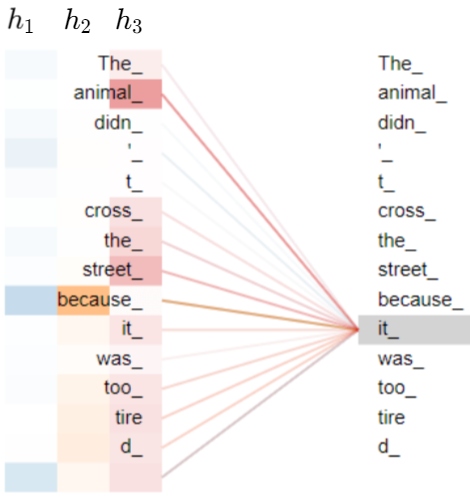

# Week 1 — Graded Assignment 1

> **Score: 100 / 100** | Submitted: Sun, 21 Jun 2026

> New to these topics? Read the [Weeks 1–2 learning notes](week1-week2-learning-notes.md) before attempting the questions.

---

## Context for Q1 – Q3

A dataset contains **four sample sequences** of words:

| # | Sequence | Word Count |
|---|---|:---:|
| 1 | I enjoyed the movie Transformers | 5 |
| 2 | We live among its people now | 6 |
| 3 | They have much to learn | 5 |
| 4 | Freedom is the right of all sentient beings | 8 |

The sequences have **no continuity** — the order among sequences does not matter.

Let the embedding dimension of each word be $\mathbb{R}^{1 \times 256}$.

---

### Q1 — Minimum Context Length $T$

**Suppose we want the transformer to process each sequence in its entirety. What should be the minimum context length (window) $T$?**

- ( ) 5
- ( ) 6
- ( ) 8
- ( ) 24

<b>Answer & Solution</b>

**Answer:** $T=8$

#### ✏️ Step-by-Step Solution

**Step 1 — Understand what context length means.**

The context length $T$ (also called the sequence length or window size) is the maximum number of tokens the transformer can process at once. For the transformer to handle *all* sequences without truncation, $T$ must be at least as large as the **longest sequence** in the dataset.

**Step 2 — Count the words in each sequence.**

$$
\text{Sequence 1: } \underbrace{\text{I}}_1 \ \underbrace{\text{enjoyed}}_2 \ \underbrace{\text{the}}_3 \ \underbrace{\text{movie}}_4 \ \underbrace{\text{Transformers}}_5 \quad \Rightarrow 5 \text{ tokens}
$$

$$
\text{Sequence 2: } \underbrace{\text{We}}_1 \ \underbrace{\text{live}}_2 \ \underbrace{\text{among}}_3 \ \underbrace{\text{its}}_4 \ \underbrace{\text{people}}_5 \ \underbrace{\text{now}}_6 \quad \Rightarrow 6 \text{ tokens}
$$

$$
\text{Sequence 3: } \underbrace{\text{They}}_1 \ \underbrace{\text{have}}_2 \ \underbrace{\text{much}}_3 \ \underbrace{\text{to}}_4 \ \underbrace{\text{learn}}_5 \quad \Rightarrow 5 \text{ tokens}
$$

$$
\text{Sequence 4: } \underbrace{\text{Freedom}}_1 \ \underbrace{\text{is}}_2 \ \underbrace{\text{the}}_3 \ \underbrace{\text{right}}_4 \ \underbrace{\text{of}}_5 \ \underbrace{\text{all}}_6 \ \underbrace{\text{sentient}}_7 \ \underbrace{\text{beings}}_8 \quad \Rightarrow 8 \text{ tokens}
$$

**Step 3 — Find the maximum.**

$$
\max(5,\ 6,\ 5,\ 8) = 8
$$

**Step 4 — Conclude.**

The minimum context length must be $T = 8$ so that Sequence 4 can be fully processed without truncation. Sequences shorter than 8 are padded.

$$
\boxed{T = 8}
$$

---

### Q2 — Dimension of the Encoder Input Tensor

**We pack all sequences into a batch and pass them to the encoder. The projection matrices $(W_Q, W_K, W_V) \in \mathbb{R}^{256 \times 64}$. Which tensor gives the correct dimension of the input to the encoder?**

- ( ) $4 \times 256 \times 8$
- ( ) $4 \times 8 \times 256$
- ( ) $8 \times 256 \times 64$
- ( ) $4 \times 256 \times 64$

<b>Answer & Solution</b>

**Answer:** $4 \times 8 \times 256$

#### ✏️ Step-by-Step Solution

**Step 1 — Identify each dimension's source.**

The input to a transformer encoder is a batch of token embedding matrices. Each axis corresponds to:

| Axis | Meaning | Value |
|:---:|---|:---:|
| 0 | Batch size (number of sequences) | 4 |
| 1 | Context length $T$ (tokens per sequence) | 8 |
| 2 | Embedding dimension $d_{\text{embed}}$ | 256 |

**Step 2 — Recall the standard convention.**

In PyTorch and most deep learning frameworks, tensors are ordered as:

$$
(\text{Batch},\ T,\ d_{\text{embed}})
$$

**Step 3 — Plug in the values.**

$$
\text{Input tensor shape} = (\text{batch size},\ T,\ d_{\text{embed}}) = (4,\ 8,\ 256)
$$

**Step 4 — Eliminate wrong options.**

- $4 \times 256 \times 8$ — swaps $T$ and $d_{\text{embed}}$, wrong order.
- $8 \times 256 \times 64$ — mixes $d_k = 64$ which is the projection dim, not the input dim.
- $4 \times 256 \times 64$ — again uses $d_k$ instead of $d_{\text{embed}}$.

$$
\boxed{4 \times 8 \times 256}
$$

---

### Q3 — Parameters in the Multi-Head Attention Sub-Layer

**We use four attention heads and an additional linear mapping $W_O \in \mathbb{R}^{256 \times 256}$. How many total parameters are in the multi-head attention sub-layer?**

*(Numeric input)*

<b>Answer & Solution</b>

**Answer:** $\boxed{262144}$

#### ✏️ Step-by-Step Solution

**Step 1 — Recall the structure of multi-head attention.**

Multi-head attention consists of:
1. **Per-head projection matrices**: $W_Q^{(i)},\ W_K^{(i)},\ W_V^{(i)}$ for each head $i$
2. **Output projection matrix**: $W_O$

**Step 2 — Determine projection dimensions.**

From the problem: $(W_Q, W_K, W_V) \in \mathbb{R}^{256 \times 64}$.

So each of $W_Q^{(i)},\ W_K^{(i)},\ W_V^{(i)} \in \mathbb{R}^{256 \times 64}$.

Parameters per matrix $= 256 \times 64 = 16{,}384$

**Step 3 — Count parameters across all 4 heads.**

Each head has 3 matrices ($W_Q, W_K, W_V$):

$$
\text{Params per head} = 3 \times (256 \times 64) = 3 \times 16{,}384 = 49{,}152
$$

For 4 heads:

$$
\text{Total head params} = 4 \times 49{,}152 = 196{,}608
$$

**Step 4 — Add the output projection $W_O$.**

$$
W_O \in \mathbb{R}^{256 \times 256} \quad \Rightarrow \quad 256 \times 256 = 65{,}536 \text{ parameters}
$$

**Step 5 — Sum everything.**

$$
\text{Total} = 196{,}608 + 65{,}536 = \boxed{262{,}144}
$$

> **Key insight:** $W_O$ maps from the concatenated head outputs back to $d_{\text{model}}$. Since each head produces a 64-dimensional output and there are 4 heads, the input to $W_O$ is $4 \times 64 = 256$, matching $\mathbb{R}^{256 \times 256}$.

---

## Context for Q4 – Q6

The diagram below shows attention scores from **three independent heads** $(h_1, h_2, h_3)$ for the word **"it\_"**.

- Each attention head is represented by a **colour**: $h_1$ = blue, $h_2$ = orange, $h_3$ = red.
- **Darker shade = higher attention score.**
- The last row is the attention score for a **special token**.
- The attention matrix in the $i$-th head: $A_i \in \mathbb{R}^{m \times n}$.
- Assume **zero-based indexing** where required.

The sentence being attended to is: *"The\_ animal\_ didn\_ '\_ t\_ cross\_ the\_ street\_ because\_ it\_ was\_ too\_ tire\_ d\_"* + 1 special token = **15 tokens total**.

---

### Q4 — Value of $m$

**What is the value of $m$?**

*(Numeric input)*

<b>Answer & Solution</b>

**Answer:** $\boxed{15}$

#### ✏️ Step-by-Step Solution

**Step 1 — Understand what $m$ represents.**

The attention matrix $A_i \in \mathbb{R}^{m \times n}$ has:
- $m$ = number of **query** positions (rows) — i.e., how many tokens are computing attention
- $n$ = number of **key** positions (columns) — i.e., how many tokens are being attended to

**Step 2 — Count the tokens from the image.**

Looking at the diagram, the tokens shown are:

$$
\text{The\_, animal\_, didn\_, '\_, t\_, cross\_, the\_, street\_, because\_, it\_, was\_, too\_, tire\_, d\_, \langle\text{special}\rangle}
$$

That gives: $14 \text{ regular tokens} + 1 \text{ special token} = 15$ total tokens.

**Step 3 — Determine $m$.**

Since the attention is computed for all 15 tokens, each token is a query:

$$
m = 15
$$

$$
\boxed{m = 15}
$$

---

### Q5 — Value of $n$

**What is the value of $n$?**

*(Numeric input)*

<b>Answer & Solution</b>

**Answer:** $\boxed{15}$

#### ✏️ Step-by-Step Solution

**Step 1 — Understand $n$.**

$n$ is the number of **key** tokens — the tokens that each query attends over.

**Step 2 — In self-attention, every token attends to every other token.**

In an encoder (non-causal) self-attention, the attention is computed over all positions:

$$
A_i = \text{softmax}\!\left(\frac{Q_i K_i^\top}{\sqrt{d_k}}\right) \in \mathbb{R}^{m \times n}
$$

where both $Q$ and $K$ come from the same sequence of 15 tokens.

**Step 3 — Conclude.**

$$
n = \text{number of key tokens} = 15
$$

$$
A_i \in \mathbb{R}^{15 \times 15}, \quad \boxed{n = 15}
$$

---

### Q6 — Which Head Captures the "it\_" → "animal\_" Relation?

**Which of these attention heads captures a strong relation between the words "it\_" and "animal\_"?**

- ( ) $h_1$
- ( ) $h_2$
- ( ) $h_3$

<b>Answer & Solution</b>

**Answer:** $h_3$

#### ✏️ Step-by-Step Solution

**Step 1 — Recall the colour coding.**

From the problem statement:
- $h_1$ → blue tones
- $h_2$ → orange tones
- $h_3$ → **red** tones

**Step 2 — Inspect the diagram.**

Looking at the image, when "it\_" is the query token:
- The **red lines** (from $h_3$) connecting "it\_" to "animal\_" are the **darkest** among all heads at that position.
- This means $h_3$ assigns the **highest attention score** to "animal\_" when processing "it\_".

**Step 3 — Linguistic interpretation.**

This makes sense: in the sentence *"The animal didn't cross the street because it was too tired"*, the pronoun "it" **refers to** (co-references) the "animal". Head $h_3$ has learned to capture this **coreference relation**.

$$
\boxed{h_3 \text{ captures the strong relation between "it\_" and "animal\_"}}
$$

---

## Context for Q7 – Q8

The input embeddings for the words **"learning"**, **"brings"**, and **"joy"** are:

$$
h_1 = [0.5,\ 0.25,\ 1], \quad h_2 = [0.1,\ 0.25,\ 0], \quad h_3 = [0.1,\ 0.1,\ 0.9]
$$

Note: embeddings are **row vectors**. The projection matrices are:

$$
W_Q = \begin{bmatrix} 1 & 1 \\ -1 & 1 \\ 0 & 1 \end{bmatrix}, \quad W_K = \begin{bmatrix} 0 & 1 \\ 1 & 0 \\ 0 & 1 \end{bmatrix}, \quad W_V = \begin{bmatrix} 0 & 0 \\ -1 & -1 \\ 1 & 1 \end{bmatrix}
$$

Let $z_j$ denote the **linear combination of value vectors** for the $j$-th word.

---

### Q7 — More Attention to "learning" While Constructing $z_1$?

**While constructing $z_1$, more attention was given to the word "learning". The statement is:**

- ( ) True
- ( ) False

<b>Answer & Solution</b>

**Answer:** True

#### ✏️ Step-by-Step Solution

We need to compute the **attention weights** used when constructing $z_1$ (the output for the word "learning") and check which word gets the highest weight.

**Step 1 — Stack the embedding matrix $H$.**

$$
H = \begin{bmatrix} h_1 \\ h_2 \\ h_3 \end{bmatrix} = \begin{bmatrix} 0.5 & 0.25 & 1 \\ 0.1 & 0.25 & 0 \\ 0.1 & 0.1 & 0.9 \end{bmatrix}
$$

**Step 2 — Compute the Query matrix $Q = H W_Q$.**

$$
Q = H W_Q = \begin{bmatrix} 0.5 & 0.25 & 1 \\ 0.1 & 0.25 & 0 \\ 0.1 & 0.1 & 0.9 \end{bmatrix} \begin{bmatrix} 1 & 1 \\ -1 & 1 \\ 0 & 1 \end{bmatrix}
$$

Row by row:

$$
q_1 = [0.5(1) + 0.25(-1) + 1(0),\quad 0.5(1) + 0.25(1) + 1(1)] = [0.25,\ 1.75]
$$

$$
q_2 = [0.1(1) + 0.25(-1) + 0(0),\quad 0.1(1) + 0.25(1) + 0(1)] = [-0.15,\ 0.35]
$$

$$
q_3 = [0.1(1) + 0.1(-1) + 0.9(0),\quad 0.1(1) + 0.1(1) + 0.9(1)] = [0.0,\ 1.1]
$$

**Step 3 — Compute the Key matrix $K = H W_K$.**

$$
K = H W_K = \begin{bmatrix} 0.5 & 0.25 & 1 \\ 0.1 & 0.25 & 0 \\ 0.1 & 0.1 & 0.9 \end{bmatrix} \begin{bmatrix} 0 & 1 \\ 1 & 0 \\ 0 & 1 \end{bmatrix}
$$

Row by row:

$$
k_1 = [0.5(0) + 0.25(1) + 1(0),\quad 0.5(1) + 0.25(0) + 1(1)] = [0.25,\ 1.5]
$$

$$
k_2 = [0.1(0) + 0.25(1) + 0(0),\quad 0.1(1) + 0.25(0) + 0(1)] = [0.25,\ 0.1]
$$

$$
k_3 = [0.1(0) + 0.1(1) + 0.9(0),\quad 0.1(1) + 0.1(0) + 0.9(1)] = [0.1,\ 1.0]
$$

**Step 4 — Compute unnormalized attention scores $e_{1j} = q_1 \cdot k_j$ (for constructing $z_1$).**

> Note: Scaling by $\sqrt{d_k}$ is **not** applied (as stated in the problem).

$$
e_{11} = q_1 \cdot k_1 = (0.25)(0.25) + (1.75)(1.5) = 0.0625 + 2.625 = 2.6875
$$

$$
e_{12} = q_1 \cdot k_2 = (0.25)(0.25) + (1.75)(0.1) = 0.0625 + 0.175 = 0.2375
$$

$$
e_{13} = q_1 \cdot k_3 = (0.25)(0.1) + (1.75)(1.0) = 0.025 + 1.75 = 1.775
$$

**Step 5 — Apply softmax to get attention weights $a_{1j}$.**

$$
\exp(e_{11}) = e^{2.6875} \approx 14.69, \quad \exp(e_{12}) = e^{0.2375} \approx 1.268, \quad \exp(e_{13}) = e^{1.775} \approx 5.902
$$

$$
\text{Sum} = 14.69 + 1.268 + 5.902 = 21.86
$$

$$
a_{11} = \frac{14.69}{21.86} \approx \mathbf{0.672}, \quad a_{12} = \frac{1.268}{21.86} \approx \mathbf{0.058}, \quad a_{13} = \frac{5.902}{21.86} \approx \mathbf{0.270}
$$

**Step 6 — Interpret the result.**

| Word | Attention Weight |
|---|:---:|
| "learning" ($j=1$) | **0.672 ← highest** |
| "brings" ($j=2$) | 0.058 |
| "joy" ($j=3$) | 0.270 |

The word "learning" receives **67.2%** of the attention weight, which is clearly the highest.

$$
\boxed{\text{True — more attention is given to "learning" while constructing } z_1}
$$

---

### Q8 — Equal Attention to All Words While Constructing $z_2$?

**While constructing $z_2$, all words were given equal attention. The statement is:**

- ( ) True
- ( ) False

<b>Answer & Solution</b>

**Answer:** False

#### ✏️ Step-by-Step Solution

We compute the attention weights for $z_2$ (query is $q_2 = [-0.15,\ 0.35]$).

**Step 1 — Compute unnormalized scores $e_{2j} = q_2 \cdot k_j$.**

$$
e_{21} = q_2 \cdot k_1 = (-0.15)(0.25) + (0.35)(1.5) = -0.0375 + 0.525 = 0.4875
$$

$$
e_{22} = q_2 \cdot k_2 = (-0.15)(0.25) + (0.35)(0.1) = -0.0375 + 0.035 = -0.0025
$$

$$
e_{23} = q_2 \cdot k_3 = (-0.15)(0.1) + (0.35)(1.0) = -0.015 + 0.35 = 0.335
$$

**Step 2 — Check if scores are equal.**

$$
e_{21} = 0.4875 \ne e_{22} = -0.0025 \ne e_{23} = 0.335
$$

The unnormalized scores are **not equal**, so after softmax the attention weights will also **not be equal**.

**Step 3 — Verify with softmax.**

$$
\exp(0.4875) \approx 1.628,\quad \exp(-0.0025) \approx 0.9975,\quad \exp(0.335) \approx 1.398
$$

$$
\text{Sum} \approx 4.024
$$

$$
a_{21} \approx \frac{1.628}{4.024} \approx 0.405, \quad a_{22} \approx \frac{0.9975}{4.024} \approx 0.248, \quad a_{23} \approx \frac{1.398}{4.024} \approx 0.347
$$

**Step 4 — Conclude.**

The attention weights $(0.405,\ 0.248,\ 0.347)$ are clearly **not equal**. Equal attention would require all three weights to be $\approx 0.333$.

$$
\boxed{\text{False — words do NOT receive equal attention while constructing } z_2}
$$

