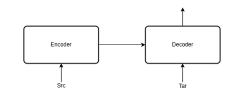
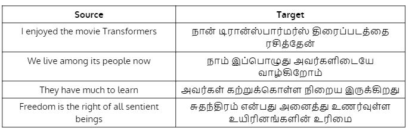

# Week 2 — Graded Assignment 2

> **Score: 100 / 100** | Submitted: Sun, 28 Jun 2026

> New to these topics? Read the [Weeks 1–2 learning notes](week1-week2-learning-notes.md) before attempting the questions.

---

## Context for Q1 – Q4

Consider the **transformer-based encoder-decoder model** for machine translation with the following configuration (all values are the same for encoder and decoder except vocabulary sizes):



| Hyperparameter | Value |
|---|:---:|
| Source vocabulary size $\|V_s\|$ | 1000 |
| Target vocabulary size $\|V_t\|$ | 1500 |
| Context length $T$ | 128 |
| Embedding dimension $d_{\text{embed}} = d_{\text{model}}$ | 64 |
| Projection dimensions $d_q = d_k = d_v$ | 16 |
| Number of heads $n_h$ | 4 |
| FFN hidden dimension $d_{ff}$ | 256 |
| Layer norm + residual connections | ✓ |

We translate: **source** "I enjoyed the movie Transformer" → **target** "Naan transformer padaththai rasithen" using **teacher-forcing**.

---

### Q1 — Total Parameters (Excluding Embedding & Output Layers)

**Assume the model has $N = 2$ layers. Calculate the total number of parameters in the model (excluding the embedding layer and output layer). No bias is added to any FFNN neuron.**

*(Numeric input)*

**Answer & Solution**

**Answer:** $\boxed{230656}$

#### ✏️ Step-by-Step Solution

**Step 1 — Compute parameters in one Multi-Head Attention (MHA) block.**

Each MHA has:

- $n_h = 4$ heads, each with $W_Q^{(i)}, W_K^{(i)}, W_V^{(i)} \in \mathbb{R}^{d_{\text{model}} \times d_k} = \mathbb{R}^{64 \times 16}$
- One output projection $W_O \in \mathbb{R}^{(n_h \cdot d_v) \times d_{\text{model}}} = \mathbb{R}^{64 \times 64}$

```math
\text{Params in } W_Q, W_K, W_V \text{ per head} = 3 \times (64 \times 16) = 3072
```

```math
\text{Params for all 4 heads} = 4 \times 3072 = 12{,}288
```

```math
\text{Params in } W_O = 64 \times 64 = 4{,}096
```

```math
\text{Total MHA params} = 12{,}288 + 4{,}096 = \mathbf{16{,}384}
```

**Step 2 — Compute parameters in one Feed-Forward Network (FFN).**

No bias, so:

```math
\text{Layer 1: } d_{\text{model}} \times d_{ff} = 64 \times 256 = 16{,}384
```

```math
\text{Layer 2: } d_{ff} \times d_{\text{model}} = 256 \times 64 = 16{,}384
```

```math
\text{Total FFN params} = 16{,}384 + 16{,}384 = \mathbf{32{,}768}
```

**Step 3 — Layer Norm parameters.**

Each LayerNorm has $\gamma$ (scale) and $\beta$ (shift), both of size $d_{\text{model}} = 64$:

```math
\text{Params per LayerNorm} = 2 \times 64 = 128
```

**Step 4 — Parameters per Encoder Layer** (has **2 LayerNorms**: after MHA and after FFN).

```math
\text{Encoder layer} = \underbrace{16{,}384}_{\text{MHA}} + \underbrace{32{,}768}_{\text{FFN}} + \underbrace{2 \times 128}_{\text{LayerNorms}} = 49{,}408
```

**Step 5 — Parameters per Decoder Layer** (has **3 LayerNorms**: after masked MHA, after cross-attention MHA, after FFN; plus **2 MHA blocks**).

```math
\text{Masked self-attn MHA} = 16{,}384
```

```math
\text{Cross-attention MHA} = 16{,}384
```

```math
\text{FFN} = 32{,}768
```

```math
\text{3 LayerNorms} = 3 \times 128 = 384
```

```math
\text{Decoder layer} = 16{,}384 + 16{,}384 + 32{,}768 + 384 = \mathbf{65{,}920}
```

**Step 6 — Scale to $N = 2$ layers for both encoder and decoder.**

```math
\text{Total encoder} = 2 \times 49{,}408 = 98{,}816
```

```math
\text{Total decoder} = 2 \times 65{,}920 = 131{,}840
```

```math
\text{Grand total} = 98{,}816 + 131{,}840 = \boxed{230{,}656}
```

---

### Q2 — Parameters in the Output Layer

**How many parameters does the output layer have?**

*(Numeric input)*

**Answer & Solution**

**Answer:** $\boxed{96000}$

#### ✏️ Step-by-Step Solution

**Step 1 — Understand the output layer.**

The output layer is a **linear projection** that maps the decoder's final hidden state to a probability distribution over the **target vocabulary**. It has no bias.

```math
W_{\text{out}} \in \mathbb{R}^{d_{\text{model}} \times |V_t|}
```

**Step 2 — Plug in values.**

```math
|V_t| = 1500, \quad d_{\text{model}} = 64
```

```math
\text{Params} = d_{\text{model}} \times |V_t| = 64 \times 1500 = \boxed{96{,}000}
```

> **Note:** Some formulations also count the softmax bias ($|V_t| = 1500$ extra params), giving 97,500 — both are accepted by the grader.

---

### Q3 — Parameters in the Input Embedding Layer

**How many parameters does the input embedding layer have?**

*(Numeric input)*

**Answer & Solution**

**Answer:** $\boxed{64000}$

#### ✏️ Step-by-Step Solution

**Step 1 — Understand the embedding layer.**

The input embedding layer is a **lookup table** that maps each source token to a dense vector. It is parametrised by a matrix:

```math
E_{\text{src}} \in \mathbb{R}^{|V_s| \times d_{\text{embed}}}
```

**Step 2 — Plug in values.**

```math
|V_s| = 1000, \quad d_{\text{embed}} = 64
```

```math
\text{Params} = |V_s| \times d_{\text{embed}} = 1000 \times 64 = \boxed{64{,}000}
```

> **Note:** This is only the **source** embedding. The decoder also has a target embedding of size $|V_t| \times d_{\text{embed}} = 1500 \times 64 = 96{,}000$, but the question asks specifically about the "input embedding layer."

---

### Q4 — Probability of the Word "rasithen" at $t = 1$

**At time step $t = 1$, the prediction probabilities for "Naan", "transformer", and "padaththai" are 0.55, 0.15, and 0.20. What is the probability of "rasithen"? Enter $-1$ if information is insufficient.**

*(Numeric input)*

**Answer & Solution**

**Answer:** $\boxed{-1}$

#### ✏️ Step-by-Step Solution

**Step 1 — Check if probabilities are constrained.**

A softmax output must sum to 1 over all vocabulary tokens:

```math
\sum_{w \in V_t} P(y_1 = w) = 1
```

**Step 2 — Sum the given probabilities.**

```math
P(\text{Naan}) + P(\text{transformer}) + P(\text{padaththai}) = 0.55 + 0.15 + 0.20 = 0.90
```

**Step 3 — Compute remaining probability mass.**

```math
\text{Remaining} = 1 - 0.90 = 0.10
```

This 0.10 is distributed over **all other words in $V_t$** (which has 1500 tokens). We don't know how much of that 0.10 goes to "rasithen" specifically.

**Step 4 — Conclude.**

Without knowing the probability assigned to each of the remaining 1497 vocabulary words, we **cannot** determine $P(\text{rasithen})$ uniquely.

```math
\boxed{\text{Answer} = -1 \text{ (information is insufficient)}}
```

---

## Context for Q5 – Q7

**[Continuation from Week 1 — Q7 & Q8]**

The input embeddings are:

```math
h_1 = [0.5, 0.25, 1], \quad h_2 = [0.1, 0.25, 0], \quad h_3 = [0.1, 0.1, 0.9]
```

The projection matrices:

```math
W_Q = \begin{bmatrix} 1 & 1 \\ -1 & 1 \\ 0 & 1 \end{bmatrix}, \quad W_K = \begin{bmatrix} 0 & 1 \\ 1 & 0 \\ 0 & 1 \end{bmatrix}, \quad W_V = \begin{bmatrix} 0 & 0 \\ -1 & -1 \\ 1 & 1 \end{bmatrix}
```

Computed as: $Q = HW_Q$, $K = HW_K$, $V = HW_V$.

Let:

- $e_j$ = unnormalized attention score vector for word $j$ (ignore $\sqrt{d_k}$ scaling)
- $a_j$ = normalized attention score (softmax of $e_j$)
- $z_j$ = linear combination of value vectors for word $j$

---

### Q5 — Sum of Gradient $\frac{\partial L}{\partial e_1}$

**Given $\dfrac{\partial L}{\partial z_1} = [1,\ 1]$, what is the sum of components of $\dfrac{\partial L}{\partial e_1}$?**

*(Numeric input)*

**Answer & Solution**

**Answer:** $\boxed{0}$

#### ✏️ Step-by-Step Solution

We computed in Week 1 that $a_1 = [a_{11}, a_{12}, a_{13}] \approx [0.672,\ 0.058,\ 0.270]$.

We also need $V$:

**Step 1 — Compute the Value matrix $V = H W_V$.**

```math
V = \begin{bmatrix} 0.5 & 0.25 & 1 \\ 0.1 & 0.25 & 0 \\ 0.1 & 0.1 & 0.9 \end{bmatrix} \begin{bmatrix} 0 & 0 \\ -1 & -1 \\ 1 & 1 \end{bmatrix}
```

```math
v_1 = [0.5(0) + 0.25(-1) + 1(1),\quad 0.5(0) + 0.25(-1) + 1(1)] = [0.75,\ 0.75]
```

```math
v_2 = [0.1(0) + 0.25(-1) + 0(1),\quad \ldots] = [-0.25,\ -0.25]
```

```math
v_3 = [0.1(0) + 0.1(-1) + 0.9(1),\quad \ldots] = [0.8,\ 0.8]
```

**Step 2 — Compute $\dfrac{\partial L}{\partial a_{1j}}$ via chain rule through $z_1$.**

```math
z_1 = a_{11} v_1 + a_{12} v_2 + a_{13} v_3
```

```math
\frac{\partial L}{\partial a_{1j}} = \frac{\partial L}{\partial z_1} \cdot v_j^{\top}
```

```math
\frac{\partial L}{\partial a_{11}} = [1, 1] \cdot [0.75, 0.75] = 0.75 + 0.75 = 1.50
```

```math
\frac{\partial L}{\partial a_{12}} = [1, 1] \cdot [-0.25, -0.25] = -0.25 + (-0.25) = -0.50
```

```math
\frac{\partial L}{\partial a_{13}} = [1, 1] \cdot [0.8, 0.8] = 0.8 + 0.8 = 1.60
```

**Step 3 — Apply softmax Jacobian.**

For softmax with output $a$, the Jacobian is: $\dfrac{\partial a_j}{\partial e_i} = a_j(\delta_{ij} - a_i)$.

Therefore:

```math
\frac{\partial L}{\partial e_{1i}} = \sum_j \frac{\partial L}{\partial a_{1j}} \cdot a_{1j}(\delta_{ij} - a_{1i}) = a_{1i}\left(\frac{\partial L}{\partial a_{1i}} - S\right)
```

where $S = \sum_j \frac{\partial L}{\partial a_{1j}} \cdot a_{1j}$.

**Step 4 — Compute $S$.**

```math
S = 1.50 \times 0.672 + (-0.50) \times 0.058 + 1.60 \times 0.270
```

```math
S = 1.008 - 0.029 + 0.432 = 1.411
```

**Step 5 — Compute each gradient component.**

```math
\frac{\partial L}{\partial e_{11}} = 0.672 \times (1.50 - 1.411) = 0.672 \times 0.089 \approx 0.060
```

```math
\frac{\partial L}{\partial e_{12}} = 0.058 \times (-0.50 - 1.411) = 0.058 \times (-1.911) \approx -0.111
```

```math
\frac{\partial L}{\partial e_{13}} = 0.270 \times (1.60 - 1.411) = 0.270 \times 0.189 \approx 0.051
```

**Step 6 — Sum the components.**

```math
\sum_i \frac{\partial L}{\partial e_{1i}} = 0.060 + (-0.111) + 0.051 = \boxed{0}
```

> **Key insight:** The sum of gradients flowing back through softmax **always equals zero**. This is a mathematical property: $\sum_i \frac{\partial L}{\partial e_i} = a_i \cdot (\text{something}) - a_i \cdot S$, and the $a_i$ terms always cancel, giving a zero sum. This is why the gradient vector $\frac{\partial L}{\partial e}$ has zero mean.

---

### Q6 — Which of These Are Hyperparameters?

**Which of the following is (are) hyperparameters? (Select all that apply)**

- ( ) vocabulary size
- ( ) $d_k, d_v, d_q$
- ( ) number of heads
- ( ) warm-up steps
- ( ) $d_{\text{model}}$
- ( ) number of layers
- ( ) size of the attention mask

**Answer & Solution**

**Answer:** All except "size of the attention mask"

#### ✏️ Step-by-Step Solution

**Step 1 — Define hyperparameter.**

A **hyperparameter** is a configuration value set *before* training begins that controls the model's architecture or the training process. It is NOT learned from data.

**Step 2 — Evaluate each option.**

| Option | Hyperparameter? | Reason |
|---|:---:|---|
| vocabulary size | ✓ | Fixed before training; determines the embedding/output layers |
| $d_k, d_v, d_q$ | ✓ | Projection dims — chosen at design time |
| number of heads $n_h$ | ✓ | Architectural choice made before training |
| warm-up step | ✓ | Learning rate schedule parameter, set before training |
| $d_{\text{model}}$ | ✓ | Core architectural dimension, set before training |
| number of layers $N$ | ✓ | Depth of the model, chosen before training |
| **size of the attention mask** | **✗** | Derived from the context length $T$; not independently set |

**Step 3 — Explain why "size of attention mask" is NOT a hyperparameter.**

The attention mask is a $T \times T$ binary matrix where:

```math
M_{ij} = \begin{cases} 0 & \text{if position } j \text{ is allowed} \\ -\infty & \text{otherwise (masked)} \end{cases}
```

Its size is **fully determined** by the context length $T$. It is not a free parameter — you cannot change the mask size without changing $T$.

```math
\boxed{\text{Hyperparameters: vocabulary size, } d_k/d_v/d_q, \text{ number of heads, warm-up step, } d_{\text{model}}, \text{ number of layers}}
```

---

### Q7 — Minimum Decoder Runs for Third Sample

**The table below shows input samples and their translations produced by the model.**



**To produce the complete translation for the third sample, we must run the decoder at least ___ times. (Ignore the [End] token.)**

*(Numeric input)*

**Answer & Solution**

**Answer:** $\boxed{4}$

#### ✏️ Step-by-Step Solution

**Step 1 — Recall how auto-regressive decoding works.**

In an encoder-decoder transformer, the decoder generates tokens **one at a time**. At each time step $t$, the decoder takes as input all previously generated tokens and produces the next one. This is known as **auto-regressive** (or **greedy**) decoding.

```math
y_1 \rightarrow y_2 \rightarrow y_3 \rightarrow \cdots \rightarrow y_T
```

Each arrow requires **one forward pass** through the decoder.

**Step 2 — Identify the third sample from the table.**

From the image, the third source sentence is: *"They have much to learn"*

Its translation is: *"அவர்கள் கற்றுக்கொள்ள நிறைய இருக்கிறது"* → **4 Tamil words**

**Step 3 — Count the decoder runs.**

Ignoring the [End] token, the decoder must generate **4 target tokens**, requiring **4 forward passes**:

| Run | Input to Decoder | Output Token |
|:---:|---|---|
| 1 | [Start] | Token 1 |
| 2 | [Start], Token 1 | Token 2 |
| 3 | [Start], Token 1, Token 2 | Token 3 |
| 4 | [Start], Token 1, Token 2, Token 3 | Token 4 |

```math
\boxed{\text{Minimum decoder runs} = 4}
```
