# Computer System Design — PYQ 1

Source: [csd-pyq-1.pdf](csd-pyq-1.pdf). Section ID: 640653124862.

21 original entries: Q1 is a 0-mark subject confirmation, Q2–Q6 carry 1 mark each, Q7–Q21 carry 3 marks each; total **50 marks**. The PDF does not state an exam date or duration. The portal uses its default practice timer (63 minutes), not an asserted source duration. No negative-mark value is supplied; the portal uses zero.

Text and all image-only formulas were transcribed after visual review of every page. Original circuit and option images are retained without colored answer indicators. Solutions below distinguish printed keys from independently derived answers. Minimized Boolean expressions assume uncomplemented primary inputs unless stated otherwise.

Source preview settings: change font color/background/theme, help, reports and progress bar are all No; maximum instruction time is 0. All short answers have evaluation required = Yes, word count = Yes, answer matching = Equal, and PlainText entry; alphanumeric entries are case insensitive. These are source metadata, not restrictions on portal accessibility.

### Q1 — Subject confirmation (MCQ)

THIS IS QUESTION PAPER FOR THE SUBJECT "DEGREE LEVEL : COMPUTER SYSTEM DESIGN (COMPUTER BASED EXAM)" ARE YOU SURE YOU HAVE TO WRITE EXAM FOR THIS SUBJECT? CROSS CHECK YOUR HALL TICKET TO CONFIRM THE SUBJECTS TO BE WRITTEN. (IF IT IS NOT THE CORRECT SUBJECT, PLS CHECK THE SECTION AT THE TOP FOR THE SUBJECTS REGISTERED BY YOU)

**Paper details:** 21 original entries, 50 marks; this subject confirmation carries zero marks. Exam date and duration are not supplied in the PDF. The portal timer is a 63-minute practice default. Solutions explicitly identify any disagreement with the printed key and explain ambiguous source wording.

**Marks:** 0

**Source question ID:** 6406531867614 · **Source type:** MCQ
**PDF page(s):** 1

- ( ) YES
- ( ) NO

**Source option IDs (A onward):** 6406536048680, 6406536048681.

<b>Answer & Solution</b>

**Answer:** A

**Printed PDF key:** `A`.

#### Step-by-step solution

1. Confirm that the subject on the hall ticket is Computer System Design.
2. Select YES only for that subject. This is an administrative confirmation, not a knowledge question, and carries zero marks.

**Quick learning tip:** Check the subject name first; an administrative confirmation should never be treated as a technical question.

---
### Q2 — Multiplexer (MCQ)

A multiplexer is a combinational circuit that selects one input from multiple inputs and forwards it to a single output.

**Marks:** 1

**Source question ID:** 6406531867615 · **Source type:** MCQ
**PDF page(s):** 2

- ( ) True
- ( ) False

**Source option IDs (A onward):** 6406536048682, 6406536048683.

<b>Answer & Solution</b>

**Answer:** A

**Printed PDF key:** `A`.

#### Step-by-step solution

1. A multiplexer has several data inputs, selection inputs, and one output.
2. The selection bits choose which data input reaches the output.
3. No stored state is needed for this selection, so it is combinational. The statement is true.

**Quick learning tip:** MUX mnemonic: many inputs become one output; the select bits choose the single path.

---

### Q3 — JK flip-flop storage (MCQ)

A JK flip-flop cannot store information without a continuous clock input.

**Marks:** 1

**Source question ID:** 6406531867616 · **Source type:** MCQ
**PDF page(s):** 2

- ( ) True
- ( ) False

**Source option IDs (A onward):** 6406536048684, 6406536048685.

<b>Answer & Solution</b>

**Answer:** B

**Printed PDF key:** `B`.

#### Step-by-step solution

1. A flip-flop stores one bit in a bistable circuit.
2. An active clock edge updates the stored state according to J and K.
3. Between edges it retains that state while powered (assuming no asynchronous set/reset). A continuous clock is not required to retain information, so the statement is false.

**Quick learning tip:** A flip-flop updates on a clock edge and remembers its bit between edges; it does not need a continuous clock level.

---

### Q4 — Two’s-complement interpretation (MCQ)

In a 4-bit system, the two's complement of a binary number 1010 can be represented as -6.

**Marks:** 1

**Source question ID:** 6406531867617 · **Source type:** MCQ
**PDF page(s):** 2

- ( ) True
- ( ) False

**Source option IDs (A onward):** 6406536048686, 6406536048687.

<b>Answer & Solution</b>

**Answer:** A

**Printed PDF key:** `A`.

#### Step-by-step solution

1. Interpret the four bits as a signed two's-complement representation. Their weights are $-8,4,2,1$.
2. Thus $1010_2=-8+0+2+0=-6$.
3. Under this intended interpretation the statement is true.

**Wording ambiguity:** Taking the two's-complement *operation* on `1010` instead gives `0101 + 1 = 0110`, or +6. The PDF says “the two's complement of” where “the value of 1010 in two's-complement representation” is intended. The portal follows that intended interpretation, and preserves the original wording.

**Quick learning tip:** For a 4-bit signed pattern, use weights $-8,4,2,1$; the leading 1 contributes $-8$.

---

### Q5 — Decoder versus multiplexer (MCQ)

A decoder performs the inverse operation of a multiplexer.

**Marks:** 1

**Source question ID:** 6406531867618 · **Source type:** MCQ
**PDF page(s):** 2

- ( ) True
- ( ) False

**Source option IDs (A onward):** 6406536048688, 6406536048689.

<b>Answer & Solution</b>

**Answer:** B

**Printed PDF key:** `A`.

#### Step-by-step solution

1. A multiplexer selects one of several data inputs for a single output.
2. A demultiplexer routes a single data input to a selected output; this is the complementary routing operation.
3. A decoder maps an input code to an asserted output line. It is conventionally paired with an encoder, not a multiplexer.
4. Therefore the statement, as a general definition, is false.

**PDF key correction:** The PDF marks True. A decoder with an enable input can be used as a demultiplexer, but that special implementation does not make the two definitions identical. [TI's decoder/demultiplexer family](https://www.ti.com/product-category/switches-multiplexers/digital-demultiplexers-decoders/overview.html) illustrates the related devices.

**Quick learning tip:** Keep the pair straight: decoder = code to one-hot line; demultiplexer = one data input to one selected output.

---

### Q6 — Moore’s Law (MCQ)

According to Moore's Law, the size of transistors on an integrated circuit doubles approximately every two years.

**Marks:** 1

**Source question ID:** 6406531867619 · **Source type:** MCQ
**PDF page(s):** 3

- ( ) True
- ( ) False

**Source option IDs (A onward):** 6406536048690, 6406536048691.

<b>Answer & Solution</b>

**Answer:** B

**Printed PDF key:** `B`.

#### Step-by-step solution

1. Identify the quantity in the claim: transistor **size**.
2. Moore's Law concerns the **number of transistors** integrated on a chip, approximately doubling every two years.
3. It does not predict a doubling in individual transistor size. The statement is false. See [Intel's description of Moore's Law](https://www.intel.com/content/www/us/en/newsroom/resources/moores-law.html).

**Quick learning tip:** Moore means “more transistors,” approximately doubling every two years; it is not a statement that each transistor doubles in size.

---

### Q7 — Number base from quadratic roots (Numeric input)

The solutions of the quadratic equation $x^2-11_bx+22_b=0$ are $x=3$ and $x=6$. What is the base $b$ of the numbers?

**Marks:** 3

**Source question ID:** 6406531867620 · **Source type:** SA · **Source response:** Numeric
**PDF page(s):** 3
**Source response settings:** Numeric · Evaluation required: Yes · Show word count: Yes · Answers type: Equal · Text area: PlainText

<b>Answer & Solution</b>

**Answer:** 8

**Printed PDF key:** `8`.

#### Step-by-step solution

1. For a monic quadratic, the sum of the roots equals the coefficient of the subtracted linear term: $11_b=3+6=9$.
2. A positional number $11_b$ equals $b+1$, so $b=8$.
3. Check the product: $22_b=2b+2=18=3\times 6$.
4. Both conditions agree and the base exceeds every digit appearing in the coefficients.

**Quick learning tip:** For $x^2-Sx+P=0$, use $S=r_1+r_2$ and $P=r_1r_2$; in base $b$, $11_b=b+1$ and $22_b=2b+2$.

---

### Q8 — Identify GT1 and GT2 (MCQ)

The circuit diagram requires the output

$$f=(x+\overline{y})zw+\overline{z}w.$$

The gates GT1 and GT2 should be (in that order).

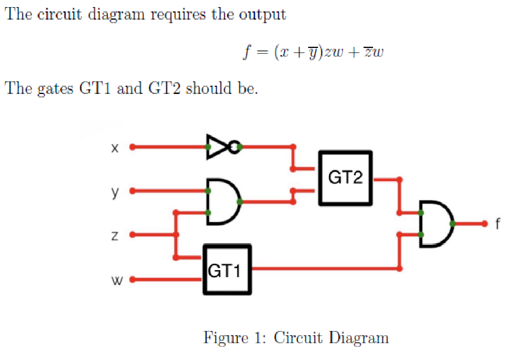

**Marks:** 3

**Source question ID:** 6406531867621 · **Source type:** MCQ
**PDF page(s):** 4

- ( ) OR, NOR
- ( ) OR, NAND
- ( ) AND, NAND
- ( ) AND, NOR
- ( ) None of these

**Source option IDs (A onward):** 6406536048693, 6406536048694, 6406536048695, 6406536048696, 6406536048697.

<b>Answer & Solution</b>

**Answer:** E

**Printed PDF key:** `B`.

#### Step-by-step solution

1. Read the actual wires: GT2 receives $\overline{x}$ and $yz$; GT1 receives $z,w$. The final gate is AND.
2. Consequently NAND at GT2 gives $\overline{\overline{x}\,yz}=x+\overline{y}+\overline{z}$, whereas NOR gives $\overline{\overline{x}+yz}=x(\overline{y}+\overline{z})$.
3. GT1 gives either $z+w$ (OR) or $zw$ (AND). Multiply that result by the GT2 result and compare with the requested function.
4. At $(x,y,z,w)=(1,0,1,0)$, the requested function is 0, but both OR-at-GT1 choices output 1. This eliminates A and B.
5. At $(x,y,z,w)=(0,0,0,1)$, the requested function is 1, but both AND-at-GT1 choices output 0. This eliminates C and D.
6. No offered pair matches: choose E.

**PDF key correction:** The printed key B gives $(z+w)(x+\overline{y}+\overline{z})$, not the printed target. The target includes a factor $w$ in its first term; it has not been silently removed.

**Quick learning tip:** Translate each gate from the wires first, then disprove a candidate with one input combination; one mismatch is enough.

---

### Q9 — Minimum XNOR gates (Numeric input)

What is the minimum number of 2-input XNOR gates required to implement the circuit for minimized SOP expression of the function

$$f(x,y,z)=\sum m(0,2,5,7)?$$

**Marks:** 3

**Source question ID:** 6406531867622 · **Source type:** SA · **Source response:** Numeric
**PDF page(s):** 5
**Source response settings:** Numeric · Evaluation required: Yes · Show word count: Yes · Answers type: Equal · Text area: PlainText

<b>Answer & Solution</b>

**Answer:** 1

**Printed PDF key:** `1`.

#### Step-by-step solution

1. Use the usual minterm order xyz, with x most significant: 0 = 000, 2 = 010, 5 = 101, 7 = 111.
2. Pair minterms 0 and 2 to eliminate y, giving $\overline{x}\,\overline{z}$. Pair 5 and 7 to give $xz$.
3. The minimized SOP is $f=\overline{x}\,\overline{z}+xz$, which is XNOR of x and z; y is irrelevant.
4. A single two-input XNOR gate implements this function. Zero gates cannot produce this nontrivial two-input function, so the minimum is 1.

**Quick learning tip:** Pair minterms that differ in only the irrelevant variable; $\overline{x}\,\overline{z}+xz$ is the XNOR pattern.

---

### Q10 — Multiplexer propagation delay (Numeric input)

Given that NOT, 2-input AND/OR gates have delays of 1 ns, what will be the maximum delay of a 2x1 multiplexer circuit? Note: if the answer is 1 ns, write 1.

**Marks:** 3

**Source question ID:** 6406531867623 · **Source type:** SA · **Source response:** Numeric
**PDF page(s):** 5
**Source response settings:** Numeric · Evaluation required: Yes · Show word count: Yes · Answers type: Equal · Text area: PlainText

<b>Answer & Solution</b>

**Answer:** 3

**Printed PDF key:** `3`.

#### Step-by-step solution

1. The standard two-to-one multiplexer is $Y=\overline{S}I_0+SI_1$.
2. A data-input path traverses one AND and one OR gate: 2 ns.
3. The select path through the complemented branch traverses NOT, AND, then OR: $1+1+1=3$ ns.
4. The maximum propagation delay is therefore 3 ns. This assumes the standard minimal AND/OR/NOT implementation, not arbitrary extra gates.

**Quick learning tip:** For propagation delay, add the gate delays along each input-to-output path and take the largest sum.

---

### Q11 — Three D flip-flops with NAND feedback (Short Answer)

Consider the circuit consisting of three D flipflops and one NAND gate as shown below. The initial states are Q1=1, Q2=0, and Q3=1. What is the output after (Q1,Q2,Q3) after 4 clock pulse? Note: If answer if Q1=0, Q2=0,Q3=0, then write 000

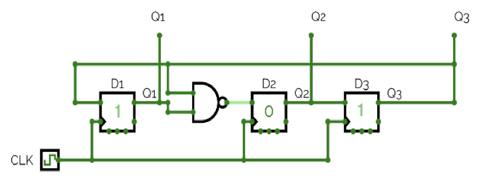

**Marks:** 3

**Source question ID:** 6406531867624 · **Source type:** SA · **Source response:** Numeric
**PDF page(s):** 6
**Source response settings:** Numeric · Evaluation required: Yes · Show word count: Yes · Answers type: Equal · Text area: PlainText

<b>Answer & Solution</b>

**Answer:** 111

**Printed PDF key:** `111`.

#### Step-by-step solution

1. Read each D input from the diagram: $Q_1^+=Q_3$, $Q_2^+=\overline{Q_1Q_3}$, and $Q_3^+=Q_2$.
2. All three flip-flops sample their **old** input values on the same edge; do not update them sequentially in place.
3. Starting at 101, evaluate every edge:

| Clock pulses | Q1 | Q2 | Q3 |
| --- | --- | --- | --- |
| 0 | 1 | 0 | 1 |
| 1 | 1 | 0 | 0 |
| 2 | 0 | 1 | 0 |
| 3 | 0 | 1 | 1 |
| 4 | 1 | 1 | 1 |
| 5 | 1 | 0 | 1 |

4. After 4 pulses the ordered state is 111.

**Quick learning tip:** For synchronous D flip-flops, write all next-state equations and evaluate them from the same old state.

---

### Q12 — Register-bank address width (Numeric input)

A processor uses the following control word format:

| Opcode | Src1 | Src2 | Dest |
| --- | --- | --- | --- |
| 10 | 10101 | 01110 | 00011 |

How many registers can be addressed in the register bank?

**Marks:** 3

**Source question ID:** 6406531867625 · **Source type:** SA · **Source response:** Numeric
**PDF page(s):** 6
**Source response settings:** Numeric · Evaluation required: Yes · Show word count: Yes · Answers type: Equal · Text area: PlainText

<b>Answer & Solution</b>

**Answer:** 32

**Printed PDF key:** `32`.

#### Step-by-step solution

1. Each register selector has 5 bits; the opcode is a separate field.
2. A 5-bit selector has $2^5=32$ distinct bit patterns.
3. Therefore the bank can address 32 registers. Do not add the widths of Src1, Src2, and Dest: they independently select from the same bank.

**Quick learning tip:** A register selector with $k$ bits names $2^k$ registers; do not add independent selector fields.

---

### Q13 — Subtraction using two’s complement (Short Answer)

Using 2's complement method, evaluate $A-B$ where $A=80$ and $B=150$. Give the answer in 8-bit binary format.

**Marks:** 3

**Source question ID:** 6406531867626 · **Source type:** SA · **Source response:** Numeric
**PDF page(s):** 7
**Source response settings:** Numeric · Evaluation required: Yes · Show word count: Yes · Answers type: Equal · Text area: PlainText

<b>Answer & Solution</b>

**Answer:** 10111010

**Printed PDF key:** `10111010`.

#### Step-by-step solution

1. Express the operands as eight-bit unsigned patterns: A = `01010000`, B = `10010110`.
2. Complement B and add 1: `01101001 + 1 = 01101010`.
3. Add to A: `01010000 + 01101010 = 010111010`. Retain the low eight bits, `10111010`.
4. The result has sign bit 1. Its signed value is $186-256=-70$, agreeing with $80-150=-70$. The positive operand 150 is outside signed eight-bit range; the subtraction uses its unsigned bit pattern and yields a representable signed result.

**Quick learning tip:** Two's-complement subtraction shortcut: $A-B=A+\overline{B}+1$; keep the required width and discard only the carry out.

---

### Q14 — Truth table and overbar scope (MCQ)

Choose the correct truth table according to the given Boolean expression:

$$F(x,y,z)=\overline{xyz}+\overline{x}y+x\overline{z}.$$

The first overbar spans the entire product xyz, as printed. Each table retains the original row order.

**Marks:** 3

**Source question ID:** 6406531867627 · **Source type:** MCQ
**PDF page(s):** 8–9

- ( ) 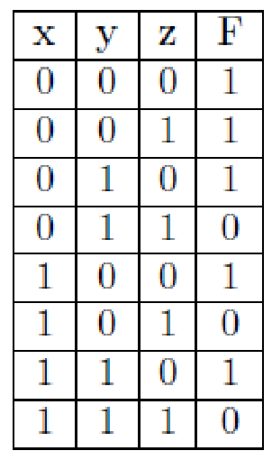
- ( ) None of these
- ( ) 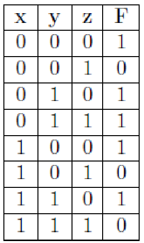
- ( ) 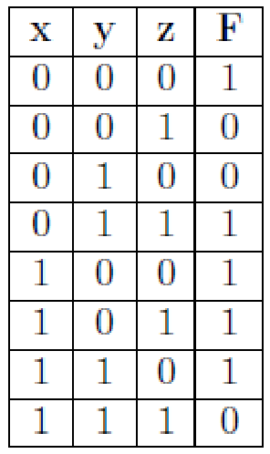

**Source option IDs (A onward):** 6406536048703, 6406536048704, 6406536048705, 6406536048706.

<b>Answer & Solution</b>

**Answer:** B

**Printed PDF key:** `C`.

#### Step-by-step solution

1. The first term is the complement of the entire product: $\overline{xyz}$, not $\overline{x}\,\overline{y}\,\overline{z}$.
2. It is 1 in every row except xyz = 111. The other two terms cannot turn any of those 1s into 0.
3. At 111 the remaining terms $\overline{x}y$ and $x\overline{z}$ both equal 0, so F = 0.
4. The full truth table is:

| x | y | z | F |
| --- | --- | --- | --- |
| 0 | 0 | 0 | 1 |
| 0 | 0 | 1 | 1 |
| 0 | 1 | 0 | 1 |
| 0 | 1 | 1 | 1 |
| 1 | 0 | 0 | 1 |
| 1 | 0 | 1 | 1 |
| 1 | 1 | 0 | 1 |
| 1 | 1 | 1 | 0 |

5. No offered table matches; choose B, None of these.

**PDF key correction:** C is marked in the source, but it outputs 0 at 001 and 101, where the printed $\overline{xyz}$ is 1. C would match $\overline{x}\,\overline{y}\,\overline{z}+\overline{x}y+x\overline{z}$, a different expression. The continuous source overbar has been preserved.

**Quick learning tip:** Always check the scope of an overbar. A bar over the whole product $xyz$ is 1 everywhere except $xyz=111$.

---

### Q15 — Common-bus control word (Short Answer)

Consider a common bus architecture containing memory and three registers: A, B, and C. The control word format is shown below.

| Memory Read | Memory Write | A Input | A Output | B Input | B Output | C Input | C Output |
| --- | --- | --- | --- | --- | --- | --- | --- |
| bit 7 | bit 6 | bit 5 | bit 4 | bit 3 | bit 2 | bit 1 | bit 0 |

What would be the control word if you intend to perform a register transfer from register A to register B?

Note: Provide your answer in hexadecimal format (e.g., 0x3A).

The bit numbers are an explanatory annotation: use the printed left-to-right order as MSB to LSB and active-high controls.

**Marks:** 3

**Source question ID:** 6406531867628 · **Source type:** SA · **Source response:** Alphanumeric (case insensitive)
**PDF page(s):** 9
**Source response settings:** Alphanumeric (case insensitive) · Evaluation required: Yes · Show word count: Yes · Answers type: Equal · Text area: PlainText · Case sensitive: No

<b>Answer & Solution</b>

**Answer:** 0x18

**Printed PDF key:** `0x18`.

#### Step-by-step solution

1. Enable register A Output so the source drives the bus.
2. Enable register B Input so the destination loads the bus. Disable all other controls, including memory read/write.
3. In the specified order the bits are `00011000`.
4. Group into nibbles: `0001 1000`, giving `0x18`.

**Quick learning tip:** For a bus transfer, assert exactly two controls: source Output and destination Input; then write the fields as one binary word.

---

### Q16 — Three-address instruction length (Numeric input)

A modern RISC processor contains 64 registers in its general-purpose register file. The Arithmetic Logic Unit (ALU) of the processor is capable of executing 16 distinct operations, which include standard arithmetic and logical functions.

What is the **minimum** number of bits required by a **three-address** instruction to perform a bitwise **OR** operation between two source operands located in the register file, and store the computational result back into a designated destination register?

**Marks:** 3

**Source question ID:** 6406531867629 · **Source type:** SA · **Source response:** Numeric
**PDF page(s):** 10
**Source response settings:** Numeric · Evaluation required: Yes · Show word count: Yes · Answers type: Equal · Text area: PlainText

<b>Answer & Solution</b>

**Answer:** 22

**Printed PDF key:** `22`.

#### Step-by-step solution

1. Each register address requires $\log_2 64=6$ bits.
2. Three addresses identify source 1, source 2, and destination: $3\times 6=18$ bits.
3. Selecting one of 16 ALU operations requires $\log_2 16=4$ opcode bits.
4. The minimum total is $18+4=22$ bits, assuming no additional mode, immediate, or alignment fields.

**Quick learning tip:** Three-address width formula: $3\log_2(R)+\log_2(O)$, where $R$ is the register count and $O$ the ALU-operation count.

---

### Q17 — Interleaved MOV encoding (Short Answer)

Suppose we want to execute a data movement instruction, where we move the data present in register $R_{25}$ to register $R_{18}$.

Instruction: $\mathrm{MOV}\ R_d,R_r$

$R_d$: Destination register; $R_r$: Source register. Operands: $0\le d\le31$, $0\le r\le31$.

Instruction Format (16-bit):

| Nibble 1 | Nibble 2 | Nibble 3 | Nibble 4 |
| --- | --- | --- | --- |
| `0010` | `11rd` | `drdr` | `rrdd` |

What will be the hexadecimal machine code for the instruction? Note: Enter the value in hexadecimal format (e.g. 0x24E8).

**Marks:** 3

**Source question ID:** 6406531867630 · **Source type:** SA · **Source response:** Alphanumeric (case insensitive)
**PDF page(s):** 10
**Source response settings:** Alphanumeric (case insensitive) · Evaluation required: Yes · Show word count: Yes · Answers type: Equal · Text area: PlainText · Case sensitive: No

<b>Answer & Solution</b>

**Answer:** 0x2F46

**Printed PDF key:** `0x2F46`.

#### Step-by-step solution

1. The source is r = 25 = `11001` and the destination is d = 18 = `10010`.
2. Read each operand from most significant bit to least significant bit as its letter appears from left to right in the format.
3. The expanded layout is `0010 | 11 r4 d4 | d3 r3 d2 r2 | r1 r0 d1 d0`.
4. Substitution gives `0010 | 1111 | 0100 | 0110`, which is `0x2F46`.

**Encoding assumption:** The source uses repeated r/d placeholders without subscripts. The conventional MSB-first consumption above is used explicitly; do not substitute an unrelated processor’s MOV layout.

**Quick learning tip:** When a format repeats r and d, consume their bits in the displayed left-to-right order, group into nibbles, and only then convert to hex.

---

### Q18 — Gated D-latch timing (Numeric input)

Consider a gated D-Latch constructed using NAND gates. The initial input (at 0 ns) is D = 1, and the write enable is high. The write enable toggles between high and low every 5 ns. The input D changes from 0 to 1 and from 1 to 0 every 6 seconds. What will be the output Q after 16 ns?

**Marks:** 3

**Source question ID:** 6406531867631 · **Source type:** SA · **Source response:** Numeric
**PDF page(s):** 11
**Source response settings:** Numeric · Evaluation required: Yes · Show word count: Yes · Answers type: Equal · Text area: PlainText

<b>Answer & Solution</b>

**Answer:** 1

**Printed PDF key:** `1`.

#### Step-by-step solution

1. With write enable high initially, the D latch is transparent and takes D = 1.
2. The printed D toggle interval is **6 seconds**, equal to 6,000,000,000 ns. No D transition occurs by 16 ns.
3. When enabled the latch sees 1, and when disabled it holds 1. Therefore Q = 1 at 16 ns.

**Unit ambiguity:** If “6 seconds” was intended to say **6 ns**, the events would instead be:

| Time (ns) | Event | Q after event |
| --- | --- | --- |
| 0 | Enable high; D=1 | 1 |
| 5 | Enable low; hold | 1 |
| 6 | D=0 while disabled | 1 |
| 10 | Enable high; D=0 | 0 |
| 12 | D=1 while enabled | 1 |
| 15 | Enable low; hold | 1 |
| 18 | D=0 while disabled | 1 |
| 20 | Enable high; D=0 | 0 |
| 22 | No new transition | 0 |

At 16 ns, both interpretations give 1, agreeing with the PDF key.

**Quick learning tip:** A gated latch is transparent while enable is high and holds while low; compare every data transition with the enable window.

---

### Q19 — Clocked XNOR timing (MCQ)

In the circuit shown below, D1 and D2 are positive edge triggered D flipflops, x1 and x2 are inputs of D1 and D2 flipflop. Choose the correct timing diagram of the output Y.

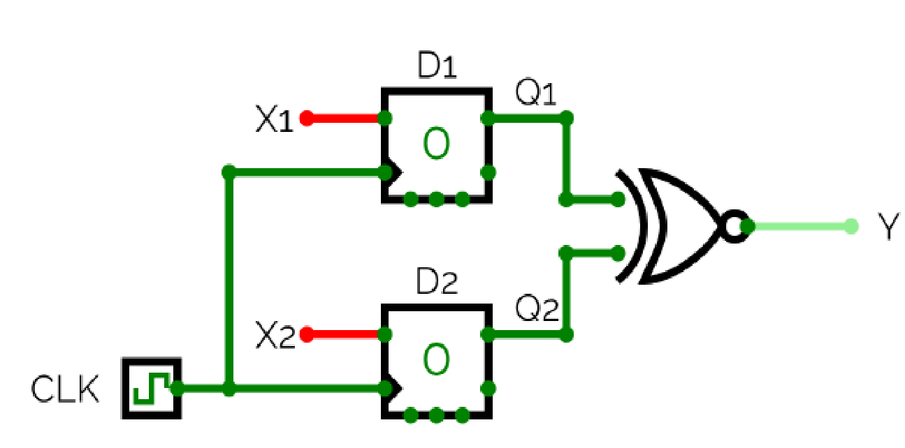

Each option includes the source CLK, x1, x2 and candidate Y waveforms.

**Marks:** 3

**Source question ID:** 6406531867632 · **Source type:** MCQ
**PDF page(s):** 12–13

- ( ) 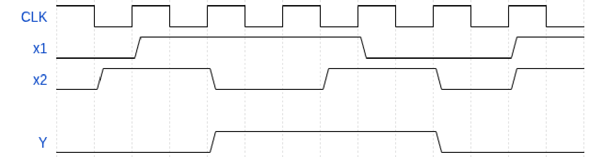
- ( ) 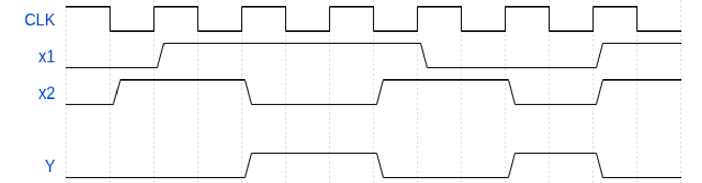
- ( ) 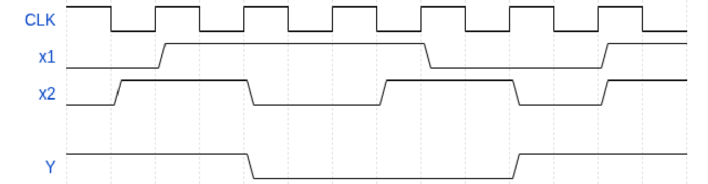
- ( ) 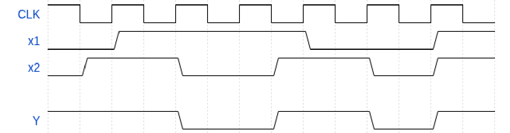
- ( ) None of these

**Source option IDs (A onward):** 6406536048711, 6406536048712, 6406536048713, 6406536048714, 6406536048715.

<b>Answer & Solution</b>

**Answer:** E

**Printed PDF key:** `C`.

#### Step-by-step solution

1. The output gate is XNOR (XOR shape with an output bubble), so $Y=\overline{Q_1\oplus Q_2}$. Initially $Q_1=Q_2=0$, hence Y = 1.
2. The flip-flops sample only the **rising** clock edges. Input transitions between these edges do not immediately change Q or Y.
3. Read the inputs immediately before each of the six subsequent rising edges. The input transitions are visibly offset from the clock edges:

| Rising edge | Sampled x1 | Sampled x2 | Y after edge |
| --- | --- | --- | --- |
| 1 | 0 | 1 | 0 |
| 2 | 1 | 1 | 1 |
| 3 | 1 | 0 | 0 |
| 4 | 1 | 1 | 1 |
| 5 | 0 | 1 | 0 |
| 6 | 0 | 0 | 1 |

4. The output starts high and then has the successive levels 0, 1, 0, 1, 0, 1, changing only at rising clock edges. None of A-D shows this sequence, so choose E.

**PDF key correction:** C is marked, but it does not even fall at the first rising edge, when the sampled pair is 01. Its transitions occur near input/falling-edge events rather than the required rising-edge sampling sequence. Do not replace the printed positive-edge trigger with another convention to force that key.

**Quick learning tip:** D flip-flop timing rule: sample inputs just before each rising edge; output changes only after that edge, then apply XNOR.

---

### Q20 — JK flip-flop with complementary feedback (Short Answer)

Consider the circuit diagram as shown below. Assuming it was initially cleared to 0, state the output(Y) for the next 4 clock pulses.

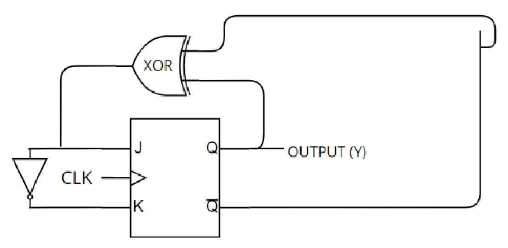

**Marks:** 3

**Source question ID:** 6406531867633 · **Source type:** SA · **Source response:** Numeric
**PDF page(s):** 14
**Source response settings:** Numeric · Evaluation required: Yes · Show word count: Yes · Answers type: Equal · Text area: PlainText

<b>Answer & Solution</b>

**Answer:** 1111

**Printed PDF key:** `1111`.

#### Step-by-step solution

1. The feedback signals are Q and its complement, so their XOR is always 1: $Q\oplus\overline{Q}=1$.
2. Therefore J = 1 and, through the inverter, K = 0.
3. For a JK flip-flop, J = 1 and K = 0 sets Q to 1 at each active clock edge. It does not toggle; toggling would require J = K = 1.
4. From the initial Q = 0, the next four outputs are 1, 1, 1, 1. Enter 1111.

**Quick learning tip:** JK reminder: 10 sets, 01 resets, 11 toggles, and 00 holds. Derive J and K before iterating clock pulses.

---

### Q21 — Minimized four-variable NAND network (Numeric input)

Consider the function given below:

$$F(A,B,C,D)=\sum m(1,2,3,5,6,7,9,10,11).$$

If we want to implement the minimized expression using only 2-input NAND gates, what is the minimum number of NAND gates required?

**Marks:** 3

**Source question ID:** 6406531867634 · **Source type:** SA · **Source response:** Numeric
**PDF page(s):** 14
**Source response settings:** Numeric · Evaluation required: Yes · Show word count: Yes · Answers type: Equal · Text area: PlainText

<b>Answer & Solution</b>

**Answer:** 4

**Printed PDF key:** `4`.

#### Step-by-step solution

1. Using ABCD order (A most significant), the included minterms have AB equal to 00, 01, or 10, and CD equal to 01, 10, or 11. Thus $F=\overline{AB}(C+D)$.
2. Let $n_1=\mathrm{NAND}(A,B)=\overline{AB}$ (gate 1). Distribute to obtain $F=n_1C+n_1D$.
3. Produce $n_2=\mathrm{NAND}(n_1,C)$ and $n_3=\mathrm{NAND}(n_1,D)$ (gates 2 and 3).
4. Gate 4 produces $\mathrm{NAND}(n_2,n_3)=n_1C+n_1D=F$. No separate OR gate or final inverter is needed.
5. For minimality, a network depending on four distinct inputs with at most three two-input gates must be a tree with four input leaves (sharing a gate would reduce the number of distinct inputs). A balanced three-NAND tree gives $uv+st$ (7 true rows), while a chain gives a permutation of $\overline{((uv)+\overline{w})t}$ (11 true rows). This function has 9 true rows, so neither tree shape works. Fewer gates cannot depend on all four inputs. Four is therefore minimal.

**Quick learning tip:** NAND-only pattern: make the shared complement once, form complemented product terms, and use a final NAND as the OR by De Morgan.

---
