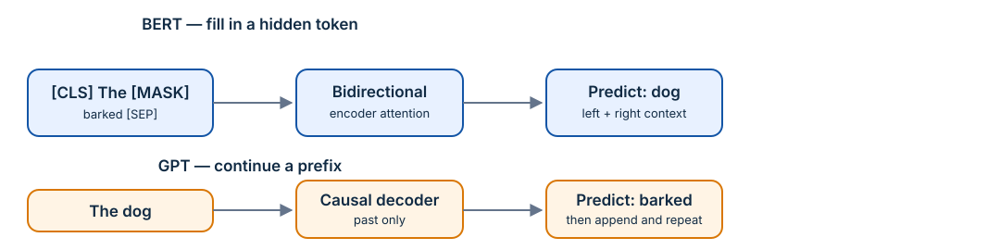

# Learning 06 — BERT and Masked Language Modeling

## Goal

Learn how BERT uses an encoder and bidirectional context to predict deliberately hidden tokens, then use its special representations for classification.

### Q1 — BERT's core stack (MCQ)

What is BERT fundamentally built from?

- ( ) A decoder-only causal stack
- ( ) An encoder-only stack with bidirectional self-attention
- ( ) A no-attention recurrent stack
- ( ) An encoder-decoder translation stack only

Solution

BERT uses transformer encoder blocks. In ordinary self-attention, a token can attend to contextual tokens on both its left and right.

**Mnemonic:** **B**ERT looks **B**oth ways; **G**PT **G**oes forward.

**Answer:** B

### Q2 — MLM target (MCQ)

In masked language modeling (MLM), what is the model trained to predict?

- ( ) The next token at every position only
- ( ) The original identities of selected hidden/corrupted tokens
- ( ) The number of transformer layers
- ( ) A fixed answer regardless of input

Solution

Some input tokens are selected and replaced/corrupted during training. BERT uses surrounding context to recover their original token identities.

**Answer:** B

### Q3 — One masked-token loss (Numeric Input)

The correct original token has predicted probability \(0.7\). What is its MLM cross-entropy contribution \(-\ln(0.7)\), rounded to three decimals?

*(Numeric input)*

Solution

\[
-\ln(0.7)=0.356675\ldots\approx0.357.
\]

The loss rewards placing high probability on the true hidden token.

**Answer:** \(\boxed{0.357}\)

### Q4 — Two masked tokens (Numeric Input)

Two selected tokens have correct-token probabilities \(0.5\) and \(0.25\). If the MLM loss is the **sum** over selected positions, what is the total loss, rounded to three decimals?

*(Numeric input)*

Solution

\[
-\ln(0.5)-\ln(0.25)=0.693147+1.386294=2.079441.
\]

So the summed loss is about \(2.079\). If an objective asks for a mean, divide by the number of selected positions afterward.

**Answer:** \(\boxed{2.079}\)

### Q5 — Which positions contribute? (MCQ)

Under the standard simplified MLM loss, which positions contribute directly to the prediction loss?

- ( ) Only the positions selected for masking/corruption
- ( ) Every position equally, whether selected or not
- ( ) Only the `[CLS]` position
- ( ) No positions; MLM has no loss

Solution

The model processes the whole corrupted sequence, but the usual MLM objective computes token-prediction loss at the selected target positions. Their surrounding unmasked tokens still help provide context through attention.

**Answer:** A

### Q6 — `[CLS]` representation (MCQ)

For single-sentence sequence classification, how is BERT's `[CLS]` representation commonly used?

- ( ) It is discarded before training
- ( ) It is fed to a task-specific classifier head
- ( ) It is used only as a padding symbol
- ( ) It blocks all attention scores

Solution

`[CLS]` is placed at the beginning of the input. Its final contextual vector can be passed to a learned classifier for tasks such as sentiment or topic classification.

**Answer:** B

### Q7 — `[SEP]` role (MCQ)

What does `[SEP]` commonly mark in BERT-style inputs?

- ( ) The end of one segment and/or separation between segments
- ( ) The only token that may be masked
- ( ) The vocabulary softmax denominator
- ( ) A causal future boundary for generation

Solution

`[SEP]` separates segments such as sentence A and sentence B, and can mark the end of the input sequence. Segment/type embeddings can additionally tell the model which segment each token belongs to.

**Answer:** A

### Q8 — Sentence-pair layout (MCQ)

Which is a typical BERT input layout for two text segments A and B?

- ( ) `[CLS] A [SEP] B [SEP]`
- ( ) `A B [MASK]` only
- ( ) `[CLS] A B` with no boundary signal ever
- ( ) `B [CLS] A [PAD]` only

Solution

The `[CLS]` token supplies a pooled classification location, and `[SEP]` provides segment boundaries:

\[
[\text{CLS}]\;A\;[\text{SEP}]\;B\;[\text{SEP}].
\]

**Answer:** A

### Q9 — BERT versus GPT (MSQ)

Which comparisons are correct?

- ( ) BERT MLM can use left and right context around a selected token.
- ( ) GPT causal language modeling blocks future tokens at a position.
- ( ) BERT is naturally used as a left-to-right free-running generator without changing the objective.
- ( ) Both BERT and GPT use token embeddings and transformer attention.

Solution

BERT's encoder attention is bidirectional in its MLM setup, while GPT's causal mask supports next-token generation. Both are transformer architectures with learned representations, but their pretraining objectives create different strengths.

**Answer:** A, B and D

### Q10 — Bidirectional intuition (MCQ)

Why can BERT be useful for understanding a token in a sentence?

- ( ) Its ordinary encoder attention can incorporate context on both sides
- ( ) It predicts only from tokens that come after it
- ( ) It forbids all token-to-token interaction
- ( ) It removes words before making embeddings

Solution

For a masked word in “The bank of the river,” context on both sides helps resolve meaning. BERT learns to exploit such two-sided context during MLM pretraining.

**Answer:** A

### Q11 — Classification logits (Numeric Input)

Suppose the final `[CLS]` vector has width \(d_{\text{model}}=16\) and a classifier predicts 3 classes. How many logits does the classifier output for one example?

*(Numeric input)*

Solution

One logit is produced per class, independent of hidden width after the linear map:

\[
W_{\text{cls}}\in\mathbb{R}^{16\times3}\quad\Rightarrow\quad 3\text{ logits}.
\]

**Answer:** \(\boxed{3}\)

### Q12 — Special-input information (MSQ)

Which information can a BERT-style input representation include before entering encoder layers?

- ( ) Token embeddings
- ( ) Positional embeddings
- ( ) Segment/type embeddings for sentence pairs
- ( ) The future ground-truth label as an input feature

Solution

BERT commonly combines token, position, and token-type/segment information. The supervised label is a target used for loss, not an input that the model should receive.

**Answer:** A, B and C

### Q13 — Choose the objective (MCQ)

You want a model to fill in a deliberately hidden word using both neighboring words. Which pretraining objective most directly matches this goal?

- ( ) Masked language modeling
- ( ) Greedy decoding
- ( ) Causal next-token prediction only
- ( ) Top-\(k\) sampling

Solution

MLM explicitly trains the model to recover selected hidden tokens from their surrounding context. Greedy/top-\(k\) are decoding methods, not pretraining objectives.

**Answer:** A

### Q14 — MLM loss form (Short Answer)

Write a simplified MLM loss for selected mask positions \(M\), where \(x_i\) is the original token and \(\tilde{x}\) is the corrupted input.

Solution

\[
\mathcal{L}_{\text{MLM}}=-\sum_{i\in M}\log P(x_i\mid\tilde{x}).
\]

The conditioning sequence \(\tilde{x}\) includes the corrupted input; the target remains the original token \(x_i\).

**Answer:** `-sum_{i in M} log P(x_i | x_tilde)`

### Q15 — Model-selection checkpoint (MCQ)

Which model family is the more direct starting point for classifying whether a review is positive or negative using a pooled sentence representation?

- ( ) BERT-style encoder model with a classifier head
- ( ) GPT decoding with random sampling only
- ( ) Exhaustive sequence search only
- ( ) A causal mask with no learned model

Solution

A BERT-style encoder produces contextual token representations and a `[CLS]` representation that can feed a classification head. A generative model can be adapted to classification too, but BERT's setup is the direct conceptual match here.

**Answer:** A

