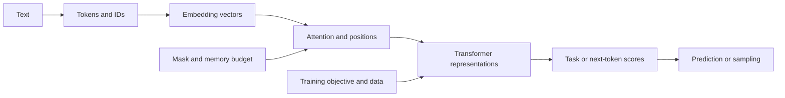
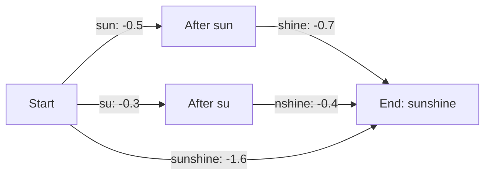
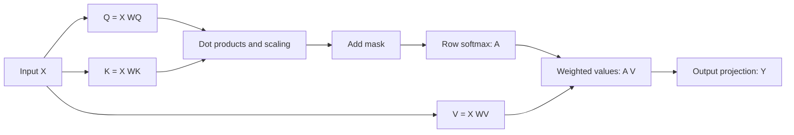
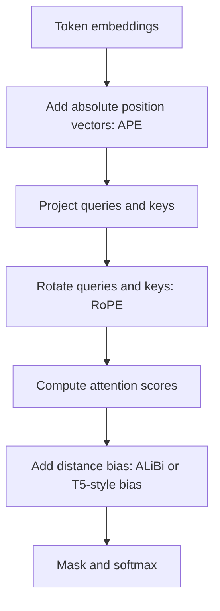
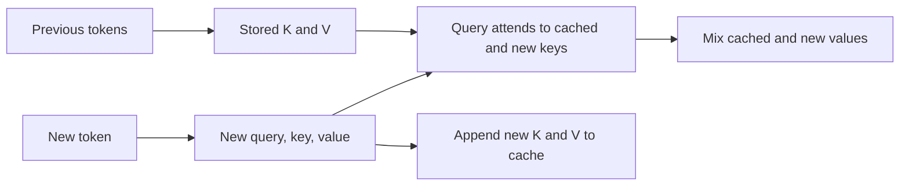
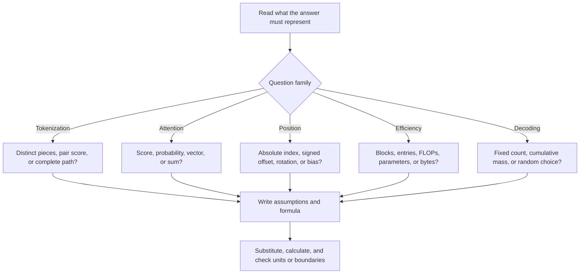

# 2025 End-Term Learning Notes — From First Principles to Solving the Papers

One beginner guide for [April 2025](April-2025-ET.md), [August 2025](August-2025-ET.md), and [December 2025](December-2025-ET.md). It covers all **64 scored questions**, with the original question numbers mapped in Section 12. Read a lesson, reproduce its worked example without looking, then attempt the linked paper questions. The paper solutions contain the full original options and source images.

The examples below are teaching examples or independent calculations from the supplied papers. They are not an official answer key. Where a paper leaves a convention unspecified, the notes explain the alternatives.

## Contents and learning route

1. [Foundations: words, vectors, and the Transformer](#1-foundations)
2. [Tokenization: characters, WordPiece, and Viterbi](#2-tokenization)
3. [Attention: calculate one output by hand](#3-attention)
4. [Training: BERT, causal prediction, and teacher forcing](#4-training)
5. [Decoding: temperature, top-k, and top-p](#5-decoding)
6. [Position: APE, RPE, RoPE, ALiBi, and NoPE](#6-position)
7. [Sparse attention: masks, permutations, and cost](#7-sparse-attention)
8. [Counting: parameters, operations, and KV cache](#8-counting)
9. [Data, scaling laws, and span corruption](#9-data-and-scaling)
10. [Formula sheet and exam decision rules](#10-formula-sheet)
11. [Practice ladder with worked answers](#11-practice-ladder)
12. [Every-question coverage map and revision plan](#12-coverage-map)



**A study habit that works:** explain each symbol aloud before using a formula. If you cannot explain what a number counts, do not multiply by it yet.

<a id="1-foundations"></a>
## 1. Foundations

### 1.1 A small vocabulary for the whole guide

A **token** is a unit of text such as a word, a character, or part of a word. A tokenizer assigns it an integer ID. An **embedding** is a learned vector looked up using that ID. A vector is simply an ordered list of numbers; a matrix is a table of numbers.

For example, a teaching tokenizer might produce:

```text
"cats sleep" → ["cat", "s", "sleep"] → [12, 8, 31]
                                            ↓ look up three rows
                              X = [[1, 0], [0, 1], [1, 1]]
```

This input has three tokens, even though it has two words. The embedding matrix for the **whole vocabulary** has one row per vocabulary entry. The matrix $X$ for this **input sentence** has one row per input token, in sentence order.

| Symbol | Meaning in these notes | Example |
|---|---|---|
| $T$ | Number of tokens in the current sequence | $T=6$ |
| $d$ or $d_{model}$ | Width of a token's model vector | $d=512$ |
| $H$ | Number of attention heads | $H=8$ |
| $d_k,d_v$ | Key/query width and value width per head | Often $d/H$ |
| $L$ | Number of Transformer layers | $L=6$ |
| $n$ | Number of blocks | $n=5$ |
| $b$ | Tokens per block | $b=T/n$ for equal blocks |
| $c$ | Allowed keys per query in a fixed-width attention pattern | $c=5$ |
| $N,D$ | Model parameter count and training-token count in scaling laws | Different from $T$ |
| $\tau$ | Sampling temperature in this guide | Some exam questions call it $T$ |

The same letter can mean different things in different questions. December Q2 uses $H$ for hidden width; its normalization count is $2H$. In the cache formulas here, $H$ means **heads**.

### 1.2 The four math operations you need

**Dot product:** multiply matching coordinates, then add:

$$[2,3]\cdot[4,1]=2\cdot4+3\cdot1=11.$$

**Matrix multiplication:** every output entry is a row-column dot product:

$$[a,b]\begin{bmatrix}u&v\\\\w&z\end{bmatrix}=[au+bw,\ av+bz].$$

Example:

$$[2,3]\begin{bmatrix}1&0\\\\2&1\end{bmatrix}=[8,3].$$

The order matters: matrix multiplication usually cannot be reversed.

**Transpose:** $K^T$ exchanges rows and columns. The shape rule is

$$[r\times s]\,[s\times t]\longrightarrow[r\times t].$$

**Softmax:** turn a row of scores $s_j$ into nonnegative weights summing to one:

$$a_j=\frac{e^{s_j}}{\sum_m e^{s_m}}.$$

For $[0,\ln3]$, the exponentials are $[1,3]$, so softmax gives $[1/4,3/4]$. Larger scores get larger weights. Subtracting the largest score before exponentiating changes no probabilities and prevents numerical overflow.

**Weighted sum:** weights $[1/4,3/4]$ applied to values $[2,0]$ and $[0,4]$ give

$$\tfrac14[2,0]+\tfrac34[0,4]=[0.5,3].$$

**Memory hook:** shape first; row times column; softmax across one row; weighted sum of values.

### 1.3 What a Transformer block contributes

Attention mixes information **between tokens**. A feed-forward network (FFN) transforms each token vector **at its own position**, using shared weights. Residual connections add a block's input back to its output; normalization controls the scale of activations. Exact normalization placement varies by architecture.

An FFN commonly has the form

$$\mathrm{FFN}(x)=\phi(xW_1+b_1)W_2+b_2.$$

The activation $\phi$ adds nonlinearity. With no nonlinearity, two linear transformations would collapse into one. Dataset, activation, positional method, and attention pattern are all design choices: this answers the principle behind April Q12.

<a id="2-tokenization"></a>
## 2. Tokenization

### 2.1 Vocabulary size is different from sequence length

| Unit | Advantage | Cost or limitation |
|---|---|---|
| Whole word | Short token sequences | Large vocabulary; unseen words need handling |
| Character | Small alphabet; new words can reuse known letters | More tokens per sentence |
| Subword | Reuses meaningful pieces | Segmentation and special-token conventions matter |

If all characters of `moonwalk` already exist, adding this new English word does not enlarge a character vocabulary. An unseen symbol outside the alphabet can still cause an unknown-token problem. Thus “no unknown words” needs an **alphabet-coverage assumption**.

**Try now:** `cat` and `cater` have how many unique character tokens? Answer: five, `{c,a,t,e,r}`. Their total character occurrences are eight. A question about vocabulary asks for the first count.

### 2.2 WordPiece: score the association of adjacent tokens

For the paper's hand calculations, use

$$s(a,b)=\frac{f(a,b)}{f(a)f(b)}.$$

Here $f(a,b)$ counts the **adjacent pair**, and $f(a),f(b)$ count token occurrences in the current segmentation. Weight every occurrence by its word's corpus frequency. This is the pedagogical normalized-score construction described in the [Hugging Face WordPiece lesson](https://huggingface.co/docs/course/chapter6/6); exact training implementations can differ.

The denominator matters: a frequent pair made of very frequent pieces can score lower than a rare pair whose pieces nearly always occur together. BPE's usual raw pair-frequency criterion is different.

**A repeatable worksheet:** split words → count tokens → count adjacent pairs → divide → select maximum → merge everywhere → recount. Apply the stated tie-break only when scores are equal.

### 2.3 Full worked example: April's dictionary

```text
Word        Frequency   Initial token sequence
taught         2        t a u g h t </w>
laughter       1        l a u g h t e r </w>
drought        4        d r o u g h t </w>
tough          5        t o u g h </w>
```

The marker `</w>` is **one token**. There are ten distinct letters `{a,d,e,g,h,l,o,r,t,u}` plus that marker, so the initial vocabulary size is **11**.

| Token | t | a | u | g | h | l | e | r | d | o | `</w>` |
|---|---:|---:|---:|---:|---:|---:|---:|---:|---:|---:|---:|
| Weighted frequency | 14 | 3 | 12 | 12 | 12 | 1 | 1 | 5 | 4 | 9 | 12 |

For example, taught contains two t's and appears twice, so it contributes four to $f(t)$. Altogether $f(t)=4+1+4+5=14$.

Every initial candidate can now be compared using exact fractions:

| Pair | Score | Pair | Score | Pair | Score |
|---|---:|---|---:|---|---:|
| t,a | $1/21$ | a,u | $1/12$ | u,g | $1/12$ |
| g,h | $1/12$ | h,t | $1/24$ | t,`</w>` | $1/28$ |
| l,a | $1/3$ | t,e | $1/14$ | e,r | $1/5$ |
| r,`</w>` | $1/60$ | d,r | $1/5$ | r,o | $4/45$ |
| o,u | $1/12$ | t,o | $5/126$ | h,`</w>` | $5/144$ |

1. The smallest candidate score is $s(r,\text{</w>})=1/(5\cdot12)=1/60$.
2. The largest is $s(l,a)=1/(1\cdot3)=1/3$. Merge **la** first. Its score rounds to **0.33**.
3. Recount. One a becomes part of la, so $f(a)$ falls from 3 to 2 and $f(la)=1$.
4. The new largest scores tie: $s(e,r)=1/5$ and $s(d,r)=1/5$. In the source word order, e,r in laughter comes before d,r in drought. The specified tie-break picks **er**.
5. After two merges, `later</w>` tokenizes as **la, t, er, `</w>`**. There is no `lat` or `ter` token yet.

**Why recounting matters:** if the next question gives different words or frequencies, memorizing `la` will not help. The worksheet still works.

### 2.4 When there is not enough information

December Q3 gives replay frequency 100 and replus frequency 3. Those word frequencies alone do not give all current token frequencies. Even under the extra assumption that these are the entire corpus, segmented as `re + play` and `re + plus`, the scores tie:

$$\frac{100}{103\cdot100}=\frac{3}{103\cdot3}=\frac1{103}.$$

Different additional occurrences could change the comparison. **Insufficient information** is justified; “100 is larger than 3” does not solve this normalized-score problem.

### 2.5 Viterbi: choose the best complete segmentation

With a fixed unigram subword vocabulary, a segmentation's probability is the product of its token probabilities. Its **log probability** is their sum:

$$\log P(t_1,\ldots,t_k)=\sum_{r=1}^k\log P(t_r).$$

For August's `sunshine`, compare:

| Complete segmentation | Sum of log probabilities |
|---|---:|
| sunshine | $-1.6$ |
| su + nshine | $-0.3-0.4=-0.7$ |
| sun + shine | $-0.5-0.7=-1.2$ |
| sun + shi + ne | $-0.5-0.6-0.5=-1.6$ |
| su + n + shine | $-0.3-1.8-0.7=-2.8$ |
| su + n + shi + ne | $-0.3-1.8-0.6-0.5=-3.2$ |

The largest score is $-0.7$, so choose **su + nshine**. Negative scores still obey ordinary ordering: $-0.7>-1.2$.

Viterbi avoids listing every path on long strings. Let $F(j)$ be the best log score for the first $j$ characters:

$$F(0)=0,\qquad F(j)=\max_{i:\ s[i:j]\in\mathcal V}\left(F(i)+\log P(s[i:j])\right).$$

Start other entries at $-\infty$. Store which preceding boundary gave each maximum, then trace back from the final character. A locally attractive first token need not yield the best complete path.



This diagram shows three candidate paths; the table also checks the paths containing shorter pieces. SentencePiece is a toolkit supporting more than one tokenization model; this question specifically supplies a unigram-style scoring task.

**Memory hooks:** vocabulary = distinct pieces; WordPiece = pair divided by both marginals; Viterbi = best sum along a complete path.

<a id="3-attention"></a>
## 3. Attention

### 3.1 Query, key, and value have different jobs

Imagine looking up an item in a catalogue. The **query** describes what a position needs, the **keys** describe what positions offer, and the **values** carry the information to mix. These are learned transformations of the same input in self-attention:

$$Q=XW_Q,\qquad K=XW_K,\qquad V=XW_V.$$

$$S=QK^T/\sqrt{d_k},\qquad A=\mathrm{softmax}_{\text{row}}(S+M),\qquad Y=AVW_O.$$

The mask $M$ blocks forbidden interactions. Omit scaling, masking, or output projection only when the question's specified operation omits them.

| Quantity | Shape for one head | Meaning |
|---|---|---|
| $X$ | $T\times d$ | One input vector per token |
| $W_Q,W_K$ | $d\times d_k$ | Learned query/key projections |
| $Q,K$ | $T\times d_k$ | Projected query/key vectors |
| $V$ | $T\times d_v$ | Projected information vectors |
| $S,A$ | $T\times T$ | One score or weight per query-key pair |
| $AV$ | $T\times d_v$ | One weighted output per query |

Row $i$, column $j$ means **query i attends to key j**. Softmax acts on each row, because one query distributes its attention across keys.



### 3.2 Worked example: August's output for enjoy

The vocabulary order is tea, you, enjoy, often, but the input is **you enjoy tea often**. Reorder the embedding rows first:

$$X=\begin{bmatrix}1&1\\\\1&0\\\\0&1\\\\-1&1\end{bmatrix},\quad
W_V=\begin{bmatrix}1&0.2\\\\0.5&1\end{bmatrix},\quad
W_O=\begin{bmatrix}0.5&0.5\\\\1&-1\end{bmatrix}.$$

1. Multiply each row by $W_V$. For example, $[1,1]W_V=[1.5,1.2]$:

$$V=\begin{bmatrix}1.5&1.2\\\\1&0.2\\\\0.5&1\\\\-0.5&0.8\end{bmatrix}.$$

2. Enjoy is the second sentence token, so use the second supplied attention row $[0.43,0.25,0.21,0.10]$. It already accounts for query/key projections and softmax.
3. Form a weighted sum of **value rows**:

$$z=0.43[1.5,1.2]+0.25[1,0.2]+0.21[0.5,1]+0.10[-0.5,0.8]=[0.95,0.856].$$

4. Apply the output projection:

$$zW_O=[0.475+0.856,\ 0.475-0.856]=[1.331,-0.381].$$

5. The question asks for the sum, so enter $1.331-0.381=\boxed{0.95}$.

**Checks:** the answer is a scalar because the question requests a sum; the intermediate output is a two-coordinate vector. The supplied rounded row sums to 0.99. Preserve its entries instead of silently renormalizing the problem data.

### 3.3 Reordering without positions

Without positional information or an order-dependent mask, reordering a sentence reorders the attention matrix's rows and columns. The weight between a particular pair of words remains the same. With permutation matrix $P$:

$$X'=PX\quad\Longrightarrow\quad A'=PAP^T.$$

In August, tea → often is the old row 2, column 3 entry **0.07** (zero-based). Changing the input to tea you enjoy often moves that entry to row 0, column 3, still **0.07**.

This property is **permutation equivariance**: token outputs move with their input tokens. It does not say every token output or ordered output sequence is unchanged. A causal mask introduces order structure and changes this reasoning.

**Memory hook:** sentence order → values → correct attention row → weighted sum → output projection → requested scalar or vector.

<a id="4-training"></a>
## 4. Training

### 4.1 Match the requested output to the model task

| Task | What must be predicted? | Typical use |
|---|---|---|
| Causal LM (CLM) | Next token from preceding tokens | GPT-style generation |
| Masked LM (MLM) | Hidden token using visible surrounding text | BERT pretraining |
| Next Sentence Prediction (NSP) | Whether a sentence pair has the specified relationship | Original BERT pretraining |
| Sequence classification | One label for the whole input | Sentiment, topic |
| Named Entity Recognition (NER) | Labels locating entity spans | Disease names, people |

For a four-class BERT classifier, take the final **[CLS] vector**, feed it to a classification head, and produce four scores. If the vector has width $d$, a simple affine head has $d\cdot4+4$ parameters, including bias. This is an optional counting example, not an extra requirement of December Q4.

For disease-name extraction, classify tokens and combine them into spans. For instance:

```text
Text:       chronic   kidney    disease   improved
NER label:  B-DISEASE I-DISEASE I-DISEASE O
```

`B` begins a span, `I` continues it, and `O` means outside an entity. Subword predictions must be aligned to the original text. This differs from assigning one label to the entire note.

BERT input preparation commonly includes the matching pretrained subword tokenizer, [CLS]/[SEP], and position information (original BERT also uses segment embeddings). Punctuation can carry meaning; deleting all of it is not a standard requirement.

### 4.2 Autoregression is an objective; teacher forcing is an input policy

For tokens $x_1,\ldots,x_T$, the paper's conditional log-likelihood is

$$\mathcal L(\theta)=\sum_{t=1}^{T-1}\log P_\theta(x_{t+1}\mid x_1,\ldots,x_t).$$

Maximize this expression, or minimize its negative. A beginning-of-sequence token can add a prediction for $x_1$ in other formulations; use the indexing in the question.

With **teacher forcing**, earlier input tokens come from the correct training sequence. With free-running generation, they include the model's previous predictions:

```text
Training sentence:  I    like   green  tea
Inputs:             I    like   green
Targets:            like green  tea

Generation: "I" → model predicts "drink" → next input is "I drink"
```

The correct tokens are all available during training, so masked Transformer computations can process many prediction positions in parallel. Each position still sees only its permitted prefix. Parallel computation does not give permission to look at future answers.

Teacher forcing often makes training easier, because one wrong prediction does not corrupt every following training prefix. At inference, the future correct sequence is unknown. Encountering one's own imperfect prefixes creates **exposure bias**. Input policies can change during training; scheduled sampling is one possible strategy, not a guarantee of improvement.

### 4.3 Visualize a causal mask

Here `1` means allowed and `0` means blocked in a **binary keep mask**:

```text
               key position
                  0 1 2 3
query position 0  1 0 0 0
               1  1 1 0 0
               2  1 1 1 0
               3  1 1 1 1
```

For a mask **added to logits**, translate allowed → 0 and blocked → $-\infty$:

$$M=\begin{bmatrix}0&-\infty&-\infty&-\infty\\\\0&0&-\infty&-\infty\\\\0&0&0&-\infty\\\\0&0&0&0\end{bmatrix}.$$

Since $e^{-\infty}=0$, blocked positions receive zero probability. Adding 0 to a score preserves it; adding 1 merely increases it and does not mask anything. The masked self-attention layer enforces causality, not the FFN or positional encoding.

### 4.4 Prefix language modeling

A prefix of length $p$ can attend bidirectionally **within the prefix**, while suffix positions attend to the prefix and their own causal suffix history. Prefix queries cannot attend to the suffix.

For $T=5,p=2$:

```text
                prefix | suffix
query 0            1 1 | 0 0 0
query 1            1 1 | 0 0 0
                 ------+------
query 2            1 1 | 1 0 0
query 3            1 1 | 1 1 0
query 4            1 1 | 1 1 1
```

Count allowed entries as prefix square + suffix-to-prefix rectangle + suffix triangle:

$$p^2+(T-p)p+\frac{(T-p)(T-p+1)}2
=\frac{T(T+1)}2+\frac{p(p-1)}2.$$

December has $T=10,p=2$, so there are $55+1=\boxed{56}$ finite mask entries. The extra one is the first prefix token seeing the second prefix token.

**Memory hooks:** [CLS] classifies a sequence; NER labels spans; teacher forcing supplies correct history; the mask prevents future leakage.

<a id="5-decoding"></a>
## 5. Decoding

The model produces **logits**, which are unnormalized scores. A decoding rule decides how to select a token from them. Training the model and selecting its next output are different operations.

### 5.1 Temperature changes concentration

$$P_i(\tau)=\frac{\exp(z_i/\tau)}{\sum_j\exp(z_j/\tau)},\qquad \tau>0.$$

Dividing by a small positive temperature spreads logits apart and concentrates probability on higher scores. A large temperature brings probabilities closer together. Positive temperature preserves score ordering.

December's logits are $[2.1,1.8,0.4,0.3,-1.0]$. At $\tau=0.5$ they become $[4.2,3.6,0.8,0.6,-2]$. Top-$k$ with $k=2$ keeps **apple and banana**. Among these two, apple has probability

$$\frac{e^{4.2}}{e^{4.2}+e^{3.6}}=\frac1{1+e^{-0.6}}\approx0.646.$$

Banana still has probability about 0.354. A low positive temperature is not automatically greedy decoding; directly substituting $\tau=0$ into the formula is undefined.

### 5.2 Top-k and top-p answer different questions

**Top-k:** keep the $k$ largest-probability tokens, renormalize, then sample.

**Top-p (nucleus):** sort by descending probability, accumulate, and keep the shortest prefix whose mass is at least $p$; then renormalize and sample. Keep the token that crosses the threshold.

August's probabilities, after sorting:

```text
Rank          1     2     3     4     5     6     7     8     9    10
Probability  .20   .15   .14   .11   .09   .08   .06   .06   .06   .05
Cumulative   .20   .35   .49   .60   .69   .77   .83   .89   .95  1.00
                                        ↑     ↑
                              too small for p=.70
                                              first sufficient prefix
```

Five tokens give 0.69; six give 0.77. Therefore the pool contains **6**, not 5. The token count changes with the distribution even if $p$ stays fixed.

### 5.3 Eligibility versus cumulative mass: April's subtle question

| Token | Probability | Cumulative mass |
|---|---:|---:|
| beautiful | 0.60 | 0.60 |
| snowy | 0.15 | 0.75 |
| hilly | 0.08 | 0.83 |
| cold | 0.05 | 0.88 |
| good | 0.01 | 0.89 |
| bad | 0.005 | 0.895 |

The omitted tail still has mass 0.105. Do not renormalize only the displayed tokens.

To make a token of rank $r$ eligible under this definition, the threshold must exceed the mass **before** it:

$$p>C_{r-1},\qquad C_{r-1}=\sum_{j\lt r}P_j.$$

For hilly, **any $p>0.75$** includes it, including 0.76 and 0.80. At 0.75 the first two tokens suffice. There is no smallest real number strictly above 0.75: between 0.75 and any proposed answer lies a smaller eligible value.

Thus April Q17 has an unspecified boundary convention. Its solution uses the paper's `-1` convention for an ill-specified numerical answer; **0.76** follows if $p$ is restricted to two decimal places. **0.83** is sufficient but is not the minimum. Do not memorize any of these as a universal nucleus rule.

For bad, the mass before it is 0.89, so $p=0.90,0.95,1$ all include it; 0.88 does not. Bad's own probability 0.005 is not the required threshold.

### 5.4 Deterministic and stochastic choices

| Method | What it does | Can repeated runs differ because of the decoding rule? |
|---|---|---|
| Greedy | Select highest score at every step | No, with fixed scores and tie-breaking |
| Ordinary beam search | Retain best-scoring candidate sequences | No, with fixed scores and tie-breaking |
| Beam width 1 | Greedy special case | No |
| Top-p sampling, $\tau=1$ | Random draw from the retained pool | Yes, if more than one token is eligible |
| Top-p sampling, $\tau>1$ | Random draw from a flatter distribution | Yes, if the pool allows alternatives |

“Can differ” does not mean “must differ every run.” A fixed random seed or a singleton pool can repeat the same output. Beam width must be a positive integer; December's printed “beam width < 1” is invalid for ordinary beam search.

**Degeneration** includes repetitive loops such as `leave leave` or `because because`, or repeated phrases adding no useful content. April's first three continuations show this behavior; the fourth gives a meaningful reason. One sample illustrates an output failure, not a proof that every output from a model fails.

**Memory hook:** temperature changes sharpness; k fixes a count; p fixes a cumulative-mass target; sampling supplies randomness.

<a id="6-position"></a>
## 6. Position

### 6.1 Where position information enters



This is a **placement map of alternatives**, not a prescription to use every method together. Vector-based RPE adds pair-dependent vectors within score computation; scalar relative biases enter at the score stage.

| Method | Basic idea | Longer-position limitation |
|---|---|---|
| Learned absolute PE (APE) | Look up a vector for each position | A finite learned table needs extension beyond its range |
| Fixed sinusoidal APE | Evaluate sine/cosine formulas | Can compute new positions; accuracy is not guaranteed |
| Relative PE (RPE) | Represent signed distance between positions | Depends on table, clipping, or bucketing scheme |
| RoPE | Rotate query/key coordinate pairs by position | Can compute rotations without new learned position rows |
| ALiBi | Add a head-specific linear distance bias to logits | Can evaluate longer distances without new position rows |
| NoPE | Omit explicit positional encodings | Masking and architecture can still provide order information |

### 6.2 Absolute sinusoidal encoding

For position $p$ and coordinate pair indexed by $r$:

$$PE(p,2r)=\sin\left(p/10000^{2r/d}\right),\qquad
PE(p,2r+1)=\cos\left(p/10000^{2r/d}\right).$$

Each pair is a clock rotating at its own rate. The same position always gives the same vector. Positions 3 and 4 do not change just because more tokens are appended to the sentence. Multiple frequencies distinguish positions in the intended range; finite-precision computation is not a claim of unlimited uniqueness.

A model trained with a learned table for positions 0–511 has no trained entries for 512–1023. Sinusoidal APE can be evaluated there. Computing a position vector and achieving good length extrapolation are different claims. April Q7 restricts the choice to **APE**; ALiBi is not an absolute-position scheme.

### 6.3 Relative distance: fix the sign before doing arithmetic

Use the paper's convention. August defines **other minus current**, $r=j-i$:

```text
index       0       1         2        3     4    5
word      small   models  sometimes  beat  big  ones
offset
from i=2   -2      -1        0        1     2    3
```

For current big ($i=4$) and other small ($j=0$), $r=0-4=-4$. With

$$p_r=[r/5,r/5,r/5,r/5],$$

the vector is $[-0.8,-0.8,-0.8,-0.8]$. A negative value indicates the other token is to the left.

### 6.4 Three different counts involving relative position

For an unmasked sequence of length $T$:

| Object counted | Count or shape | Why |
|---|---|---|
| Absolute position vectors | $T$ | Positions 0 through $T-1$ |
| Distinct signed offsets | $2T-1$ | $-(T-1)$ through $T-1$ |
| Pairs with a fixed offset $r$ | $T-\lvert r\rvert$ | The ends lose $\lvert r\rvert$ possible pairs |
| Expanded relative vector for every pair | $T\times T\times d_k$ | Query index, key index, vector coordinate |

At $T=6$, the first two counts are **6 and 11**, while offset +1 occurs in **5 pairs**. If a causal mask forbids positive $j-i$, those future pairs are unavailable; the exam's count is over all positional pairs.

The expanded tensor can reuse a smaller table of shape $(2T-1)\times d_k$. With signed clipping at $k$, the table needs at most $(2k+1)\times d_k$ entries.

April Q6's expected expanded tensor is $T\times T\times d_{model}$ under its width convention. Its compact expression hides broadcasting: ordinary 2D addition alone cannot express a different relative vector for every $(i,j)$.

### 6.5 Clipping distances

$$r_{clip}=\max(-k,\min(k,r)).$$

For $k=2$, distances $-8,-3,-2$ all map to -2; distances $2,3,8$ all map to +2. This bounds the number of learned distance entries but loses fine distinctions far away. Clipping does **not** increase far-distance precision. T5 uses distance buckets, a related but more elaborate grouping scheme; it is not simply this signed clamp in every detail.

### 6.6 Worked relative-position calculations

**Example A: the particular naive sum in August Q19.** The paper defines $h_i=x_i+\sum_jp_{j-i}$. For models, $i=1$, $x_1=[2,2,2,2]$ and offsets are $-1,0,1,2,3,4$.

1. Sum the offsets: $-1+0+1+2+3+4=9$.
2. Divide by 5: each summed positional coordinate is $9/5=1.8$.
3. Add to the token: $h_1=[3.8,3.8,3.8,3.8]$.
4. Sum coordinates: $4(3.8)=\boxed{15.2}$.

A reusable shortcut is $\sum_{j=0}^{T-1}(j-i)=T(T-1)/2-Ti$. This naive sum is a problem-specific definition, not a universal RPE operation.

**Example B: add the relative vector to the key before the dot product.** August Q20 defines

$$e_{ij}=(x_iW_Q)\cdot(x_jW_K+p_{j-i}).$$

For big → small, $x_i=[5,5,5,5]$, $x_j=[1,1,1,1]$, $W_Q=I$, $W_K=2I$:

$$q_i=[5,5,5,5],\quad k_j+p_{-4}=[2-0.8,2-0.8,2-0.8,2-0.8].$$

$$e_{4,0}=4(5)(1.2)=\boxed{24.0}.$$

There is no scaling or softmax in this requested expression. Read the requested stage before using the general attention formula.

### 6.7 RoPE: rotate pairs of coordinates

The standard positive-angle rotation for a column vector is

$$R(\theta)=\begin{bmatrix}\cos\theta&-\sin\theta\\\sin\theta&\cos\theta\end{bmatrix}.$$

At $90^\circ$, $\cos\theta=0$, $\sin\theta=1$, so

$$R(90^\circ)\begin{bmatrix}4\\\\0\end{bmatrix}=\begin{bmatrix}0\\\\4\end{bmatrix}.$$

```text
          y
          ↑  (0,4) rotated vector
          |
          |
origin ---+----------→ x
                    (4,0) original vector
```

Check the length: both have norm 4. In RoPE, queries and keys rotate by position; their dot product contains a relative rotation because $R(i\theta)^TR(j\theta)=R((j-i)\theta)$. Content still matters. This is the construction described by [RoFormer](https://arxiv.org/abs/2104.09864).

Moving from 100 to 1000 positions does not inherently add learned position vectors in standard RoPE. More cached trigonometric values or attention memory may be needed; parameter count and runtime memory are different quantities.

### 6.8 ALiBi: add a scalar distance penalty

With a positive head slope $m_h$, a common causal form for allowed $j\le i$ is

$$e_{ij}=q_i\cdot k_j+m_h(j-i)=q_i\cdot k_j-m_h|i-j|.$$

The bias becomes more negative for farther past keys. It modifies scores, not the input embedding vector. The [ALiBi paper](https://arxiv.org/abs/2108.12409) uses head-dependent linear biases for length extrapolation; this does not promise perfect accuracy at arbitrary lengths.

In August Q21, use the **supplied** slope schedule $m_h=1/2^h$. At head index $h=2$, $m_h=1/4$. Big → small has content score $4\cdot5\cdot2=40$ and offset -4:

$$e_{4,0}=40+\tfrac14(-4)=\boxed{39.0}.$$

Do not carry over the relative key vector from Q20: the method has changed. “Head index 2” is the third head when indexing starts at zero.

### 6.9 Matching questions and NoPE

For December's matching: learned absolute table → unseen-position problem; RPE → distance lookup; RoPE → rotation; ALiBi → linear bias; NoPE → no explicit position signal. The source's NoPE “permutation-invariant” wording needs the equivariance qualification in Section 3.3. A causal NoPE model can still exploit order from its mask.

**Memory hooks:** APE addresses; RPE distances; RoPE rotations; ALiBi score penalties. Always ask: before the dot product, inside it, or afterward?

<a id="7-sparse-attention"></a>
## 7. Sparse attention

### 7.1 Count interactions before estimating cost

Dense attention compares every query with every key, giving $T^2$ scores. Each dot product works across a feature dimension, producing the familiar $O(T^2d)$ attention-interaction cost across heads of total width $d$.

Sparse attention selects fewer pairs. In these diagrams, `1` means compute/allow the pair:

```text
Dense             Local window       Diagonal blocks
1 1 1 1           1 1 0 0            1 1 0 0
1 1 1 1           1 1 1 0            1 1 0 0
1 1 1 1           0 1 1 1            0 0 1 1
1 1 1 1           0 0 1 1            0 0 1 1
```

| Pattern | Visual clue | What it buys |
|---|---|---|
| Local window | Band around the diagonal | Nearby context with few pairs |
| Dilated/strided connections | Regularly spaced selected cells | Wider reach for a fixed number of selected keys |
| Random connections | Irregular off-diagonal cells | Additional distant interactions |
| Local + global | Local band plus broadly connected rows/columns | Short-range detail plus shared global communication |
| Sparse blocks | Dense squares with empty regions between them | Fewer interactions in convenient matrix blocks |

August Q4 calls its first local-band diagram “Strided Local Attention.” Use its supplied taxonomy, but learn to recognize the geometry. A diagram does not by itself specify all boundary and causal rules.

Low-rank attention is another efficiency strategy: compress keys/values along the sequence axis to rank $r\ll T$, giving a $T\times r$ score array and interaction cost $O(Trd)$. Increasing FFN width alone does not reduce the dense attention matrix. Replacing softmax alone also does not remove the $T^2$ pairs.

### 7.2 Fixed-width local counting and boundaries

If **every** query computes exactly $c$ keys, count $Tc$ scores. Thus April's course convention gives $32\cdot5=\boxed{160}$.

If instead a causal window includes at most $c$ keys, including self, and is truncated at the beginning, row counts are $1,2,\ldots,c,c,\ldots,c$. For $T\ge c$:

$$\sum_{i=1}^T\min(i,c)=Tc-\frac{c(c-1)}2.$$

At $T=32,c=5$, this gives $160-10=150$. A symmetric window can have different end corrections. April Q15 does not fully specify these rules; **160 uses its stated practice convention**. For a new problem, count allowed entries row by row if the boundaries are explicit.

Dilating a window increases the gap between selected keys. If the number of selected keys stays the same, interaction cost stays the same even though the receptive field grows.

### 7.3 Equal-sized block attention

Split $T$ tokens into $n$ blocks of $b=T/n$ tokens. One selected block pair computes $b^2$ scores. If each query block selects one key block, there are $n$ selected pairs:

$$\text{scores}=nb^2=n(T/n)^2=T^2/n,$$

$$\text{interaction cost}=O(T^2d/n).$$

**Sanity checks:** at $n=1$, this is dense attention; at $n=T$, one-token blocks give $T$ scores. Increasing the number of equally sized blocks reduces the size of each block.

Do not confuse $n$ (number of blocks) with $b$ (tokens per block). December Q6's option counting just $(T/n)^2d$ accounts for only one selected block pair, not all $n$ pairs.

### 7.4 Read a block permutation row by row

For each query block $r$, a permutation $\pi(r)$ chooses exactly one key block. A proper permutation uses every column exactly once too.

August gives $T=30,n=5$, so each block has six tokens. Its block-resolution mask is:

```text
             key block
             0  1  2  3  4
query 0      1  0  0  0  0     π(0)=0
      1      0  0  0  1  0     π(1)=3
      2      0  0  0  0  1     π(2)=4
      3      0  0  1  0  0     π(3)=2
      4      0  1  0  0  0     π(4)=1
```

Therefore $\pi=(0,3,4,2,1)$. Query-token rows 6–11, for example, belong to block 1 and attend to key-token columns 18–23, block 3. Reading columns top-to-bottom instead would find the inverse permutation, a common wrong option.

There are $5\cdot4\cdot3\cdot2\cdot1=5!=\boxed{120}$ possible permutations. After assigning a key block, remove it from the remaining choices.

The original mask is available for comparison:


April uses the opposite color convention: its selected blocks are **white**. In its fourth head, query block 4 selects key block 1 in one-based naming, hence the pairing $q_4^Tk_1$. Read the legend before the colors. Each of its four diagrams satisfies one selected block per row and per column.

### 7.5 Density and sparsity are complements

For one selected block per query block:

$$\text{density}=\frac{T^2/n}{T^2}=\frac1n,\qquad
\text{sparsity}=1-\frac1n.$$

At $T=30,n=5$, the full matrix has 900 entries; selected entries are $5\cdot6^2=180$; zeros in the binary mask are $900-180=720$. The zero percentage is $720/900\cdot100=\boxed{80\text{ percent}}$.

The additive logit mask has $-\infty$ at blocked entries; it is the **binary mask or masked attention weights** that have zeros there. Read which representation is being counted.

### 7.6 Diagonal plus extra random blocks

December gives $T=1024,b=64$. There are $1024/64=16$ query-block rows. Each computes one diagonal block and one distinct off-diagonal block:

$$\text{block computations}=16(1+1)=\boxed{32}.$$

If asked for scalar score entries instead, multiply by $64^2$, giving $32\cdot4096=131072$. Those are different answers to different units of counting.

With $k$ distinct selected blocks per block-row, the general counts are $nk$ block pairs and $nkb^2$ scalar scores. If requested blocks overlap, count unique selected pairs instead of blindly adding duplicates.

The claim that random block permutations must be far more important than identity permutations is not a general principle. Identity blocks preserve within-block context, while other permutations connect different blocks. The [BlockBERT study](https://arxiv.org/abs/1911.02972) investigates this combination; geometry and empirical usefulness should not be conflated.

**Memory hook:** count selected squares, multiply by the work inside each square, then state whether the result is blocks, entries, operations, or percent.

<a id="8-counting"></a>
## 8. Counting

### 8.1 Learned parameters are not activations or statistics

A learned parameter persists across inputs and is adjusted by training. An activation is a value computed for a particular input. Running statistics can persist without being gradient-trained parameters.

Standard affine normalization applies

$$y=\gamma\frac{x-\mu}{\sqrt{\sigma^2+\epsilon}}+\beta.$$

At hidden width $d$, each feature has a learned scale $\gamma$ and shift $\beta$, so there are $d+d=2d$ trainable scalars. For $d=512$, both the usual BatchNorm and LayerNorm affine versions add **1024**. BatchNorm running mean/variance are not additional trainable parameters. This assumes the affine scale and bias are enabled and the stated hidden-feature normalization arrangement.

### 8.2 Count heads, sets, matrices, and scalars separately

For $L$ layers and $H$ independent heads per layer:

$$\text{QKV sets}=LH,\qquad \text{individual Q/K/V matrices}=3LH.$$

December asks for **sets** of $(W_Q,W_K,W_V)$ with $L=6,H=8$: $6\cdot8=\boxed{48}$ sets. If it asked for individual matrices, the answer would be 144. Libraries often pack heads into larger matrices; the paper counts conceptual head-specific sets.

If each per-head matrix has shape $d\times d_k$, the three projections contain $3LHdd_k$ scalar weights, excluding biases and output projections. With $d_k=d/H$, this becomes $3Ld^2$. A matrix count is not a parameter count.

### 8.3 Doubling context length

The score and value-mixing operations scale as $O(T^2d)$; a standard FFN scales as $O(Tdd_{ff})$. At fixed widths:

$$\frac{(2T)^2}{T^2}=4,\qquad \frac{2T}{T}=2.$$

So attention interactions grow **4×**, while FFN work grows **2×**. Q/K/V projections also scale linearly in $T$, so the cost of an entire attention module, including those projections, is not exactly 4×. December Q16 uses the usual interaction-term convention.

A dot product of width $d_k$ needs $d_k$ multiplications and $d_k-1$ additions, or $2d_k-1$ elementary FLOPs. A rough count often uses $2d_k$. Use the convention in the question and distinguish exact operations from big-O growth.

### 8.4 Why KV caching helps a causal decoder

At generation step 1, compute keys and values for the prompt. At step 2, retain them and append the new token's keys/values. Previous causal hidden states cannot depend on newly appended future tokens, so their cached projections remain reusable.



The cache avoids recomputing old projections; the new query must still attend to the stored prefix. BERT usually processes a whole bidirectional input at once. Appending tokens can change earlier hidden states, so the usual autoregressive cache does not transfer directly to that computation.

### 8.5 Cache memory: build the formula from the objects stored

For standard multi-head attention, one token needs a key and a value vector in every head and layer. With batch size $B$, context length $T$, and $s$ bytes per scalar:

$$\boxed{\text{cache bytes}=2BTLHd_{head}s}.$$

The first factor 2 counts **K and V**, not FP16. FP16 separately gives $s=2$ bytes. The per-token, single-sequence count drops the factors $B,T$:

$$2LHd_{head}s.$$

December supplies $L=32,H=16,d_{head}=128,s=2$:

1. One head stores $2\cdot128=256$ scalars per token.
2. One layer stores $16\cdot256=4096$ scalars.
3. All layers store $32\cdot4096=131072$ scalars.
4. Multiply by two bytes: $131072\cdot2=\boxed{262144\text{ bytes}}=256\text{ KiB}$.

This is per token. A context of 100 tokens requires 100 times that cache, excluding allocator overhead. In grouped-query or multi-query attention, use the number of **KV heads**, which can be smaller than the number of query heads.

**Memory hooks:** normalization = scale plus shift; QKV sets = layers times heads; cache = K and V times tokens times layers times KV heads times width times bytes.

<a id="9-data-and-scaling"></a>
## 9. Data and scaling

### 9.1 Model capacity, training data, and loss

**Training loss** measures how well the model fits seen examples. **Test loss** measures performance on held-out examples. More capacity can fit the training set more closely without a matching improvement on new examples. Data quality and coverage matter too.

April uses the joint scaling form

$$\mathcal E(N,D)=\left[\left(\frac{N_c}{N}\right)^{\alpha_N/\alpha_D}+\frac{D_c}{D}\right]^{\alpha_D}.$$

Here $N$ is parameter count, $D$ is training-token count, and $N_c,D_c,\alpha_N,\alpha_D$ are fitted positive constants. These empirical relationships are studied in [Kaplan et al.](https://arxiv.org/abs/2001.08361).

**How to choose the right formula without memorizing its entire appearance:**

1. Let $D\to\infty$. The data term vanishes. The remaining exponent multiplies to $(\alpha_N/\alpha_D)\alpha_D=\alpha_N$, giving $(N_c/N)^{\alpha_N}$.
2. Let $N\to\infty$. The model term vanishes, leaving $(D_c/D)^{\alpha_D}$.
3. Reject options whose limiting exponent or scale is wrong.

For a deliberately simple teaching example, set $N_c=D_c=1$, $\alpha_N=\alpha_D=1$. Then $\mathcal E=1/N+1/D$. At $N=D=10$, loss is 0.2; doubling only $N$ gives 0.15; doubling both gives 0.1. This demonstrates diminishing benefit from improving only one limiting resource. These numbers illustrate the algebra, not fitted real-world exponents.

Balancing the two terms gives

$$D=D_c(N/N_c)^{\alpha_N/\alpha_D}.$$

Thus “scale data along with capacity” is a useful qualitative lesson, but exact proportionality $D\propto N$ is not implied unless the exponent ratio is 1. April Q4 also calls $N$ layers; the law's usual $N$ counts parameters. Its option A is an intended interpretation with these qualifications.

### 9.2 C4: match filtering claims to actual rules

C4 cleaning includes English filtering, line punctuation/length checks, a five-sentence page minimum, removal of JavaScript lines and lorem-ipsum pages, a curly-brace heuristic, and repeated three-sentence-span deduplication. See [T5, Section 2.2](https://www.jmlr.org/papers/volume21/20-074/20-074.pdf).

April Q11's inferred classroom key rejects Spanish, code, placeholder text, navigation/JavaScript text, and repetition. Literal pipeline behavior is less certain: its Python has no curly brace; two repeated sentences do not establish a repeated three-sentence span; even the ordinary English sentence would fail the page minimum if it were the whole page. Page boundaries matter. Learn the rule and its scope rather than treating every code-looking or repeated fragment identically.

### 9.3 Span corruption and sentinel targets

Replace each removed span with a distinct sentinel; the target lists sentinel-plus-missing-span pairs in source order, followed by a terminal sentinel. This is the span-corruption structure in [T5](https://www.jmlr.org/papers/volume21/20-074/20-074.pdf).

```text
Original:         The red fox jumps over the lazy dog.
Removed spans:        red fox                lazy
Corrupted input:  The [a] jumps over the [b] dog.
Target:           [a] red fox [b] lazy [z]
```

Trace the missing pieces left to right; do not copy the unmasked words into this target. The sentinel names must agree with the corrupted input.

April's four spans are:

1. your mind
2. ask for brief replies
3. demonstrate the format
4. less the model has to guess

Its A and D preserve this order and include the specified terminal [z]. Without a supplied corrupted-input sentinel assignment, different letter names can satisfy the stated structure. Omitting the terminal marker or swapping spans fails it.

**Memory hooks:** scaling = test the limits; filtering = apply the exact rule at the right text scope; span corruption = sentinel, missing span, repeat, terminal sentinel.

<a id="10-formula-sheet"></a>
## 10. Formula sheet

Use this after deriving the formulas at least once. An equation is useful only with its assumptions.

| If asked for… | Use… | Check first |
|---|---|---|
| WordPiece pair score | $f(a,b)/(f(a)f(b))$ | Current, frequency-weighted segmentation |
| Best unigram segmentation | Maximize $\sum\log P(t)$ | Whole string covered by valid tokens |
| Attention output | $\mathrm{softmax}(QK^T/\sqrt{d_k}+M)VW_O$ | Requested stage; supplied $A$; row order |
| Temperature distribution | $\mathrm{softmax}(z/\tau)$ | $\tau>0$ |
| Nucleus size | First rank $r$ with $C_r\ge p$ | Sort first; include crossing token |
| Eligibility of rank $r$ | $p>C_{r-1}$ | Stated threshold convention |
| Relative offset | $j-i$ in August | Other minus current; zero-based indices |
| Absolute / signed-relative counts | $T$ / $2T-1$ | Unclipped full signed-distance table |
| Pairs at signed offset $r$ | $T-\lvert r\rvert$ | $\lvert r\rvert<T$; no causal exclusion |
| Expanded RPE shape | $T\times T\times d_k$ | Distinguish expansion from stored lookup |
| ALiBi allowed causal score | $q_i\cdot k_j+m_h(j-i)$ | Supplied head slope and sign |
| Dense score entries | $T^2$ | One head, one layer unless multiplied |
| Causal finite entries | $T(T+1)/2$ | Self included |
| Prefix-LM finite entries | $T(T+1)/2+p(p-1)/2$ | Bidirectional prefix; causal suffix |
| Fixed-width local entries | $Tc$ | Exactly $c$ keys per query |
| Truncated causal local entries | $Tc-c(c-1)/2$ | $T\ge c$; self included |
| Equal-block score entries | $T^2/n$ | One selected key block per query block |
| Block interaction cost | $O(T^2d/n)$ | Projection cost excluded |
| Block-permutation count | $n!$ | Each key block used exactly once |
| Block-mask sparsity | $100(1-1/n)\text{ percent}$ | One selected block per block-row |
| QKV sets / matrices | $LH$ / $3LH$ | Conceptual independent heads |
| Affine normalization parameters | $2d$ | Scale and shift both enabled |
| KV cache bytes | $2BTLH_{KV}d_{head}s$ | Query heads may differ from KV heads |

### An exam decision tree



Before submitting a numeric answer, check the requested rounding, whether a percentage means 80 or 0.8, and whether the question wants one coordinate, a vector sum, or a memory total. Preserve fractions during comparisons to avoid artificial ties.

<a id="11-practice-ladder"></a>
## 11. Practice ladder

These are new transfer exercises. Try each without looking at its answer. If you miss one, return to the linked lesson and redo the steps on paper.

### Practice 1 — Vocabulary versus occurrences

The corpus is `cat: 2, cap: 1`. Split into characters and append one `</w>` token per word. How many initial vocabulary tokens exist, and what is $s(c,a)$?

<details>
<summary><b>Worked answer</b></summary>

The distinct tokens are c, a, t, p, `</w>`: **5**. Weighted counts are $f(c)=3$, $f(a)=3$, and $f(c,a)=3$. Thus $s(c,a)=3/(3\cdot3)=\boxed{1/3}$. The frequency of the word cat multiplies every occurrence in that word.

</details>

### Practice 2 — Best log-score path

For `rainbow`, scores are rain = -0.4, bow = -0.5, rainbow = -1.1; assume these are the only valid complete paths. Which segmentation wins?

<details>
<summary><b>Worked answer</b></summary>

rain + bow gives $-0.4-0.5=-0.9$; rainbow gives -1.1. Since $-0.9>-1.1$, choose **rain + bow**. The log probabilities here are negative; choose the larger value, which is closer to zero.

</details>

### Practice 3 — One attention output

An attention row is $[0.25,0.75]$ and the value rows are $[2,0]$, $[0,4]$. Use identity output projection. Find the output vector and its coordinate sum.

<details>
<summary><b>Worked answer</b></summary>

$0.25[2,0]+0.75[0,4]=[0.5,3]$. Identity leaves the vector unchanged; its sum is **3.5**. Do not return 3.5 if the question asks for the vector.

</details>

### Practice 4 — Nucleus threshold

Sorted probabilities are $[0.45,0.30,0.15,0.10]$. How many tokens does $p=0.8$ retain? Is the third token retained at $p=0.75$?

<details>
<summary><b>Worked answer</b></summary>

Cumulative masses are 0.45, 0.75, 0.90, 1.00. At 0.8, the first qualifying prefix has **3 tokens**. At 0.75, two suffice, so the third is **not** retained under the at-least-threshold convention.

</details>

### Practice 5 — Relative positions and ALiBi

Current index is 3; other index is 1. Let $p_r=[r/4,r/4]$. Separately, an ALiBi content score is 7 with slope 0.5. Find $p_{j-i}$ and the ALiBi score.

<details>
<summary><b>Worked answer</b></summary>

$r=1-3=-2$, so $p_r=[-0.5,-0.5]$. For the separate ALiBi calculation, add a scalar bias $0.5(-2)=-1$, giving **6**. Do not add the positional vector as well.

</details>

### Practice 6 — Counting relative objects

For $T=8$, how many signed offsets exist, how many pairs have offset +3, and what is the expanded pair tensor shape at width 4?

<details>
<summary><b>Worked answer</b></summary>

Offsets run from -7 to +7: $2(8)-1=\boxed{15}$. Offset +3 occurs in $8-3=\boxed{5}$ pairs. One four-coordinate vector for every query-key pair gives shape **$8\times8\times4$**. These count different objects.

</details>

### Practice 7 — Prefix mask

A prefix-LM sequence has $T=6,p=3$. Count finite additive-mask entries.

<details>
<summary><b>Worked answer</b></summary>

The prefix square gives $3^2=9$; the three suffix rows give 4, 5, and 6. Total $9+4+5+6=\boxed{24}$. Check with the shortcut: $6(7)/2+3(2)/2=21+3=24$.

</details>

### Practice 8 — Block geometry

$T=24,n=4$, with one selected block per query-block row. Find block size, selected scalar entries, sparsity, and possible permutations.

<details>
<summary><b>Worked answer</b></summary>

Block size $b=24/4=6$. Selected entries $4\cdot6^2=\boxed{144}$. Full entries $24^2=576$, so sparsity $(576-144)/576=\boxed{75\text{ percent}}$. There are $4!=\boxed{24}$ permutations.

</details>

### Practice 9 — Cache units

Two sequences each have 10 tokens. A model has 4 layers, 2 KV heads, head width 8, and uses two bytes per scalar. Find total KV cache bytes.

<details>
<summary><b>Worked answer</b></summary>

Use $2BTLH_{KV}d_{head}s=2\cdot2\cdot10\cdot4\cdot2\cdot8\cdot2=\boxed{5120\text{ bytes}}$. The first 2 is K plus V; the second is batch size; the final 2 is bytes per scalar. Per token per sequence is 256 bytes, and there are 20 such tokens.

</details>

### Practice 10 — Three ways to count parameters

There are 3 layers with 4 heads each. How many QKV sets and individual Q/K/V matrices exist? Separately, how many affine normalization parameters exist at width 128?

<details>
<summary><b>Worked answer</b></summary>

Sets: $3\cdot4=\boxed{12}$. Individual matrices: $3\cdot12=\boxed{36}$. Normalization: $128+128=\boxed{256}$ trainable scalars. The three results have different counting units.

</details>

### Practice 11 — Reconstruct a sentinel target

Original: `Please write a short answer in plain English.` Remove `a short` and `plain English`; assign sentinels [a] and [b], with terminal [z]. Write corrupted input and target.

<details>
<summary><b>Worked answer</b></summary>

Corrupted input: `Please write [a] answer in [b].`

Target: `[a] a short [b] plain English [z]`

The period was not part of the second removed span, so it stays in the input. Span boundaries and order determine the answer.

</details>

### Practice 12 — A scaling limit

In the joint loss expression from Section 9, which term survives as training-data size tends to infinity? Does that force loss to become zero for a finite model?

<details>
<summary><b>Worked answer</b></summary>

$D_c/D\to0$. The surviving term is $[(N_c/N)^{\alpha_N/\alpha_D}]^{\alpha_D}=(N_c/N)^{\alpha_N}$. For finite positive $N$, this model-limited term remains positive. Unlimited data alone does not remove the model-capacity limitation in this fitted expression.

</details>

<a id="12-coverage-map"></a>
## 12. Coverage map

Every scored source question appears once in this table. Numbers refer to the original papers; gaps are unscored administrative or shared-context items. For original options and detailed answer qualifications, open the linked paper.

| Lesson to study | [April](April-2025-ET.md) | [August](August-2025-ET.md) | [December](December-2025-ET.md) |
|---|---|---|---|
| [1: Transformer components and design](#1-foundations) | Q12 | — | — |
| [2: Character vocabulary, WordPiece, Viterbi](#2-tokenization) | Q10, Q20, Q21, Q22, Q23, Q24 | Q2 | Q3 |
| [3: Attention outputs and permutation](#3-attention) | — | Q10, Q11 | — |
| [4: Tasks, training, teacher forcing, masks](#4-training) | Q9 | Q3, Q5 | Q4, Q5, Q20, Q23, Q24, Q25, Q26 |
| [5: Temperature, nucleus sampling, degeneration](#5-decoding) | Q13, Q17, Q18 | Q8 | Q1, Q14 |
| [6: Position methods and calculations](#6-position) | Q6, Q7, Q8 | Q7, Q17, Q18, Q19, Q20, Q21 | Q7, Q8, Q9, Q10, Q11, Q12, Q13, Q15 |
| [7: Sparse and block attention](#7-sparse-attention) | Q15, Q26, Q27 | Q4, Q6, Q13, Q14, Q15 | Q6, Q17, Q18 |
| [8: Normalization, projections, cost, cache](#8-counting) | Q5 | — | Q2, Q16, Q19, Q21 |
| [9: Data, scaling, sentinel corruption](#9-data-and-scaling) | Q3, Q4, Q11, Q14 | — | — |
| **Total scored questions covered** | **22** | **17** | **25** |

### A practical revision schedule

| Session | Learn and reconstruct | Then attempt |
|---|---|---|
| 1 | Sections 1–2; reproduce the weighted token counts | April Q20–Q24, August Q2, December Q3 |
| 2 | Sections 3–4; calculate enjoy's output and draw a mask | August Q3, Q10–Q11; December Q20, Q23–Q26 |
| 3 | Sections 5–6; draw cumulative sums and signed offsets | April Q17–Q18; August Q17–Q21; December Q7–Q15 |
| 4 | Sections 7–8; count blocks and build cache bytes from units | August Q13–Q15; December Q16–Q21 |
| 5 | Section 9; derive limiting laws and sentinel targets | Remaining questions using the coverage map |
| 6 | Solve the 12 transfer exercises, then one complete paper | Review every uncertain answer before trying the next paper |

Use whatever session length lets you explain the worked examples without copying. On the next day, try to recreate the formula sheet from memory before reopening it.

Keep an error log with three columns: **what I confused**, **the rule that resolves it**, and **one new example**. Useful entries include “query row versus vocabulary row,” “pair frequency versus token frequency,” “eligible token versus cumulative mass,” and “number of blocks versus tokens per block.” Re-solving a new example is a stronger check than recognizing a previously seen answer.

For deeper background in the repository, continue with the GA notes on [attention](../GA/week1-week2-learning-notes.md), [BERT and GPT](../GA/week3-week4-learning-notes.md), [tokenization](../GA/week5-learning-notes.md), [T5](../GA/week7-learning-notes.md), [scaling](../GA/week8-learning-notes.md), [efficiency](../GA/week11-learning-notes.md), and [position methods](../GA/week12-learning-notes.md).
