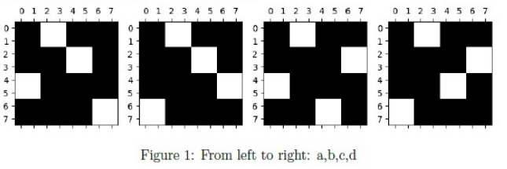

# April-2025-ET - Previous Year Question Paper

**Learn before practicing:** [2025 End-Term Learning Notes](2025-ET-learning-notes.md) — concepts, worked examples, diagrams, formulas, and practice for all three end-term papers.

> **Exam:** End Term, Large Language Models | **Date:** 13 April 2025
> **Source:** [April-2025-ET.pdf](April-2025-ET.pdf), saved QuizPractice question paper.
> **Original total:** 50 marks | **Scored questions:** 22
> **Verification:** Question text, options, equations, tables and diagrams checked against rendered PDF pages. Solutions are independently derived; the PDFs do not display an official answer key.

Original question numbers and option order are retained. Page references mean PDF pages, including the blank first page. Only whitespace and mathematical typesetting have been normalized. Source Q1 is a zero-mark subject confirmation (YES/NO); Q2 is a zero-mark instruction acknowledgement. Q16, Q19 and Q25 are shared contexts, reproduced below. The general instruction says to enter -1 when a numerical question has insufficient information, and to keep at least two decimal digits in calculations (example: 1.860875 becomes 1.86). Ambiguous items are explicitly discussed; assumed practice answers are not official keys.

## Original zero-mark and context items

These items are preserved for an exact transcription of the paper. They are not included as scored interactive questions because the source assigns them zero marks or uses them only as a shared passage/figure for the following questions.

## Beginner study guide

For every solution, use the same four moves: (1) underline what is given and what is asked, (2) write the definition or governing formula before substituting numbers, (3) calculate one small step at a time, and (4) sanity-check the answer using units, tensor shapes, limits, or the wording of the option. The memory hook under each solution is a compact cue for the rule to recall during revision.

#### Original Q1 — Subject confirmation (0 marks)

**THIS IS QUESTION PAPER FOR THE SUBJECT "DEGREE LEVEL : LARGE LANGUAGE MODELS (COMPUTER BASED EXAM)" ARE YOU SURE YOU HAVE TO WRITE EXAM FOR THIS SUBJECT? CROSS CHECK YOUR HALL TICKET TO CONFIRM THE SUBJECTS TO BE WRITTEN. (IF IT IS NOT THE CORRECT SUBJECT, PLS CHECK THE SECTION AT THE TOP FOR THE SUBJECTS REGISTERED BY YOU)**

- YES
- NO

#### Original Q2 — Instruction acknowledgement (0 marks)

**General Note:**

- If you find the given information is insufficient in any of the Numerical Answer Type (NAT) questions, enter `-1` as the answer.
- In all your calculations, take at least two digits. For example, if the intermediate result is `1.860875`, then take it as `1.86` to the next step.

- Instructions has been mentioned above.
- This Instructions is just for a reference & not for an evaluation.

#### Original Q16, Q19 and Q25 — Shared source contexts

The comprehension table, block-permutation figure and block-attention figure are reproduced in the dedicated context sections below, immediately before the scored questions that use them.

---
### Q3 - Scaling-law formula (MCQ)

Identify the correct scaling laws formula. The symbols have usual meaning.

- ( ) $L(N,D)=\left[\left(\frac{N_c}{N}\right)^{\alpha_N/\alpha_D}+\frac{D_c}{D}\right]^{\alpha_D}$
- ( ) $L(N,D)=\left[\left(\frac{N_c}{N}\right)^{\alpha_D/\alpha_N}+\frac{D_c}{D}\right]^{\alpha_D}$
- ( ) $L(N,D)=\left[\left(\frac{N_c}{N}\right)^{\alpha_N/\alpha_D}+\frac{D_c}{D}\right]^{\alpha_N}$
- ( ) $L(N,D)=\left[\left(\frac{D_c}{D}\right)^{\alpha_N/\alpha_D}+\frac{N_c}{N}\right]^{\alpha_D}$
- ( ) None of these

> **Source:** PDF p. 3 | **Marks:** 2

<details>
<summary><b>Answer & Solution</b></summary>

**Answer:** A

#### Step-by-step solution

1. In the model-limited regime, loss must reduce to $(N_c/N)^{\alpha_N}$; in the data-limited regime it must reduce to $(D_c/D)^{\alpha_D}$.
2. In option A, let $D\to\infty$. The two exponents multiply: $(\alpha_N/\alpha_D)\alpha_D=\alpha_N$.
3. Let $N\to\infty$. The remaining term is $(D_c/D)^{\alpha_D}$. The other options exchange exponents or scales and fail these checks in general.

This is the joint finite-data formula in [Kaplan et al., Scaling Laws for Neural Language Models](https://arxiv.org/abs/2001.08361). Here $N$ counts model parameters, not layers alone.

**Memory hook:** Name the governing rule first, write its formula or table, substitute only the given values, and then check the result against the wording and units.

</details>

---

### Q4 - Scaling model and data (MCQ)

Suppose we are given a Model A with N layers and a dataset with D tokens. Choose the correct statements according to the scaling law.

- ( ) Increasing the model size requires a proportionate increase in the dataset size to reduce the test loss
- ( ) Increasing the model size requires a proportionate increase in the dataset size to reduce the training loss
- ( ) Increasing the model size requires us to double the dataset size to reduce the test loss
- ( ) Increasing the model size requires us to double the dataset size to reduce the train loss

> **Source:** PDF p. 3 | **Marks:** 2

<details>
<summary><b>Answer & Solution</b></summary>

**Answer:** A

#### Step-by-step solution

1. Increasing capacity can make a model data-limited. Scaling data as well as capacity can continue improving held-out (test) loss.
2. A is the intended qualitative statement. Increasing data is not required merely to fit the training set better; a larger model can lower training loss by fitting the same examples more closely.
3. No change in model size is specified, so an unconditional instruction to double data (C or D) cannot follow.

**Precision note:** “requires” and “proportionate” are loose wording. The formula in Q3 permits some reduction in test loss at fixed $D$. Keeping its two terms balanced gives $D\propto N^{\alpha_N/\alpha_D}$, not necessarily $D\propto N$. The source also calls $N$ the number of layers, whereas the scaling law uses parameter count. A is the best available interpretation, not a literal theorem.

**Memory hook:** Name the governing rule first, write its formula or table, substitute only the given values, and then check the result against the wording and units.

</details>

---

### Q5 - KV caching in BERT (MCQ)

The statement that KV caching is not helpful during inference in encoder models like BERT is

- ( ) TRUE
- ( ) FALSE

> **Source:** PDF p. 4 | **Marks:** 2

<details>
<summary><b>Answer & Solution</b></summary>

**Answer:** A

#### Step-by-step solution

1. Autoregressive KV caching reuses earlier tokens' keys and values across successive decoding steps.
2. BERT normally processes the complete input with bidirectional attention in one pass, rather than repeatedly extending an unchanged causal prefix.
3. Adding a token can change earlier hidden states in a bidirectional encoder, invalidating deeper-layer cached keys and values. Thus the usual incremental decoding cache does not provide the same benefit. This does not rule out caching the output of an entirely unchanged input.

**Memory hook:** Name the governing rule first, write its formula or table, substitute only the given values, and then check the result against the wording and units.

</details>

---

### Q6 - Relative-position tensor shape (MCQ)

The pre-attention score $e_{ij}$ in Relative Position Encoding (RPE) can be written in matrix form as follows:

$$E=XW_Q(XW_K+P_K)^T.$$

What will be the dimension of $P_K$? In all the options, $T$ denotes context length.

- ( ) $T\times T\times T\times d_{model}$
- ( ) $T\times T\times d_{model}$
- ( ) $T\times d_{model}$
- ( ) $T\times T$
- ( ) None of these.

> **Source:** PDF p. 4 | **Marks:** 2

<details>
<summary><b>Answer & Solution</b></summary>

**Answer:** B

#### Step-by-step solution

1. A relative key-position vector depends on a pair of positions: $p^K_{ij}=p^K_{j-i}$.
2. Materializing one $d_{model}$-dimensional vector for every query-key pair gives $T\times T\times d_{model}$ entries, hence B (assuming the head/key width equals $d_{model}$).
3. The precise scalar operation is $e_{ij}=(x_iW_Q)\cdot(x_jW_K+p^K_{j-i})$. The printed “matrix form” suppresses broadcasting and contraction over the feature axis.

**Notation caveat:** If the printed expression is interpreted as ordinary two-dimensional matrix addition, C would be required, but that cannot express general pair-dependent RPE. B uses the stated RPE interpretation. A stored table can be smaller, for example $(2T-1)\times d_k$ before clipping; it is different from the expanded pair tensor.

**Memory hook:** Name the governing rule first, write its formula or table, substitute only the given values, and then check the result against the wording and units.

</details>

---

### Q7 - Extrapolating absolute positions (MCQ)

Consider the problem of length extrapolation using the Absolute Position Encoding (APE) scheme. Suppose the context length of a model during training is 512. Which of the following approaches allows the model to extrapolate to a context length of 1024 tokens

- ( ) Fixed Sinusoidal Encoding
- ( ) Parameterized APE
- ( ) ALiBi
- ( ) T5

> **Source:** PDF p. 4 | **Marks:** 2

<details>
<summary><b>Answer & Solution</b></summary>

**Answer:** A

#### Step-by-step solution

1. Fixed sinusoidal APE defines position vectors by formulas, such as $PE(p,2i)=\sin(p/10000^{2i/d})$. The formula can be evaluated for positions beyond 511.
2. A learned 512-position table has no learned rows for positions 512 through 1023 unless it is extended or adapted.
3. ALiBi and T5 use relative biases, so they are not answers within the stated **APE scheme**. Under that restriction, choose A.

**Scope caveat:** Computing unseen position vectors does not guarantee good accuracy at twice the training length. Without the APE restriction, ALiBi is also specifically designed for length extrapolation; the single-choice wording would then be ambiguous.

**Memory hook:** Name the governing rule first, write its formula or table, substitute only the given values, and then check the result against the wording and units.

</details>

---

### Q8 - Sinusoidal encoding properties (MSQ)

Select correct statements about sinusoidal positional encoding:

- ( ) It produces a unique encoding for each time-step (token’s position in a sentence)
- ( ) Distance between two tokens at time-steps 3 and 4 is independent of the length of the input sequence.
- ( ) It is non-deterministic.
- ( ) None of these.

> **Source:** PDF p. 4-5 | **Marks:** 2

<details>
<summary><b>Answer & Solution</b></summary>

**Answer:** A, B

#### Step-by-step solution

1. Each position is mapped to a vector of sine/cosine phases at several frequencies. In the intended position range these distinguish the token positions, so A is correct.
2. The vectors for positions 3 and 4 depend on those positions and the fixed frequency schedule, not on how many other tokens occur. Their distance is unchanged when the sequence is extended, so B is correct.
3. The same position and frequency schedule always yield the same vector. C is false and therefore D is false. Finite-precision arithmetic is not a guarantee of unique vectors over arbitrarily large position indices.

**Memory hook:** Name the governing rule first, write its formula or table, substitute only the given values, and then check the result against the wording and units.

</details>

---

### Q9 - Teacher forcing and training (MSQ)

Suppose we have a dataset for machine translation tasks with thousands of samples. Suppose a team considers training the transformer model. The model could be trained using two approaches:

A. Autoregressive training B. Teacher forcing

Choose the correct statements.

- ( ) Approach A helps the model to converge faster than approach B
- ( ) Approach B helps the model to converge faster than approach A
- ( ) One can start the training with approach B first and then switch to approach A after some training steps
- ( ) Once the training starts with approach A and then switching to approach B after some training steps cannot be done

> **Source:** PDF p. 5 | **Marks:** 2

<details>
<summary><b>Answer & Solution</b></summary>

**Answer:** B, C

#### Step-by-step solution

1. Here approach A must mean feeding the model's own previous predictions, while B feeds ground-truth previous tokens. Teacher forcing is itself compatible with an autoregressive objective.
2. Correct prefixes give a stable supervised training signal; causal masking permits parallel calculation of token losses. B expresses the usual faster/easier convergence compared with free-running training, not a guarantee for every experiment.
3. The training input policy can be changed, including a transition toward model-generated prefixes (scheduled sampling). C is possible.
4. The reverse transition is also possible, so D is false. There is no general reason for A's claimed faster convergence.

**Memory hook:** Name the governing rule first, write its formula or table, substitute only the given values, and then check the result against the wording and units.

</details>

---

### Q10 - Character tokenization (MSQ)

Select correct statements regarding character level tokenization:

**Note:** Assume that the character level vocabulary has English uppercase letters, lowercase letters, digits, special symbols, etc.

- ( ) The size of the vocabulary with character-level tokenization will be larger than that with word-level tokenization if the corpus consists of all the books published on Harry Potter (in English).
- ( ) The vocabulary will not expand if new English words/sentences are added to the corpus.
- ( ) No issue of handling unknown tokens as long as the unknown tokens are from English vocabulary
- ( ) None of these.

> **Source:** PDF p. 5 | **Marks:** 2

<details>
<summary><b>Answer & Solution</b></summary>

**Answer:** B, C

#### Step-by-step solution

1. A character alphabet has far fewer distinct entries than the words in the English Harry Potter books. A is false; character tokenization typically increases sequence length, not vocabulary size.
2. Any new word made from existing characters can be decomposed into those characters. No new token is needed, so B is correct under the supplied alphabet assumption.
3. The same decomposition handles previously unseen English words, so C is correct. A genuinely new character outside the assumed alphabet would still need handling; that case is excluded here.

**Memory hook:** Name the governing rule first, write its formula or table, substitute only the given values, and then check the result against the wording and units.

</details>

---

### Q11 - C4 filtering (MSQ)

Consider the C4 pipeline. Which of the following will NOT pass through it as it is?

For option B, the displayed code is:

```python
def fibo(n):
    if n <= 1:
        return n
    return fibo(n - 1)
    + fibo(n - 2)
```

- ( ) ir a la escuela es un buen habito. (Above sentence is Spanish translation of “Going to school is a good habit”)
- ( ) Following function computes $n$-th Fibonacci number: (code above)
- ( ) Lorem ipsum dolor sit amet...
- ( ) Please enable JavaScript to use our site. / Home / Products / Shipping / Contact / FAQ / ...
- ( ) D Gukesh defeated defending champion Ding Liren at the World Chess Championship. D Gukesh defeated defending champion Ding Liren at the World Chess Championship.
- ( ) Sardar Vallabhbhai Patel was the first deputy prime minister of independent India.
- ( ) None of these.

> **Source:** PDF p. 5-6 | **Marks:** 2

<details>
<summary><b>Answer & Solution</b></summary>

**Answer:** A, B, C, D, E

#### Step-by-step solution

1. **Intended classroom interpretation:** A is non-English; B contains code rather than prose; C is placeholder text; D is a JavaScript warning/navigation menu; E repeats a sentence. These illustrate filtering or deduplication, whereas F is ordinary English prose.
2. The exact original C4 rules are more specific: English language filtering, terminal-punctuation and minimum-length checks, JavaScript-line removal, lorem-ipsum-page removal, a curly-brace code heuristic, and repeated **three-sentence** span removal. See [T5, section 2.2](https://www.jmlr.org/papers/volume21/20-074/20-074.pdf).
3. B's Python code contains no curly brace, though its displayed lines fail the punctuation rule. E's two identical sentences alone do **not** establish a repeated three-sentence span. If each option is a whole page, even F fails the five-sentence minimum.

**Ambiguity:** A-E is an inferred educational key, not a rigorously determined output of the exact C4 implementation. Page boundaries and surrounding content are missing, so the literal pipeline question has no unique fully justified option set. The original options are preserved rather than silently rewritten.

**Memory hook:** Name the governing rule first, write its formula or table, substitute only the given values, and then check the result against the wording and units.

</details>

---

### Q12 - LLM design choices (MSQ)

Which of the following are design choices for building a large language model?

- ( ) Activation function in feed forward layer
- ( ) Training dataset.
- ( ) Positional encoding
- ( ) Attention mechanism.
- ( ) None of these.

> **Source:** PDF p. 6 | **Marks:** 2

<details>
<summary><b>Answer & Solution</b></summary>

**Answer:** A, B, C, D

#### Step-by-step solution

1. The feed-forward activation determines the nonlinearity, for example GELU or a gated variant.
2. The dataset determines the training distribution and available coverage.
3. Position encoding determines how order/distance enters computation, and the attention mechanism determines which token interactions are computed.
4. All four can be selected by the model designer; E is therefore false.

**Memory hook:** Name the governing rule first, write its formula or table, substitute only the given values, and then check the result against the wording and units.

</details>

---

### Q13 - Degenerate generation (MSQ)

Consider the following set of GPT-based text generative models (represented by $M_i$ with $i\in\{1,2,3,4\}$) and the corresponding text generated with the prompt “I had to leave the party”.

1. $M_1$: I had to leave the party because had to leave the party.
2. $M_2$: I had to leave the party leave leave
3. $M_3$: I had to leave the party because because
4. $M_4$: I had to leave the party because I received an SOS message from my cousin

Select the model(s) that is(are) degenerative.

- ( ) $M_1$
- ( ) $M_2$
- ( ) $M_3$
- ( ) $M_4$
- ( ) None of these.

> **Source:** PDF p. 6-7 | **Marks:** 3

<details>
<summary><b>Answer & Solution</b></summary>

**Answer:** A, B, C

#### Step-by-step solution

1. Degeneration includes unhelpful repetitive continuations and local loops.
2. $M_1$ repeats the prompt's phrase instead of supplying a meaningful reason. $M_2$ loops on “leave”; $M_3$ loops on “because”.
3. $M_4$ supplies a coherent new reason and does not exhibit that repetition. Select the first three outputs. These samples demonstrate degeneration in the outputs; a single sample does not establish that the corresponding model always degenerates.

**Memory hook:** Name the governing rule first, write its formula or table, substitute only the given values, and then check the result against the wording and units.

</details>

---

### Q14 - Sentinel target sequence (MSQ)

The strikeout words in the passage given below denote the words to be dropped from the original sentence.

“These models can’t read ~~your mind~~. If outputs are too long, ~~ask for brief replies~~. If outputs are too simple, ask for expert-level writing. If you dislike the format, ~~demonstrate the format~~ you’d like to see. The ~~less the model has to guess~~ at what you want, the more likely you’ll get it.”

Which of the following represents the correct target sequence, with sentinel tokens, to the baseline model that uses pre-training denoising objectives? [z] represents the end of the sentinel token in a sentence. The characters inside the square brackets are the sentinel tokens.

- ( ) [a] your mind [b] ask for brief replies [c] demonstrate the format [d] less the model has to guess [z]
- ( ) [a] your mind [b] ask for brief replies [c] demonstrate the format [d] less the model has to guess
- ( ) [v] your mind [w] ask for brief replies [x] demonstrate the format [y] less the model has to guess
- ( ) [v] your mind [w] ask for brief replies [x] demonstrate the format [y] less the model has to guess [z]
- ( ) [a] your mind [b] demonstrate the format [c] ask for brief replies [d] less the model has to guess
- ( ) None of these

> **Source:** PDF p. 7 | **Marks:** 3

<details>
<summary><b>Answer & Solution</b></summary>

**Answer:** A, D

#### Step-by-step solution

1. Read the deleted spans left to right: “your mind”; “ask for brief replies”; “demonstrate the format”; “less the model has to guess”. Preserve the order and all words inside each span.
2. The target concatenates a distinct sentinel followed by each missing span, and ends with the extra terminal sentinel stipulated as [z].
3. A and D have the correct span order and ending. The letters naming sentinels may differ because the corrupted input's actual sentinel assignment is not supplied; they must match that assignment when used in a real training example.
4. B and C omit [z]. E also swaps the second and third spans.

**Memory hook:** Name the governing rule first, write its formula or table, substitute only the given values, and then check the result against the wording and units.

</details>

---

### Q15 - Strided attention entry count (Short Answer)

How many entries of the unnormalized attention matrix $QK^T$ will be calculated with the strided attention mechanism with $c=5$. The sequence length is $T=32$.

*(Numeric input)*


> **Source:** PDF p. 7 | **Marks:** 2

<details>
<summary><b>Answer & Solution</b></summary>

**Answer:** $\boxed{160}$

#### Step-by-step solution

1. Using the course's fixed-window counting convention, $c$ is the number of keys attended to by each query.
2. There are $T=32$ query rows and $c=5$ calculated entries in each row, giving $Tc=32\cdot5=160$.
3. This is fewer than the $T^2=1024$ dense entries.

**Assumption:** The question does not provide a mask or boundary rule. This answer uses the $Tc$ convention in the repository's Week 11 notes. A truncated causal window would instead contain $1+2+3+4+28\cdot5=150$ entries. A centered radius-5 band or a stride-of-5 pattern would be different again; an exact count is not uniquely specified without the convention.

**Memory hook:** Name the governing rule first, write its formula or table, substitute only the given values, and then check the result against the wording and units.

</details>

---

## Context for Q17–Q18

**Source Q16, PDF pp. 7-8 (0 marks).** Consider the following distribution generated by a GPT model after feeding the sentence “I love Manali because it is so”. Words are listed in decreasing order of their probabilities.

| Token | Probability |
|---|---:|
| beautiful | 0.6 |
| snowy | 0.15 |
| hilly | 0.08 |
| cold | 0.05 |
| good | 0.01 |
| bad | 0.005 |
| … | … |

Based on the above data, answer the given subquestions. The omitted tail has total probability $0.105$; it must not be removed or renormalized before choosing the nucleus.

### Q17 - Top-p threshold for hilly (Short Answer)

If you are using the Top-P sampling method, what should be the minimum value of P to make sure that “hilly” could be selected as an output?

*(Numeric input)*


> **Source:** PDF p. 8 | **Marks:** 2

<details>
<summary><b>Answer & Solution</b></summary>

**Answer:** $\boxed{-1}$

#### Step-by-step solution

1. Sort order is already supplied. The cumulative probabilities are $0.60$, $0.75$, $0.83$ for beautiful, snowy and hilly.
2. Standard nucleus sampling retains the shortest leading prefix whose mass is at least $P$. Thus hilly is eligible precisely when $P>0.75$; at $P=0.75$, the first two tokens suffice. See [the nucleus-sampling definition](https://arxiv.org/html/1904.09751v2).
3. There is no smallest real number strictly above $0.75$. For any eligible $P$, $(P+0.75)/2$ is smaller and still eligible. The infimum is $0.75$, but it is not an eligible minimum.
4. Therefore the question as written has no numerical minimum. The practice answer uses the paper's **-1 convention for insufficiently specified numerical questions**. If $P$ were restricted to two decimal places, the minimum would be $0.76$; no such restriction on $P$ is stated. Keeping at least two digits in calculations does not impose that grid.

**Common intended answer:** $0.83$ is the cumulative mass through hilly and is sufficient, but it is not the minimum (e.g. $0.80$ also includes hilly). No official answer is visible in the source.

**Memory hook:** Name the governing rule first, write its formula or table, substitute only the given values, and then check the result against the wording and units.

</details>

---

### Q18 - Top-p eligibility of bad (MSQ)

What value of P will allow “bad” to be selected in the output?

- ( ) 1
- ( ) 0.9
- ( ) 0.95
- ( ) 0.005
- ( ) 0.75
- ( ) 0.88

> **Source:** PDF p. 8 | **Marks:** 2

<details>
<summary><b>Answer & Solution</b></summary>

**Answer:** A, B, C

#### Step-by-step solution

1. Mass before bad is $0.60+0.15+0.08+0.05+0.01=0.89$.
2. To require inclusion of bad, the nucleus threshold must exceed $0.89$. Mass through bad is $0.895$; larger thresholds include bad and some omitted tail tokens as necessary.
3. $1$, $0.90$ and $0.95$ all qualify. $0.005$, $0.75$ and $0.88$ stop before bad. The probability of bad itself, $0.005$, is not the required nucleus threshold.

**Memory hook:** Name the governing rule first, write its formula or table, substitute only the given values, and then check the result against the wording and units.

</details>

---

## Context for Q20–Q24

**Source Q19, PDF p. 8 (0 marks).** Consider the following dictionary with the number of word occurrences in a corpus:

```text
wo = {"taught": 2,
      "laughter": 1,
      "drought": 4,
      "tough": 5}
```

**Note:** Append `</w>` to each word at the end. You will be working with the WordPiece algorithm; answer the given subquestions in that context. Treat `</w>` as one end-of-word token. Use frequency-weighted pair scores $s(a,b)=f(ab)/(f(a)f(b))$ and preserve the listed word order for tie-breaking.

### Q20 - Initial vocabulary (Short Answer)

How many tokens are there in the initial vocabulary?

*(Numeric input)*


> **Source:** PDF p. 9 | **Marks:** 2

<details>
<summary><b>Answer & Solution</b></summary>

**Answer:** $\boxed{11}$

#### Step-by-step solution

1. Split the words into individual characters plus one end marker each: `t a u g h t </w>`, `l a u g h t e r </w>`, `d r o u g h t </w>`, `t o u g h </w>`.
2. The distinct letters are `{a, d, e, g, h, l, o, r, t, u}`, totaling 10.
3. Add the single token `</w>`: $10+1=11$. Frequencies change scores, not the count of distinct initial tokens.

**Memory hook:** Name the governing rule first, write its formula or table, substitute only the given values, and then check the result against the wording and units.

</details>

---

### Q21 - Least WordPiece score (MCQ)

Which of the following pairs has the least score before any merge?

- ( ) `('h', '</w>')`
- ( ) `('r', '</w>')`
- ( ) `('l', 'a')`
- ( ) `('r', 'o')`
- ( ) `('t', 'e')`
- ( ) `('u', 'g')`

> **Source:** PDF p. 9 | **Marks:** 3

<details>
<summary><b>Answer & Solution</b></summary>

**Answer:** B

#### Step-by-step solution

1. Count occurrences weighted by word frequency. The token frequencies are:

| Token | t | a | u | g | h | l | e | r | d | o | `</w>` |
|---|---:|---:|---:|---:|---:|---:|---:|---:|---:|---:|---:|
| Frequency | 14 | 3 | 12 | 12 | 12 | 1 | 1 | 5 | 4 | 9 | 12 |

2. Apply $s(a,b)=f(ab)/(f(a)f(b))$ to each option:

| Option | Pair frequency | Score |
|---|---:|---:|
| A | 5 | $5/(12\cdot12)=0.034722\ldots$ |
| B | 1 | $1/(5\cdot12)=0.016667\ldots$ |
| C | 1 | $1/(1\cdot3)=0.333333\ldots$ |
| D | 4 | $4/(5\cdot9)=0.088889\ldots$ |
| E | 1 | $1/(14\cdot1)=0.071429\ldots$ |
| F | 12 | $12/(12\cdot12)=0.083333\ldots$ |

3. B is the smallest. Count both t's in taught: that word contributes $2\cdot2=4$ occurrences to $f(t)$, a frequent source of counting errors.

**Memory hook:** Name the governing rule first, write its formula or table, substitute only the given values, and then check the result against the wording and units.

</details>

---

### Q22 - First WordPiece merge (Short Answer)

Which pair will be merged in the very first merge? Say the pair is (‘a’,‘b’), then enter “ab” (without quotes and white spaces). If there is a tie between two or more candidates, pick the one that occurs first in the original vocabulary outlined in the question.

**Note:** Enter the exact answer without any extra space in the beginning or at the end.


> **Source:** PDF p. 9 | **Marks:** 3

<details>
<summary><b>Answer & Solution</b></summary>

**Answer:** `la`

#### Step-by-step solution

1. WordPiece chooses the greatest normalized pair score, not the most frequent pair.
2. All initial candidate scores are:

| Pair | Score | Pair | Score | Pair | Score |
|---|---:|---|---:|---|---:|
| t,a | $1/21$ | a,u | $1/12$ | u,g | $1/12$ |
| g,h | $1/12$ | h,t | $1/24$ | t,`</w>` | $1/28$ |
| l,a | $1/3$ | t,e | $1/14$ | e,r | $1/5$ |
| r,`</w>` | $1/60$ | d,r | $1/5$ | r,o | $4/45$ |
| o,u | $1/12$ | t,o | $5/126$ | h,`</w>` | $5/144$ |

3. The unique largest score is $s(l,a)=1/3$. Merge l and a to form `la`; no tie-break is needed for the first merge.

**Memory hook:** Name the governing rule first, write its formula or table, substitute only the given values, and then check the result against the wording and units.

</details>

---

### Q23 - First merge score (Short Answer)

What is the score of the pair merged in the very first merge?

*(Numeric input)*


> **Source:** PDF p. 9 | **Marks:** 3

<details>
<summary><b>Answer & Solution</b></summary>

**Answer:** $\boxed{0.33}$

#### Step-by-step solution

1. The first merged pair is `(l,a)`, occurring once in laughter, whose frequency is 1.
2. Therefore $f(la)=1$, $f(l)=1$, and $f(a)=2+1=3$ (two taught occurrences and one laughter).
3. The score is $1/(1\cdot3)=1/3=0.333333\ldots$, or **0.33** to two decimals. Preserve the exact fraction while comparing scores; rounding too early can create false ties.

**Memory hook:** Name the governing rule first, write its formula or table, substitute only the given values, and then check the result against the wording and units.

</details>

---

### Q24 - Tokenization after two merges (MCQ)

Assuming that the algorithm was stopped after two merges only, how will the word `later</w>` be tokenized with this vocabulary? Please note that `</w>` is already appended to the word.

- ( ) `la, t, er, </w>`
- ( ) `l, a, t, er, </w>`
- ( ) `la, t, e, r, </w>`
- ( ) `l, a, t, e, r, </w>`
- ( ) `l, a, ter, </w>`
- ( ) `lat, e, r, </w>`
- ( ) None of these

> **Source:** PDF p. 9-10 | **Marks:** 3

<details>
<summary><b>Answer & Solution</b></summary>

**Answer:** A

#### Step-by-step solution

1. First merge l+a into `la`. The counts become $f(a)=2$, $f(la)=1$; the remaining relevant counts $f(e)=1$, $f(r)=5$, $f(d)=4$ are unchanged.
2. Recompute pair scores. The largest are $s(e,r)=1/(1\cdot5)=1/5$ and $s(d,r)=4/(4\cdot5)=1/5$.
3. e,r appears in laughter before d,r appears in drought in the source dictionary. The stated first-occurrence tie rule therefore chooses `er` as merge two.
4. The resulting vocabulary contains `la` and `er`, but not `lat` or `ter`. Longest matching segmentation of `later</w>` is `la`, `t`, `er`, `</w>`, option A. The second-merge tie matters.

**Memory hook:** Name the governing rule first, write its formula or table, substitute only the given values, and then check the result against the wording and units.

</details>

---

## Context for Q26–Q27

**Source Q25, PDF p. 10 (0 marks).** The diagram below shows a few possible permutation blocks (for four attention heads) to be used in the masking matrix $M$ in the block-wise attention mechanism.



Rows and columns run from 0 to 7. Each block contains two consecutive tokens. The isolated **white** blocks represent the selected pairings in this source figure; this is the opposite of the August paper's explicitly stated color convention. Based on the above data, answer the given subquestions.

### Q26 - Valid block permutations (MSQ)

Of these 4 blocks, choose the block(s) that is (are) proper permutation of 4 blocks.

- ( ) a
- ( ) b
- ( ) c
- ( ) d
- ( ) None of these

> **Source:** PDF p. 10 | **Marks:** 2

<details>
<summary><b>Answer & Solution</b></summary>

**Answer:** A, B, C, D

#### Step-by-step solution

1. Compress each $2\times2$ white square into one selected cell of a $4\times4$ block matrix.
2. Reading selected column numbers from top row to bottom row, using one-based block numbers:

| Mask | Selected columns |
|---|---|
| a | $(2,3,1,4)$ |
| b | $(2,3,4,1)$ |
| c | $(2,4,1,3)$ |
| d | $(2,4,3,1)$ |

3. Each row selects exactly one column, and each list contains all four column numbers exactly once. Every displayed mask is therefore a permutation. Inspect the white squares rather than confusing the black background with selected blocks.

**Memory hook:** Name the governing rule first, write its formula or table, substitute only the given values, and then check the result against the wording and units.

</details>

---

### Q27 - Fourth head query-key pairing (MCQ)

Let $q_1,q_2,q_3,q_4$ denote the 4 query blocks and $k_1,k_2,k_3,k_4$ denote the 4 key blocks. Select which of the following denotes the computation of pre-attention score for $q_4$ in the 4-th attention head.

- ( ) $q_4^Tk_4$
- ( ) $q_4^Tk_1$
- ( ) $q_4^Tk_2$
- ( ) $q_4^Tk_3$

> **Source:** PDF p. 10-11 | **Marks:** 2

<details>
<summary><b>Answer & Solution</b></summary>

**Answer:** B

#### Step-by-step solution

1. The fourth attention head is the rightmost diagram, d.
2. Its fourth query block occupies rows 6 and 7. The selected white square is at columns 0 and 1, which form key block $k_1$.
3. Thus $q_4$ attends to $k_1$. With the source's vector orientation, its unnormalized score is $q_4^Tk_1$, option B.

**Memory hook:** Name the governing rule first, write its formula or table, substitute only the given values, and then check the result against the wording and units.

</details>

---
