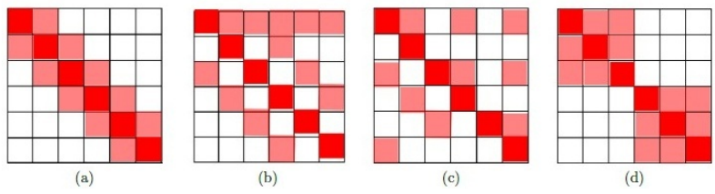
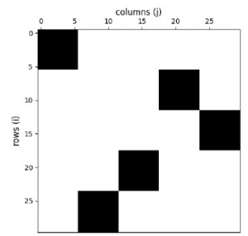

# August-2025-ET - Previous Year Question Paper

**Learn before practicing:** [2025 End-Term Learning Notes](2025-ET-learning-notes.md) — concepts, worked examples, diagrams, formulas, and practice for all three end-term papers.

> **Exam:** End Term, Large Language Models | **Date:** 31 August 2025
> **Source:** [August-2025-ET.pdf](August-2025-ET.pdf), saved QuizPractice question paper.
> **Original total:** 40 marks | **Scored questions:** 17
> **Verification:** Question text, options, equations, tables and diagrams checked against rendered PDF pages. Solutions are independently derived; the PDFs do not display an official answer key.

Original question numbers and option order are retained. Page references mean PDF pages, including the blank first page. Only whitespace and mathematical typesetting have been normalized. Source Q1 is a zero-mark subject confirmation (YES/NO). Q9, Q12 and Q16 are shared contexts, reproduced below. The attention context instructs candidates to enter -1 if information is insufficient. Supplied rounded matrix values are preserved exactly.

## Original zero-mark and context items

These items are preserved for an exact transcription of the paper. They are not included as scored interactive questions because the source assigns them zero marks or uses them only as a shared passage/figure for the following questions.

## Beginner study guide

For every solution, use the same four moves: (1) underline what is given and what is asked, (2) write the definition or governing formula before substituting numbers, (3) calculate one small step at a time, and (4) sanity-check the answer using units, tensor shapes, limits, or the wording of the option. The memory hook under each solution is a compact cue for the rule to recall during revision.

#### Original Q1 — Subject confirmation (0 marks)

**THIS IS QUESTION PAPER FOR THE SUBJECT "DEGREE LEVEL : LARGE LANGUAGE MODELS (COMPUTER BASED EXAM)" ARE YOU SURE YOU HAVE TO WRITE EXAM FOR THIS SUBJECT? CROSS CHECK YOUR HALL TICKET TO CONFIRM THE SUBJECTS TO BE WRITTEN. (IF IT IS NOT THE CORRECT SUBJECT, PLS CHECK THE SECTION AT THE TOP FOR THE SUBJECTS REGISTERED BY YOU)**

- YES
- NO

#### Original Q9, Q12 and Q16 — Shared source contexts

The embedding matrix, block-attention mask and ALiBi context are reproduced in the dedicated context sections below, immediately before the scored questions that use them.

---
### Q2 - Viterbi subword tokenization (MCQ)

Given the input string: `sunshine`

And the following vocabulary of subword tokens with their corresponding log-probabilities:

| Subword | Log-probability (base e) |
|---|---:|
| sun | -0.5 |
| shine | -0.7 |
| sunshine | -1.6 |
| su | -0.3 |
| nshine | -0.4 |
| n | -1.8 |
| shi | -0.6 |
| ne | -0.5 |

Using the Viterbi algorithm (as used in the SentencePiece tokenizer), determine the most probable tokenization of the input string. The probability of a tokenized sequence is the sum of the log-probabilities of the selected subwords. Only subwords from the vocabulary may be used.

- ( ) `[sunshine]`
- ( ) `[su, nshine]`
- ( ) `[sun, shine]`
- ( ) `[sun, shi, ne]`

> **Source:** PDF p. 2-3 | **Marks:** 3

<b>Answer & Solution</b>

**Answer:** B

#### Step-by-step solution

1. For a segmentation $t_1,\ldots,t_k$, the **log** probability is $\sum_r\log P(t_r)$. The source calls this sum “probability”; strictly, probability is its exponential.
2. Compare all complete segmentations:

| Segmentation | Log score |
|---|---:|
| sunshine | $-1.6$ |
| su + nshine | $-0.3-0.4=-0.7$ |
| sun + shine | $-0.5-0.7=-1.2$ |
| sun + shi + ne | $-0.5-0.6-0.5=-1.6$ |
| su + n + shine | $-0.3-1.8-0.7=-2.8$ |
| su + n + shi + ne | $-0.3-1.8-0.6-0.5=-3.2$ |

3. Viterbi retains the best score for each prefix: $F(j)=\max_{t=s[i:j]}(F(i)+\log P(t))$, with $F(0)=0$. The best final score is $-0.7$, attained by `su + nshine`. Larger (less negative) log score means more probable, so B wins.

**Memory hook:** Name the governing rule first, write its formula or table, substitute only the given values, and then check the result against the wording and units.

---

### Q3 - Causal attention mask (MCQ)

A GPT model is trained using **causal language modeling**. During training, for a sequence of $T=4$ tokens, which of the following correctly represents the **attention mask matrix** applied to the attention logits?

- ( ) `[[0, −∞, −∞, −∞], [0, 0, −∞, −∞], [0, 0, 0, −∞], [0, 0, 0, 0]]`
- ( ) `[[0, ∞, ∞, ∞], [0, 0, ∞, ∞], [0, 0, 0, ∞], [0, 0, 0, 0]]`
- ( ) `[[1, 0, 0, 0], [1, 1, 0, 0], [1, 1, 1, 0], [1, 1, 1, 1]]`
- ( ) `[[0, 1, 1, 1], [0, 0, 1, 1], [0, 0, 0, 1], [0, 0, 0, 0]]`

> **Source:** PDF p. 3 | **Marks:** 2

<b>Answer & Solution</b>

**Answer:** A

#### Step-by-step solution

1. At row $i$, the query may attend to columns $j\le i$, including itself, while future columns $j>i$ are forbidden.
2. An additive logit mask puts 0 at allowed entries and $-\infty$ at forbidden entries. Then $\exp(-\infty)=0$ makes the corresponding softmax probabilities zero.
3. A has that lower-triangular allowed region. B boosts future positions instead. C is a possible binary **keep** mask, but is not the additive mask shown in the question. Adding D's ones would not block anything.

**Memory hook:** Name the governing rule first, write its formula or table, substitute only the given values, and then check the result against the wording and units.

---

### Q4 - Identify sparse attention patterns (MCQ)

Match the given attention masks with their corresponding variants of attention mechanisms. In each figure, the colored cells indicate positions where a query token $(Q_i)$ attends to a key token $(K_j)$, while the white cells represent positions that are not attended. Choose the correct option.

- ( ) (a): Random Local Attention, (b): Strided Local Attention, (c): Sparse Block Attention, (d): Local + Global Attention
- ( ) (a): Strided Local Attention, (b): Local + Global Attention, (c): Random Local Attention, (d): Sparse Block Attention
- ( ) (a): Strided Local Attention, (b): Random Local Attention, (c): Local + Global Attention, (d): Sparse Block Attention
- ( ) (a): Sparse Block Attention, (b): Local + Global Attention, (c): Strided Local Attention, (d): Random Local Attention

> **Source:** PDF p. 3-4 | **Marks:** 2

<b>Answer & Solution</b>

**Answer:** B

#### Step-by-step solution

1. In (a), selected cells form a narrow diagonal band: each token attends to a small neighborhood. The choices call this “Strided Local Attention”; the depicted pattern is a sliding local window.
2. In (b), the diagonal neighborhood is supplemented by broadly connected rows/columns, corresponding to local plus global attention in the supplied taxonomy.
3. In (c), irregular off-diagonal selected cells add random connections. In (d), two dense square groups occupy the diagonal, making non-overlapping sparse blocks.
4. Only B gives this ordered mapping. The source diagram is preserved even though its local/global schematic is not a complete specification of a particular implementation.

**Memory hook:** Name the governing rule first, write its formula or table, substitute only the given values, and then check the result against the wording and units.

---

### Q5 - Preparing BERT inputs (MSQ)

Which of the following preprocessing steps are commonly used when preparing data for transformer models like BERT?

- ( ) Adding special tokens such as [CLS] and [SEP] to the sequence
- ( ) Splitting tokens into subword units using a model-specific tokenizer
- ( ) Removing all punctuation marks to ensure cleaner embeddings
- ( ) Adding positional information to each token embedding

> **Source:** PDF p. 4 | **Marks:** 3

<b>Answer & Solution</b>

**Answer:** A, B, D

#### Step-by-step solution

1. The tokenizer splits input using the model's subword vocabulary and inserts the task's special tokens; thus A and B are correct.
2. BERT's input representation combines token, position and segment embeddings. D is correct when “preparing data” includes constructing the model's input embeddings; the position-vector addition normally happens inside the model.
3. Punctuation carries meaning and is handled by BERT's tokenizer. Removing all punctuation is not a required or generally appropriate preprocessing step, so C is false.

**Memory hook:** Name the governing rule first, write its formula or table, substitute only the given values, and then check the result against the wording and units.

---

### Q6 - Efficient long-sequence attention (MSQ)

Which modifications are used in transformers to handle longer sequences efficiently?

- ( ) Using sparse attention patterns to reduce computational complexity
- ( ) Applying low-rank matrix factorization to approximate attention
- ( ) Increasing only the feed-forward network width without modifying attention
- ( ) Replacing the softmax function in attention with other activation function for faster training

> **Source:** PDF p. 4 | **Marks:** 3

<b>Answer & Solution</b>

**Answer:** A, B

#### Step-by-step solution

1. Dense attention forms $T^2$ query-key interactions. Sparse patterns compute only a subset, reducing work and storage when connectivity remains bounded.
2. Low-rank approaches approximate the attention operation through a smaller intermediate dimension, reducing the quadratic bottleneck. B is therefore also correct.
3. Widening the FFN increases its cost and leaves dense attention unchanged, so C does not solve this problem.
4. Merely replacing softmax by another elementwise activation still leaves the $T\times T$ score matrix. Linear attention needs a suitable kernel **and reassociation of products**, not an arbitrary activation replacement. D is not sufficient as written.

**Memory hook:** Name the governing rule first, write its formula or table, substitute only the given values, and then check the result against the wording and units.

---

### Q7 - Clipping relative distances (MSQ)

In Transformer models that use relative position embeddings (such as in Transformer-XL or T5), clipping is often applied to the relative position indices. Which of the following statements about clipping in relative position embeddings are correct?

- ( ) Clipping ensures that very large relative distances are mapped to a fixed maximum distance.
- ( ) Without clipping, the model would require embeddings for every possible relative distance, which is infeasible for long sequences.
- ( ) Clipping increases the precision of embeddings for large relative distances.
- ( ) Clipping introduces an upper bound k such that all distances greater than k are mapped to the same index.

> **Source:** PDF p. 5 | **Marks:** 3

<b>Answer & Solution</b>

**Answer:** A, B, D

#### Step-by-step solution

1. In a learned signed-distance lookup table, clipping uses $r'=\max(-k,\min(k,r))$. Distances beyond the positive or negative boundary share their respective boundary index. A and D describe this.
2. With a separate learned vector for every exact distance and maximum length $T$, an unclipped table needs $2T-1$ rows. Supporting arbitrarily growing lengths would require an unbounded table. B is intended in that lookup-table setting.
3. Clipping merges large distances, so it **reduces**, rather than increases, their distinguishability. C is false.

**Scope:** B is not universal for all RPE methods: formula-generated relative encodings do not require a learned vector for every distance. T5 uses distance buckets (with coarse large-distance bins), not simply one vector for every raw distance. These distinctions qualify the broad source wording.

**Memory hook:** Name the governing rule first, write its formula or table, substitute only the given values, and then check the result against the wording and units.

---

### Q8 - Nucleus pool size (Short Answer)

Consider the following probability distribution over a vocabulary of 10 tokens:

$$[0.06,0.20,0.14,0.06,0.09,0.08,0.05,0.15,0.06,0.11].$$

You apply top-p (nucleus) sampling with $p=0.7$. How many tokens are included in the sampling pool?

*(Numeric input)*

> **Source:** PDF p. 5 | **Marks:** 2

<b>Answer & Solution</b>

**Answer:** $\boxed{6}$

#### Step-by-step solution

1. Verify the values sum to 1. Sort them descending: $0.20,0.15,0.14,0.11,0.09,0.08,0.06,0.06,0.06,0.05$.
2. The cumulative totals are $0.20,0.35,0.49,0.60,0.69,0.77,\ldots$.
3. Five tokens supply only $0.69<0.70$. Six supply $0.77\ge0.70$, so the shortest qualifying prefix contains 6 tokens. Include the token that crosses the threshold; do not stop at five.

**Memory hook:** Name the governing rule first, write its formula or table, substitute only the given values, and then check the result against the wording and units.

---

## Context for Q10–Q11

**Source Q9, PDF p. 5 (0 marks).** A vocabulary $\mathcal V=\{\text{tea, you, enjoy, often}\}$ is associated with the following embedding matrix:

$$E=\begin{bmatrix}0&1\\\\1&1\\\\1&0\\\\-1&1\end{bmatrix}.$$

Words are indexed in the order shown above: tea (index 0), you (1), enjoy (2), and often (3). **No positional encodings are used.** The parameters of the attention layer are:

$$W_Q=\begin{bmatrix}0.5&1\\\\1&0.5\end{bmatrix},\quad W_K=\begin{bmatrix}1&0.5\\\\-0.5&1\end{bmatrix},\quad W_V=\begin{bmatrix}1&0.2\\\\0.5&1\end{bmatrix},\quad W_O=\begin{bmatrix}0.5&0.5\\\\1&-1\end{bmatrix}.$$

For the input sequence “you enjoy tea often”, the computed attention matrix $A=\mathrm{softmax}(QK^T/\sqrt{d_k})$ is given as:

$$A=\begin{bmatrix}0.55&0.32&0.11&0.02\\\\0.43&0.25&0.21&0.1\\\\0.39&0.39&0.16&0.07\\\\0.24&0.4&0.2&0.17\end{bmatrix}.$$

Answer the given subquestions. If you believe the information is insufficient, enter -1 as your answer. The supplied values are rounded; their rows need not sum to exactly 1.

### Q10 - Attention output for enjoy (Short Answer)

For the input “you enjoy tea often”, compute the final representation of the word “enjoy” after the attention layer (i.e., after applying $W_Q,W_K,W_V$, attention weights, and $W_O$). Enter the sum of the elements in the resulting vector.

*(Numeric input)*

> **Source:** PDF p. 5-6 | **Marks:** 3

<b>Answer & Solution</b>

**Answer:** $\boxed{0.95}$

#### Step-by-step solution

1. Arrange input embeddings in **sentence order**, not vocabulary order:

$X=[(1,1);\,(1,0);\,(0,1);\,(-1,1)]$.

2. Compute the projected values:

$V=XW_V=[(1.5,1.2);\,(1,0.2);\,(0.5,1);\,(-0.5,0.8)]$.

The supplied attention matrix already incorporates $W_Q$ and $W_K$; do not apply them to $V$ again.

3. Enjoy is sentence row 1 (second row). Its context vector is

$$z=0.43[1.5,1.2]+0.25[1,0.2]+0.21[0.5,1]+0.10[-0.5,0.8]=[0.95,0.856].$$

4. Apply the output projection:

$$zW_O=[0.475+0.856,\;0.475-0.856]=[1.331,-0.381].$$

5. The required sum is $1.331-0.381=0.95$. This also follows from $W_O[1,1]^T=[1,0]^T$: the sum equals $z$'s first coordinate.

**Rounding check:** Recomputing softmax from the unrounded projections gives approximately $[0.430182,0.253124,0.212109,0.104585]$ for this row and a final sum $0.95216$, again 0.95 to two decimals. Use the printed $A$ directly rather than renormalizing it.

**Memory hook:** Name the governing rule first, write its formula or table, substitute only the given values, and then check the result against the wording and units.

---

### Q11 - Permutation and attention (Short Answer)

Suppose the input sentence is “tea you enjoy often”. Using the same matrices and processing method, what is the attention score (i.e., softmax entry from A) for the query word “tea” attending to key word “often”?

*(Numeric input)*

> **Source:** PDF p. 6 | **Marks:** 2

<b>Answer & Solution</b>

**Answer:** $\boxed{0.07}$

#### Step-by-step solution

1. There are no positional encodings or order-dependent masks in this setup. Moving the words only permutes the query and key rows.
2. If $P$ reorders tokens, the new attention is $A'=PAP^T$. A particular word-to-word weight is unchanged.
3. In the old sentence tea was row 2 and often was column 3, using zero-based positions. Read $A_{2,3}=0.07$.
4. In the new sentence tea is row 0, often still column 3; the same weight moves to $A'_{0,3}=0.07$. The unrounded value is approximately 0.06607, consistent with the supplied rounding.

**Memory hook:** Name the governing rule first, write its formula or table, substitute only the given values, and then check the result against the wording and units.

---

## Context for Q13–Q15

**Source Q12, PDF pp. 6-7 (0 marks).** Suppose we have context length $T=30$ and the number of blocks $n=5$ for the block attention mechanism. The masking matrix $M$ is defined as:

$$M_{ij}=\begin{cases}1&\text{if }\pi(\lfloor in/T\rfloor)=\lfloor jn/T\rfloor,\\\\0&\text{otherwise.}\end{cases}$$

Here $i$ is the row index and $j$ the column index, both starting from 0; $\pi$ is a permutation of $\{0,1,\ldots,n-1\}$. If query token $i$ lies in block $r=\lfloor in/T\rfloor$, it attends only to key tokens in block $\pi(r)$. Equivalently, partitioning queries and keys into blocks,

$$Q=(Q_0,Q_1,\ldots,Q_{n-1}),\qquad K=(K_{\pi(0)},K_{\pi(1)},\ldots,K_{\pi(n-1)}),$$

the block $Q_r$ attends only to $K_{\pi(r)}$. This limits computation to the specified query-key block pairs.

Answer using the following source mask: **black squares equal 1 and white squares equal 0**.

For accessibility, the same mask at block resolution (one entry represents a $6\times6$ token block) is:

$$\begin{bmatrix}1&0&0&0&0\\\\0&0&0&1&0\\\\0&0&0&0&1\\\\0&0&1&0&0\\\\0&1&0&0&0\end{bmatrix}.$$

### Q13 - Read the block permutation (MCQ)

Choose the correct representation of $\pi$ for the given mask image.

- ( ) $\pi=(2,1,3,4,0)$
- ( ) $\pi=(0,4,3,1,2)$
- ( ) $\pi=(0,3,4,2,1)$
- ( ) All of these

> **Source:** PDF p. 7 | **Marks:** 2

<b>Answer & Solution</b>

**Answer:** C

#### Step-by-step solution

1. Each block contains $T/n=30/5=6$ rows or columns. Read the black block in each row group from top to bottom.
2. Rows 0-5 select columns 0-5, so $\pi(0)=0$. Rows 6-11 select 18-23, so $\pi(1)=3$.
3. Rows 12-17 select 24-29, rows 18-23 select 12-17, and rows 24-29 select 6-11. Thus the remaining values are $4,2,1$.
4. Together this gives $(0,3,4,2,1)$, C. Reading columns instead of rows produces the inverse permutation and would incorrectly suggest B.

**Memory hook:** Name the governing rule first, write its formula or table, substitute only the given values, and then check the result against the wording and units.

---

### Q14 - Count permutations (Short Answer)

How many permutations of $\pi$ are possible for $n=5$?

*(Numeric input)*

> **Source:** PDF p. 7 | **Marks:** 1

<b>Answer & Solution</b>

**Answer:** $\boxed{120}$

#### Step-by-step solution

1. Assign a distinct key block to each query block.
2. There are 5 choices for the first row, then 4 unused choices, then 3, 2 and 1.
3. By the product rule, $5!=5\cdot4\cdot3\cdot2\cdot1=120$. Reusing a column would not be a permutation.

**Memory hook:** Name the governing rule first, write its formula or table, substitute only the given values, and then check the result against the wording and units.

---

### Q15 - Mask sparsity (Short Answer)

What percentage of entries in the attention matrix are zero (i.e., the sparsity)?

*(Numeric input)*

> **Source:** PDF p. 7 | **Marks:** 2

<b>Answer & Solution</b>

**Answer:** $\boxed{80}$

#### Step-by-step solution

1. The complete token matrix has $30^2=900$ entries.
2. There are 5 selected blocks, each $6\times6$, so $5\cdot36=180$ entries are allowed.
3. The remaining $900-180=720$ entries are zero after masking and softmax. The zero percentage is $100\cdot720/900=80\text{ percent}$. Enter 80, not 0.8 or the 20% nonzero density.

**Memory hook:** Name the governing rule first, write its formula or table, substitute only the given values, and then check the result against the wording and units.

---

## Context for Q17–Q21

**Source Q16, PDF pp. 7-8 (0 marks).** Consider the short sentence “small models sometimes beat big ones”. A model processes it using the **naive relative positional embedding** method. The model embedding dimension is $d_{model}=4$, and the number of tokens is $T=6$. Use zero-based indexing:

| Index | 0 | 1 | 2 | 3 | 4 | 5 |
|---|---|---|---|---|---|---|
| Token | small | models | sometimes | beat | big | ones |

Relative position is **$j-i$**, with rows representing the current token $i$ and columns the other token $j$.

1. Token embeddings (rows correspond to tokens in order):

$$X=\begin{bmatrix}1&1&1&1\\\\2&2&2&2\\\\3&3&3&3\\\\4&4&4&4\\\\5&5&5&5\\\\6&6&6&6\end{bmatrix}.$$

Denote row $i$ by $x_i$.

2. Positional embedding definition:

$$p_{j-i}=\left[\frac{j-i}{5},\frac{j-i}{5},\frac{j-i}{5},\frac{j-i}{5}\right].$$

### Q17 - Relative positions for sometimes (MCQ)

Choose the sequence of relative positions $(j-i)$ for the token “sometimes” with respect to each token in the sentence.

- ( ) $(0,1,2,3,4,5)$
- ( ) $(-1,0,1,2,3,4)$
- ( ) $(-3,-2,-1,0,1,2)$
- ( ) $(-2,-1,0,1,2,3)$

> **Source:** PDF p. 8 | **Marks:** 2

<b>Answer & Solution</b>

**Answer:** D

#### Step-by-step solution

1. Sometimes is the third token, so its zero-based index is $i=2$.
2. Subtract 2 from every other-token index $j=0,1,2,3,4,5$.
3. This produces $(-2,-1,0,1,2,3)$, option D. The zero lies at sometimes itself; words to its left have negative offsets.

**Memory hook:** Name the governing rule first, write its formula or table, substitute only the given values, and then check the result against the wording and units.

---

### Q18 - Relative vector from big to small (MCQ)

Choose the value of $p_{j-i}$ for the current token “big” and the other token “small”.

- ( ) $[-0.4,-0.4,-0.4,-0.4]$
- ( ) $[-0.1,-0.1,-0.1,-0.1]$
- ( ) $[-0.8,-0.8,-0.8,-0.8]$
- ( ) $[-0.2,-0.2,-0.2,-0.2]$

> **Source:** PDF p. 8 | **Marks:** 2

<b>Answer & Solution</b>

**Answer:** C

#### Step-by-step solution

1. Big is current token $i=4$; small is other token $j=0$.
2. The relative offset is $j-i=0-4=-4$.
3. Divide by 5 in every component: $p_{-4}=[-4/5,-4/5,-4/5,-4/5]=[-0.8,-0.8,-0.8,-0.8]$. This is C; using $i-j$ would reverse the required sign.

**Memory hook:** Name the governing rule first, write its formula or table, substitute only the given values, and then check the result against the wording and units.

---

### Q19 - Naive combined embedding (Short Answer)

With a naive implementation, for each token embedding we combine (by addition) relative position embeddings. For token index $i\in\{0,\ldots,T-1\}$,

$$h_i=x_i+\sum_{j=0}^{T-1}p_{j-i}.$$

Compute the final combined embedding $h_i$ for the token “models” (i.e., $i=1$). Submit the sum of all the elements of $h_1$.

*(Numeric input)*

> **Source:** PDF p. 8-9 | **Marks:** 3

<b>Answer & Solution</b>

**Answer:** $\boxed{15.2}$

#### Step-by-step solution

1. Models has $x_1=[2,2,2,2]$. Its six relative offsets are $-1,0,1,2,3,4$.
2. Their sum is 9. Therefore each coordinate of the summed positional vectors equals $9/5=1.8$.
3. Add componentwise: $h_1=[2+1.8,2+1.8,2+1.8,2+1.8]=[3.8,3.8,3.8,3.8]$.
4. The required coordinate sum is $4\cdot3.8=15.2$. Use the particular naive rule in the question; ordinary RPE does not generally add all distance vectors to each token this way.

**Memory hook:** Name the governing rule first, write its formula or table, substitute only the given values, and then check the result against the wording and units.

---

### Q20 - Relative-position attention score (Short Answer)

Compute $e_{ij}$ for the current token “big” and other token “small”.

$$e_{ij}=x_iW_Q(x_jW_K+p_{j-i})^T.$$

Assume $W_Q=I$ and $W_K=2I$ where $I$ is an identity matrix. Answer $e_{ij}$ correct up to 1 digit after the decimal.

*(Numeric input)*

> **Source:** PDF p. 9 | **Marks:** 2

<b>Answer & Solution</b>

**Answer:** $\boxed{24.0}$

#### Step-by-step solution

1. Current query is $x_4W_Q=[5,5,5,5]I=[5,5,5,5]$.
2. Small's projected key is $x_0W_K=[1,1,1,1](2I)=[2,2,2,2]$.
3. Add $p_{0-4}=[-0.8,-0.8,-0.8,-0.8]$, obtaining $[1.2,1.2,1.2,1.2]$.
4. Dot with the query: $e_{4,0}=4\cdot5\cdot1.2=24.0$. No $\sqrt{d_k}$ division or softmax appears in the requested formula.

**Memory hook:** Name the governing rule first, write its formula or table, substitute only the given values, and then check the result against the wording and units.

---

### Q21 - ALiBi score for head two (Short Answer)

Now consider the same sequence but assume the model uses the ALiBi (Attention with Linear Biases) method. The model has $H=4$ heads and the per-head slope is defined as

$$m_h=\frac{1}{2^h},\quad h=0,1,2,3.$$

The pre-attention $e_{ij}$ for head $h$ is computed as:

$$x_iW_Qx_jW_K+m_h[(j-i)].$$

Assume $W_Q=I$ and $W_K=2I$ where $I$ is an identity matrix. Answer $e_{ij}$ for the current token “big” and other token “small” for head $h=2$, correct up to 1 digit after the decimal.

*(Numeric input)*

> **Source:** PDF p. 9 | **Marks:** 3

<b>Answer & Solution</b>

**Answer:** $\boxed{39.0}$

#### Step-by-step solution

1. Interpret the source's product of projected token vectors as their scalar dot product; a transpose is implicit in the displayed shorthand.
2. The content score is $[5,5,5,5]\cdot[2,2,2,2]=40$.
3. For head **index** $h=2$, $m_2=1/2^2=0.25$. The offset is $j-i=0-4=-4$, so the bias is $0.25(-4)=-1$.
4. Add that scalar bias: $40-1=39.0$. Do not also add Q20's relative key vector: this question switches to ALiBi.

**Memory hook:** Name the governing rule first, write its formula or table, substitute only the given values, and then check the result against the wording and units.

---
