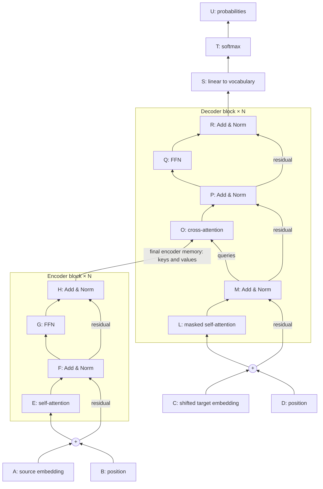

# Transformer Visual Lab

A separate learning section for **GA 1–4, May 2026 Quiz 1, and the supplied A–U architecture diagram**.

## Open the interactive material

From `portal/`, run `npm run dev`, open the printed local address, and select **Visual Lab** in the header or on the homepage. Direct development route: `http://localhost:5173/#/visual-lab`.

The production route is `/llm/#/visual-lab` after the repository is deployed. All calculations and exercises run in the browser; no backend or account is required. Exercise progress lasts for the current page visit.

## How to study

1. **Objects and shapes:** separate parameters, activations and hyperparameters.
2. **Architecture:** click every box in the encoder and decoder; hide names and identify them again.
3. **Embeddings:** move the position slider; compare token vectors, position vectors and their sum.
4. **Attention:** follow all five calculation stages, then switch on the causal mask.
5. **Masks:** change sequence length, batch and heads; predict each count before reading it.
6. **Parameters:** reproduce GA 2, then toggle biases, learned positions and weight tying.
7. **Generation:** compare greedy, top-k and top-p; distinguish model probabilities from decoding decisions.
8. **Practice:** solve the 38 exercises with hints and worked feedback, then retry the original packs.

For plain repository reading, use [the complete study guide](study-guide.md). The interactive version is the primary experience.

## Exact diagram key

| Label | Component |
|---|---|
| A / C | Source / target token embedding |
| B / D | Source / target positional encoding |
| E | Encoder multi-head self-attention |
| F, H | Encoder Add & Norm |
| G | Encoder FFN |
| L | Masked decoder multi-head self-attention |
| M, P, R | Decoder Add & Norm |
| O | Encoder–decoder cross-attention |
| Q | Decoder FFN (diagram label Q, not the query tensor) |
| S | Linear vocabulary projection |
| T | Vocabulary softmax |
| U | Output probabilities |

**All Add & Norm labels: FHMPR. Component L: masked multi-head self-attention.**

The brackets show one block's internal structure; repeat with independent weights. Final encoder memory feeds cross-attention at each decoder layer.

## Source map and assumptions

| Repository source | Lab coverage |
|---|---|
| [GA 1](../GA/ga1.md) | Token counts, batch shapes, heads, parameter matrices, attention score reading and multiplication |
| [GA 2](../GA/ga2.md) | Full encoder/decoder ledger, embeddings/output, softmax gradients, hyperparameters, autoregression |
| [GA 3](../GA/ga3.md) | Sinusoidal/learned positions, causal order, GPT training, tying, degenerative generation |
| [GA 4](../GA/ga4.md) | Conditional probabilities, top-k, MLM loss, BERT classification |
| [Quiz 1](../pyq/May-2026-Quiz-1.md) | Attention arithmetic, mask counts, tensor volume, teacher forcing, generation/search |

The lab distinguishes course conventions from general statements: GA 4's non-greedy output probability is not its model probability; Quiz 1's 2800 tree-node count is not 400 distinct prefix-logit evaluations. Partial histories cannot silently be treated as complete probability trees. The supplied source solutions are preserved.

Foundational references: [Attention Is All You Need](https://arxiv.org/abs/1706.03762), [BERT](https://aclanthology.org/N19-1423/).

## Implementation and validation

- `portal/src/features/visual-lab/content.ts`: lessons and explained exercises.
- `portal/src/features/visual-lab/VisualLabPage.tsx`: interactive explorations and practice.
- `portal/src/features/visual-lab/math.ts`: numerical routines and explicit parameter assumptions.
- `portal/src/features/visual-lab/visual-lab.css`: responsive, keyboard-accessible presentation.
- `portal/scripts/test-visual-lab.mjs`: numerical regression checks. Run `node scripts/test-visual-lab.mjs` from `portal/` with Node 24 (native TypeScript stripping); production build remains on the repository's normal build commands.

Run `npm run build` and `npm run lint` in `portal/` for compilation, type checking and linting.
