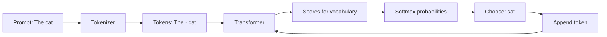
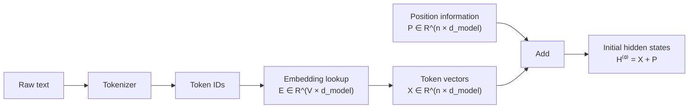
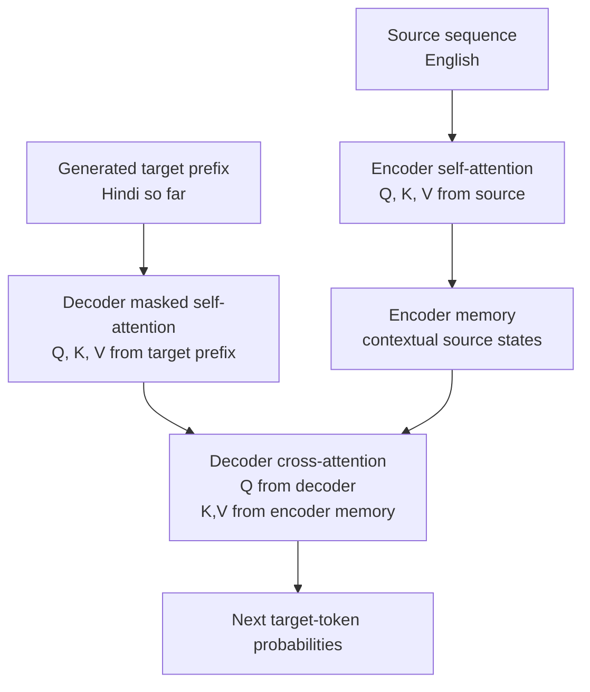
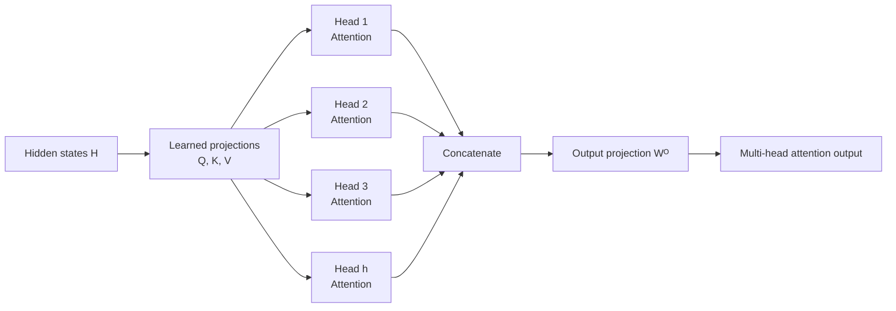
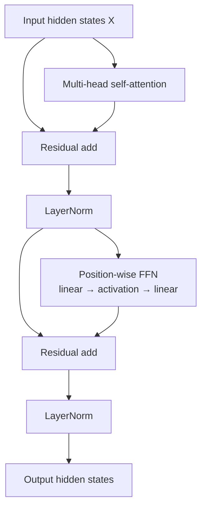
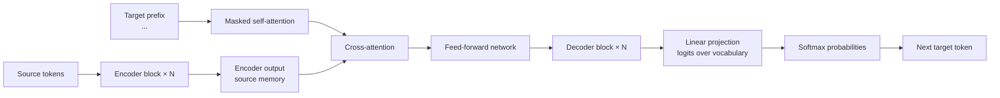
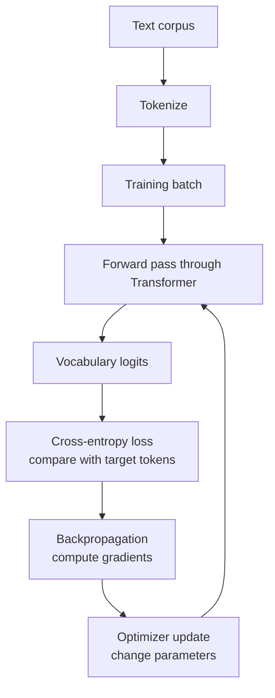

# Transformers, Clearly Explained

> Beginner-friendly notes based on the video subtitle in [`transformer.txt`](transformer.txt), corrected and expanded using the original Transformer, BERT, GPT, and GPT-3 papers.

## How to use this note

Read the sections in order the first time. On later revisions, use the diagrams, the “one-page summary,” and the Q&A as quick revision material.

The diagrams are written in **Mermaid syntax supported by Kroki**. A Markdown viewer with Mermaid support should render them automatically. If it does not, copy a `mermaid` block into [Kroki](https://kroki.io/) and choose Mermaid.

## The one-sentence mental model

A Transformer repeatedly lets every token **look at other relevant tokens**, mixes the information it finds into a richer representation, and finally uses that representation to predict an output token.

The entire story is:

```text
text → tokens → vectors → add position information → attention → feed-forward transformation
     → repeat many Transformer blocks → output scores → probabilities → next token
```

## Learning goals

By the end, you should be able to explain:

- why text is converted into tokens and vectors;
- why a token needs context and position information;
- what Query, Key, and Value mean;
- how scaled dot-product attention is computed;
- why multiple attention heads are useful;
- what residual connections, layer normalization, and the feed-forward network do;
- how the original encoder–decoder Transformer differs from BERT and GPT;
- how training and generation differ; and
- why the model can produce fluent text without guaranteeing that it is true.

---

## 1. What is a language model?

A language model assigns probabilities to token sequences. For a causal language model, the next-token task is:

\[
P(x_t \mid x_1, x_2, \ldots, x_{t-1})
\]

In words: **given the tokens already seen, how likely is each possible next token?**

Example:

```text
The spacecraft entered the      → atmosphere
The chef prepared a spicy rice  → dish
Please close the                 → door
```

The model does not normally “look up the answer” in a table. It computes a probability distribution over its vocabulary, chooses or samples a token, appends that token to the input, and repeats.

### Important correction: “next word” is shorthand

The model usually predicts the next **token**, not necessarily the next complete word. A token can be:

- a whole word: `cat`;
- part of a word: `play` + `##ing` or `play` + `ing`;
- punctuation: `?`;
- whitespace plus a word, depending on the tokenizer; or
- a byte or character-like unit.

So “next-word prediction” is an intuitive name. “Next-token prediction” is more precise.

### Training versus inference

These two stages are easy to confuse:

| Stage | What happens? | Are parameters updated? |
|---|---|---:|
| **Training** | The model predicts known target tokens, measures error, and learns from the error. | Yes |
| **Inference** | The trained model receives new input and produces predictions. | No |

During training, many positions can be processed in parallel for a causal model because the correct previous tokens are already available. During generation, the model must produce one new token before it can condition on that token.



The loop stops when the model emits an end-of-sequence token, reaches a length limit, or the application decides to stop.

---

## 2. From text to vectors

Neural networks operate on numbers. A Transformer therefore has a front end that converts text into a sequence of numeric vectors.

### 2.1 Tokenization

Let the tokenizer map text to token IDs:

```text
Text:       Transformers are useful.
Tokens:     [Transform, ers, are, useful, .]
Token IDs:  [  4812,   93,  27,  8012, 4  ]   ← illustrative IDs
```

The exact split and IDs depend on the tokenizer and vocabulary. A token ID is only an index; ID `4812` is not intrinsically more meaningful than ID `93`.

Subword tokenization is useful because it can represent rare or new words without requiring every whole word to be in the vocabulary. The original Transformer paper used byte-pair or word-piece style representations for its translation experiments. BERT used a 30,000-token WordPiece vocabulary in the original paper; GPT-2 used a 50,257-token byte-level BPE vocabulary. These are historical model configurations, not universal constants.

### 2.2 Token embeddings

Suppose:

- \(V\) = vocabulary size;
- \(d_{model}\) = vector width; and
- \(E \in \mathbb{R}^{V \times d_{model}}\) = the learned embedding matrix.

Looking up token ID \(i\) selects row \(E_i\), a vector of length \(d_{model}\):

\[
\text{token ID } i \longmapsto E_i \in \mathbb{R}^{d_{model}}
\]

For a sequence of (n) tokens, the lookup gives a matrix:

\[
X \in \mathbb{R}^{n \times d_{model}}
\]

The embedding is learned during training. It is not a hand-written list of questions such as “does this word have authority?”

### 2.3 Static and contextual representations

Older methods such as Word2Vec and GloVe assign one main vector to a word type. This is a **static embedding**: `bank` has one vector whether the sentence discusses money or a river.

A Transformer begins with token embeddings but then repeatedly transforms them using the whole sequence. The representation of `bank` can therefore become different in:

```text
I deposited money at the bank.
I sat beside the river bank.
```

The output at a token position is a **contextual representation**. It is better to say that attention and later layers *compute* a contextual representation than to imagine that the model simply adds the vectors for every adjective to a word.

#### About “king − man + woman ≈ queen”

Vector arithmetic can sometimes reveal useful directions in older embedding spaces, such as gender or country–capital relationships. It is an intuition for distributed representations, not a definition of how a Transformer understands language, and it is not guaranteed to work reliably for all words or models.

### 2.4 Position information

Self-attention by itself does not inherently know whether a token was first or last. If we shuffled the input rows and gave the model no position signal, the model would lose important word-order information.

The original Transformer added a positional encoding to each token embedding:

\[
H^{(0)} = X + P
\]

For the original fixed sinusoidal encoding:

\[
PE_{(pos,2i)} = \sin\left(pos / 10000^{2i/d_{model}}\right)
\]

\[
PE_{(pos,2i+1)} = \cos\left(pos / 10000^{2i/d_{model}}\right)
\]

Other Transformer families use learned absolute positions or relative/rotary position methods. Therefore, “the Transformer always uses the sinusoidal formula” is too strong; it describes the original paper’s choice.



---

## 3. Attention: the central idea

Consider:

```text
The animal did not cross the road because it was tired.
```

To interpret `it`, useful information may be found elsewhere in the sequence. Self-attention gives each position a way to retrieve information from other positions, with different strengths.

The original paper describes attention as mapping a **query** and a set of **key–value pairs** to an output. The output is a weighted sum of the values; the weights depend on how compatible the query is with each key.

### 3.1 Query, Key, and Value intuition

Imagine a library:

- **Query:** what information am I looking for?
- **Key:** what label or searchable description does each item have?
- **Value:** what information is actually returned if that item is selected?

For a token, these are not human-written fields. The model learns linear projections that produce vectors useful for matching and mixing information.

For a hidden-state matrix (H):

\[
Q = HW^Q, \qquad K = HW^K, \qquad V = HW^V
\]

Here (W^Q), (W^K), and (W^V) are learned parameter matrices. The same idea applies separately in each attention head.

### 3.2 Scaled dot-product attention

For a collection of queries, keys, and values:

\[
\text{Attention}(Q,K,V)
= \operatorname{softmax}\left(\frac{QK^T}{\sqrt{d_k}}\right)V
\]

Read the formula from left to right:

1. (QK^T) computes a compatibility score between every query and every key.
2. Dividing by (\sqrt{d_k}) keeps scores in a numerically useful range.
3. Softmax turns each row of scores into non-negative weights that sum to 1.
4. Multiplying by (V) forms a weighted mixture of value vectors.

For one query, the result looks like:

\[
0.45V_1 + 0.32V_2 + 0.23V_3
\]

The output is therefore a context-aware mixture, not a hard selection of exactly one token.

### 3.3 Tiny numerical example

Suppose one query and three keys are:

\[
q=[1,0],\quad k_1=[1,0],\quad k_2=[0.5,0.5],\quad k_3=[0,1]
\]

The unscaled dot products are:

\[
q\cdot k_1=1,\qquad q\cdot k_2=0.5,\qquad q\cdot k_3=0
\]

With (d_k=2), the scaled scores are approximately:

\[
[1,0.5,0]/\sqrt{2} \approx [0.707,0.354,0]
\]

Softmax gives approximately:

\[
[0.455, 0.320, 0.225]
\]

So the output is:

\[
0.455V_1 + 0.320V_2 + 0.225V_3
\]

The numbers above are only an illustration. In a real model, the projections and attention patterns are learned from data.

### 3.4 Self-attention and cross-attention

| Type | Queries come from | Keys and values come from | Typical use |
|---|---|---|---|
| **Self-attention** | The same sequence | The same sequence | Build context within a sentence |
| **Cross-attention** | One sequence, often the decoder | Another sequence, often encoder output | Let a translation decoder read the source sentence |

In encoder self-attention, (Q), (K), and (V) all come from the encoder’s current hidden states. In decoder cross-attention, (Q) comes from the decoder, while (K) and (V) come from the encoder output.



### 3.5 Causal masking

A decoder used for generation must not see the future target tokens during training. For the sequence `I made tea`, the representation at `made` may use `I` and `made` but not `tea`.

The model implements this with a triangular mask. Illegal future scores are replaced by a very negative number before softmax, so their attention weights become effectively zero.

```text
Allowed attention in a causal decoder:

          keys / visible context
query     I     made    tea
I        yes    no      no
made     yes    yes     no
tea      yes    yes     yes
```

This restriction is what makes a decoder-only Transformer autoregressive. An encoder such as BERT generally uses bidirectional self-attention because it is not being asked to generate a left-to-right answer in the same way.

---

## 4. Multi-head attention

One attention operation may focus on one kind of relationship. Multiple heads let the model perform several learned projections in parallel.

For head (i):

\[
\text{head}_i = \text{Attention}(QW_i^Q, KW_i^K, VW_i^V)
\]

The original Transformer then concatenates the head outputs and applies another learned projection:

\[
\text{MultiHead}(Q,K,V)
= \operatorname{Concat}(\text{head}_1,\ldots,\text{head}_h)W^O
\]

### What multiple heads buy us

Different heads can learn different relationships, for example:

- subject–verb agreement;
- a pronoun and its likely referent;
- nearby phrase structure;
- long-distance dependencies; or
- relationships between source and target positions in translation.

These are possibilities, not fixed assignments. It is misleading to say “head 1 is always the adjective head.” Heads learn whatever projections reduce the training loss, and their behaviour may be mixed or difficult to interpret.

Also note the important correction: the head outputs are **concatenated and projected**, not simply added together. Their information is combined after each head works in its own smaller representation subspace.



---

## 5. Inside one Transformer block

A Transformer is not just an attention calculation. A typical block contains:

1. multi-head attention;
2. a residual connection and layer normalization;
3. a position-wise feed-forward network;
4. another residual connection and layer normalization.

### 5.1 Residual connections

A residual connection adds a block’s input back to its output:

\[
\text{output} = x + \text{sublayer}(x)
\]

This gives information and gradients a shorter path through a deep stack. The block can learn a useful modification to (x) instead of having to rebuild the entire representation from scratch.

### 5.2 Layer normalization

Layer normalization normalizes the activations within each token representation and applies learned scale and bias parameters. It helps keep the signal numerically well behaved as it travels through many layers.

The original paper used a **post-normalization** form:

\[
\text{LayerNorm}(x + \text{Sublayer}(x))
\]

Many later large models use a **pre-normalization** variant, so diagrams and implementations may place `LayerNorm` before the sublayer. Both are Transformer-family design choices; do not assume every modern architecture follows the exact original ordering.

### 5.3 Position-wise feed-forward network

After attention has mixed information between positions, a feed-forward network transforms each position independently using the same weights at every position in that layer:

\[
\operatorname{FFN}(x)=W_2\,\sigma(W_1x+b_1)+b_2
\]

In the original paper, \(\sigma\) was ReLU. Modern models often use GELU or another activation.

Usually the hidden width (d_{ff}) is larger than (d_{model}). The network expands, applies a nonlinearity, and projects back:

```text
d_model → larger hidden width → d_model
```

Attention answers, “which other positions should influence this position?” The feed-forward network then applies a learned nonlinear transformation to the resulting representation. It is shared across positions within a layer, but different Transformer layers have different parameters.

### 5.4 One block as a flow



In a real implementation, dropout may also be used during training, and the normalization order may be pre-norm rather than post-norm.

### 5.5 Stacking blocks

One block builds a better representation; many blocks build progressively richer representations. If a model has (N) blocks:

\[
H^{(0)} \rightarrow H^{(1)} \rightarrow H^{(2)} \rightarrow \cdots \rightarrow H^{(N)}
\]

The original Transformer base configuration used (N=6) encoder layers and (N=6) decoder layers. BERT, GPT, and later models use their own depths and widths. “The Transformer has 12 layers” is therefore not a general fact; it is a fact about a particular model configuration.

---

## 6. The original encoder–decoder Transformer

The architecture introduced in **Attention Is All You Need** was designed mainly for sequence-to-sequence tasks such as machine translation.

### Encoder

The encoder reads the source sequence and produces one contextual vector per source position. Its blocks contain:

1. bidirectional multi-head self-attention; and
2. a position-wise feed-forward network.

Every source position can attend to every other source position, subject to padding masks.

### Decoder

The decoder generates the target sequence one token at a time. Each decoder block contains:

1. masked self-attention over already-generated target tokens;
2. cross-attention over the encoder output; and
3. a position-wise feed-forward network.

Finally, a linear layer maps the final decoder state to one score per vocabulary token. Softmax converts those scores, called **logits** before normalization, into probabilities.



### Translation example

For translating `I made tea` into another language:

1. The encoder processes the complete source sentence.
2. The decoder starts with a special start token.
3. Its masked self-attention reads the target prefix generated so far.
4. Its cross-attention decides which source positions matter.
5. It predicts the next target token.
6. That token is appended and the loop continues until an end token.

---

## 7. BERT, GPT, and the word “Transformer”

“Transformer” is an architecture family. BERT and GPT are specific models built from parts of that family.

| Model/family | Main stack | Attention direction during pretraining | Typical strength | Main objective |
|---|---|---|---|---|
| **Original Transformer** | Encoder + decoder | Encoder is bidirectional; decoder is causal | Translation and sequence-to-sequence mapping | Predict target sequence |
| **BERT** | Encoder-only | Bidirectional self-attention | Understanding, classification, tagging, extractive QA | Predict masked tokens; original BERT also used NSP |
| **GPT family** | Decoder-only | Causal/left-to-right self-attention | Text generation and continuation | Predict the next token |

### BERT

BERT stands for **Bidirectional Encoder Representations from Transformers**. In the original BERT training procedure:

- 15% of WordPiece token positions were selected for the masked-language-model task;
- selected tokens were replaced with `[MASK]`, a random token, or left unchanged according to the paper’s mixture; and
- the model predicted the original token using both left and right context.

The original paper also described **next sentence prediction (NSP)**, a binary task over sentence pairs. Later research and BERT variants changed or removed NSP, so it should not be treated as an essential feature of every encoder model.

BERT is not normally used as a free-form left-to-right generator. Its strength is producing contextual representations for understanding tasks.

### GPT

GPT models are decoder-only Transformers with causal self-attention. They are trained on a left-to-right language-modeling objective, so at position (t) the model can use earlier tokens but not future tokens.

GPT-2 and GPT-3 are particular historical members of the GPT family. Their vocabulary sizes, layer counts, embedding widths, attention-head counts, and parameter counts should not be copied as universal Transformer values. For example, GPT-3 had 175 billion parameters, but “GPT” does not mean one fixed 175-billion-parameter architecture.

### Chat models

At the architectural core, a chat model still uses token prediction. However, a deployed assistant may additionally be trained or configured with instruction data, preference optimization, safety rules, system messages, tools, and retrieval. Saying “it predicts the next token” explains the core mechanism, not every part of a modern assistant product.

---

## 8. How training teaches the model

### 8.1 Self-supervised data

Raw text can generate training pairs without a person labeling every example. For causal language modeling:

```text
Input:  The  cat  sat  on  the  mat
Target: cat  sat  on   the  mat <end>
```

The target is the input shifted one position to the left. This is called **self-supervised learning**: the data supplies its own prediction targets. It is not “no supervision” in the sense of having no target; the targets are automatically derived from the text.

For BERT-style masked language modeling:

```text
Input:  The cat [MASK] on the mat
Target:             sat
```

Only selected masked positions contribute to the original MLM loss.

### 8.2 Loss and backpropagation

Let (p_t) be the predicted probability assigned to the correct target token at position (t). A simplified causal-language-model loss is:

\[
\mathcal{L} = -\sum_t \log p_t
\]

The optimizer uses gradients of this loss to update the embedding matrix, attention projections (W^Q,W^K,W^V,W^O), feed-forward weights, normalization parameters, and output projection.

Early in training, predictions are poor. Repeated exposure to many sequences gradually changes the parameters so that useful statistical regularities become easier to predict. The model does not receive a hand-written rule saying that `crude` is likely to be followed by `spacecraft`; it learns such patterns from data.



### 8.3 Pretraining and adaptation

The broad pattern is often:

1. **Pretraining:** learn general language regularities from a large text corpus.
2. **Fine-tuning or instruction training:** adapt the model to a task, style, or interaction format.
3. **Inference:** run the trained model on new inputs.

The exact stages differ across model families. The key idea is that the model’s parameters store learned statistical structure, while the current context supplies the information used for the present prediction.

---

## 9. Why Transformers became so important

### Parallel training

An RNN processes a sequence step by step. A Transformer can compute self-attention for all input positions using matrix operations in parallel during training. This is much more compatible with modern accelerators.

### Short paths between distant tokens

In one full self-attention layer, a token can directly interact with any other token in the sequence. This makes long-distance relationships easier to represent than in a strictly recurrent chain.

### A major cost: quadratic attention

For sequence length (n), the attention-score matrix has (n \times n) entries. The original paper summarizes the main self-attention cost as roughly:

\[
O(n^2 d)
\]

where (d) is the representation width. Doubling sequence length can therefore increase the score-matrix work by about four times.

Generation also has a sequential dependency: token (t+1) cannot be produced until token (t) exists. Implementations use techniques such as key–value caching to avoid recomputing all earlier projections on every generation step.

### Fluency is not truth

The model is optimized to assign high probability to plausible continuations. A fluent continuation can still be false, biased, stale, or unsupported. Attention is a mechanism for mixing representations; it is not a built-in fact-checker or guarantee of reasoning correctness.

---

## 10. A compact implementation view

The following pseudocode is intentionally simplified. It shows the data flow, not production optimizations.

```python
def transformer_block(x, mask=None):
    # Pre-norm style; original paper used a post-norm ordering.
    a = multi_head_attention(layer_norm(x), mask=mask)
    x = x + a                         # residual connection

    f = feed_forward(layer_norm(x))   # same FFN at every position
    x = x + f                         # another residual connection
    return x


def causal_language_model(token_ids):
    x = token_embedding(token_ids) + position_information(token_ids)

    for _ in range(number_of_layers):
        x = transformer_block(x, mask=causal_mask(token_ids))

    logits = output_projection(layer_norm(x))
    return softmax(logits, axis=-1)
```

The core attention operation inside one head is:

```python
def attention(x_q, x_k, x_v):
    q = x_q @ W_Q
    k = x_k @ W_K
    v = x_v @ W_V

    scores = (q @ transpose(k)) / sqrt(key_dimension)
    scores = apply_mask(scores)       # optional for encoder; causal in decoder
    weights = softmax(scores, axis=-1)
    return weights @ v
```

The real model includes batching, padding masks, multiple heads, dropout, efficient kernels, numerical-precision choices, and caching. The pseudocode is useful because it exposes the essential flow.

---

## 11. A worked conceptual example

Take the sentence:

```text
I made a sweet Indian rice dish.
```

At the beginning:

1. The tokenizer produces token IDs.
2. The embedding lookup produces one vector per token.
3. Position information is added.

Inside a self-attention layer, the representation for `dish` produces a query. Every token produces a key and a value. The query–key scores determine how much the `dish` position reads from `sweet`, `Indian`, `rice`, and the other tokens.

The result for `dish` may now encode information related to a sweet Indian rice dish rather than only a generic dish. In the next sublayer, the feed-forward network applies a nonlinear transformation to that enriched vector. Repeating blocks lets later layers build more abstract patterns.

If the final output is used for next-token generation, the output projection converts the final hidden state into vocabulary logits. A softmax distribution might assign high probability to tokens such as `called`, `.` or another token depending on the full context and learned parameters.

The attention weights are not manually assigned percentages such as “sweet contributes 36%.” Such numbers can be useful in an analogy, but in a real model they vary by layer, head, position, input, mask, and parameter values.

---

## 12. Common mistakes to avoid

| Mistake | Better understanding |
|---|---|
| “A token is always a word.” | A token may be a word, subword, punctuation mark, whitespace pattern, byte, or another unit. |
| “The model understands text directly.” | It operates on numeric vectors derived from token IDs. |
| “Every word has one fixed embedding in GPT.” | The lookup vector is learned, but hidden states become context-dependent through Transformer layers. |
| “Attention means the model reads only one important word.” | It normally forms a weighted mixture of many value vectors. |
| “The heads are hard-coded as noun, verb, and adjective heads.” | Heads learn different projections; linguistic roles are useful interpretations, not fixed assignments. |
| “Multi-head outputs are simply added.” | They are usually concatenated and passed through an output projection. |
| “BERT is a GPT-style generator.” | BERT is encoder-only and was trained with a masked-token objective in the original paper. |
| “All Transformers have an encoder and a decoder.” | The original model did; BERT is encoder-only and GPT is decoder-only. |
| “The model predicts one word and then the answer appears.” | It predicts one token, appends it, and repeats autoregressively. |
| “A high-probability token is necessarily correct.” | Probability reflects learned patterns, not a guarantee of truth. |
| “Self-supervised means no target exists.” | Targets exist, but they are generated automatically from the input text. |
| “The Transformer always uses sinusoidal positions.” | The original paper did; modern models use several position schemes. |

---

## 13. Questions and answers

### Q1. Why not assign one integer to each word?

An integer ID is just a label. It does not express similarity or useful relationships. An embedding maps the ID to a vector whose dimensions can be adjusted during training so that the model can use meaningful geometric patterns.

### Q2. Does an embedding dimension correspond to a human-readable feature?

Usually not. The coordinates are learned distributed features. Some directions may correlate with recognizable properties, but there is no general rule that coordinate 17 means “gender” or coordinate 42 means “food.”

### Q3. What exactly changes when context is added?

The token’s hidden vector is updated by attention and feed-forward layers. The update can encode information from other positions, so the same token string can have different final representations in different sentences.

### Q4. Why use (Q), (K), and (V) instead of one vector?

Separating “what I am looking for,” “what I match against,” and “what content I return” gives the model flexibility. The three projections can learn different spaces for matching and information transfer.

### Q5. Why divide by (\sqrt{d_k})?

As vector width grows, dot products can grow in magnitude. Very large scores make softmax overly sharp and can produce tiny gradients. Scaling keeps the scores in a more useful range.

### Q6. Why does the decoder need a mask?

Without a causal mask, a training position could look at the correct future token and cheat. The mask ensures the prediction at position (i) uses only allowed earlier context.

### Q7. Why use multiple heads if one head can attend to all tokens?

Each head has its own projections and can represent a different pattern of relationships. Their outputs are combined after the parallel attention calculations.

### Q8. What does the feed-forward network add after attention already mixed context?

Attention mixes information between positions. The FFN applies a nonlinear transformation at each position, allowing the model to reshape and combine features in more complex ways.

### Q9. Does BERT predict the next token?

The original BERT pretraining objective was masked language modeling, not ordinary left-to-right next-token generation. It predicts selected hidden tokens using both left and right context. BERT can still be placed inside systems that generate text, but that is not its defining pretraining setup.

### Q10. Why can GPT generate text if it has no encoder?

A decoder-only Transformer can process the prompt with causal self-attention and predict the next token. It then appends the prediction and runs the loop again. An encoder is necessary for the original translation architecture, not for every generative model.

### Q11. Is attention an explanation of the model’s reasoning?

Not by itself. Attention weights show one part of the information-mixing computation, but they are not guaranteed to be faithful explanations of every internal cause of a prediction.

### Q12. Why does the model sometimes hallucinate?

The training objective rewards likely continuations, not guaranteed truth. If the context is incomplete or the learned patterns are uncertain, a fluent but unsupported continuation can receive high probability.

### Q13. Why can training be parallel but generation is sequential?

During training, the target sequence is known and teacher forcing supplies the correct previous tokens. During generation, the next token is unknown, so each new token must be produced before it can become part of the next input.

### Q14. What should I remember from the equation?

\[
\boxed{\text{softmax}\left(\frac{QK^T}{\sqrt{d_k}}\right)V}
\]

It means: compare queries with keys, turn the comparisons into weights, and use those weights to mix values.

---

## 14. One-page revision summary

```text
1. Text is split into tokens.
2. Token IDs select learned embedding vectors.
3. Position information is added because order matters.
4. Attention computes Q, K, V and mixes value vectors using
   softmax(QKᵀ / √d_k).
5. Multi-head attention repeats this in parallel, concatenates the
   results, and applies an output projection.
6. Residual connections and layer normalization stabilize deep stacks.
7. A position-wise FFN adds nonlinear feature transformation.
8. Many blocks produce rich contextual representations.
9. A vocabulary projection produces logits; softmax gives probabilities.
10. A causal model selects/appends one token and repeats.

Original Transformer = encoder + decoder
BERT             = encoder-only, bidirectional, masked-token training
GPT              = decoder-only, causal, next-token training
```

## 15. Glossary

| Term | Meaning |
|---|---|
| **Token** | A unit produced by a tokenizer; not necessarily a whole word. |
| **Vocabulary** | The fixed set of tokens known to a model. |
| **Token ID** | Integer index of a token in the vocabulary. |
| **Embedding** | Learned vector representation of a token ID. |
| **Hidden state** | A vector carried through the Transformer; it becomes contextual. |
| **Logit** | Unnormalized score for a vocabulary token. |
| **Softmax** | Converts scores into a probability distribution. |
| **Query (Q)** | Vector used to search for relevant information. |
| **Key (K)** | Vector used to match against a query. |
| **Value (V)** | Vector containing information that can be mixed into the output. |
| **Self-attention** | Attention where Q, K, and V come from the same sequence. |
| **Cross-attention** | Attention where queries and key–value memory come from different sequences. |
| **Causal mask** | Prevents a position from attending to future positions. |
| **Residual connection** | Adds a sublayer input to its output. |
| **Layer normalization** | Normalizes activations within a token representation. |
| **FFN** | Position-wise nonlinear feed-forward network. |
| **Pretraining** | Learning general patterns from a large corpus. |
| **Fine-tuning** | Updating a pretrained model for a task or format. |
| **Inference** | Using fixed learned parameters to make predictions. |
| **Perplexity** | An evaluation measure related to average next-token uncertainty. |

## 16. Sources and corrections

The subtitle was used as the starting outline, not as an authority. The most important corrections in this note are:

- `BERT`, not “BIRD”;
- tokens are not identical to words;
- real Transformer representations are contextual hidden states, not merely a manual sum of adjective vectors;
- multi-head outputs are concatenated and projected;
- decoder self-attention is causally masked;
- BERT is encoder-only and GPT is decoder-only;
- positional encoding choices vary across Transformer families; and
- “next-word prediction” is more accurately “next-token prediction.”

Primary references:

1. Vaswani et al., [Attention Is All You Need](https://arxiv.org/abs/1706.03762) — original encoder–decoder architecture, scaled dot-product attention, multi-head attention, feed-forward networks, positional encodings, masking, and complexity.
2. Devlin et al., [BERT: Pre-training of Deep Bidirectional Transformers for Language Understanding](https://arxiv.org/abs/1810.04805) — encoder-only BERT, bidirectional self-attention, masked language modeling, WordPiece input, and the original NSP objective.
3. Radford et al., [Improving Language Understanding with Unsupervised Learning](https://openai.com/index/language-unsupervised/) — early GPT pretraining and fine-tuning approach.
4. Radford et al., [Language Models are Unsupervised Multitask Learners](https://cdn.openai.com/better-language-models/language_models_are_unsupervised_multitask_learners.pdf) — GPT-2’s decoder-style language modeling, byte-level BPE, layer-normalization variant, and model configurations.
5. Brown et al., [Language Models are Few-Shot Learners](https://arxiv.org/abs/2005.14165) — GPT-3 scale and in-context learning experiments.

Original video referenced by the subtitle: [YouTube link](https://youtu.be/ZhAz268Hdpw?si=R2VfL2HFt0HC-FUc).

---

## Final self-test

Try to answer these without looking back:

1. Why does the model need both token embeddings and position information?
2. In one sentence, what does `softmax(QKᵀ / √d_k)V` do?
3. In decoder cross-attention, where do Q, K, and V come from?
4. Why is a causal mask needed for GPT-style generation?
5. What is the architectural difference between BERT and GPT?
6. Why does a feed-forward network appear after attention?
7. Why can a model be fluent yet factually wrong?

If you can explain those seven answers using the diagrams, you understand the main Transformer mechanism rather than only memorizing the labels.
